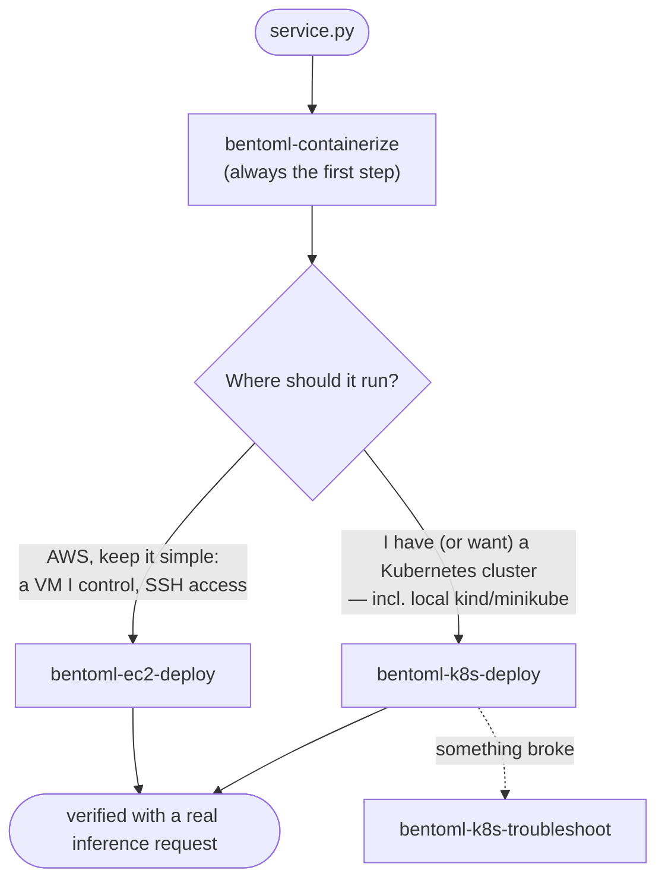

# BentoML Deployment Agent Skills

A set of [Claude Code agent skills](https://code.claude.com/docs/en/skills) for deploying
BentoML services to infrastructure **you** own — a vanilla Kubernetes cluster or plain AWS
EC2 instances — using a fully open-source stack: the `bentoml` CLI, Docker, `kubectl` with
plain manifests, `ssh`, and the AWS CLI. No Helm charts, no operators or CRDs, no Yatai,
no BentoCloud, no closed-source dependencies.

These skills cover **basic deployment**. Features that were part of the commercial
BentoCloud platform — scale-to-zero, inference-metric autoscaling, canary/blue-green
rollouts, model registry sync, observability dashboards — are out of scope for every
target. Where a standard building block exists (Kubernetes HPA, an AWS ALB), the skills
point at it in one line and stop.

## The skills

| Skill | What it does |
|---|---|
| [`bentoml-containerize`](bentoml-containerize/SKILL.md) | Builds your local BentoML project into a Bento, containerizes it, smoke-tests the container locally, and pushes it to your registry (Docker Hub, GHCR, ECR, private, `kind`/`minikube` local load, or ttl.sh). The entry point for every deploy target. |
| [`bentoml-k8s-deploy`](bentoml-k8s-deploy/SKILL.md) | Deploys a pushed image to your Kubernetes cluster: writes one `deploy/config.yml`, renders plain manifests from it — **one Deployment + Service per BentoML service the bento declares**, plus optional HPA/Ingress — applies them in dependency order, and verifies with a real inference request. |
| [`bentoml-k8s-troubleshoot`](bentoml-k8s-troubleshoot/SKILL.md) | Diagnostic runbook for Kubernetes deployments that went wrong: ImagePullBackOff, CrashLoopBackOff, OOM, Pending, probe failures, unreachable services, inference 4xx/5xx. |
| [`bentoml-ec2-deploy`](bentoml-ec2-deploy/SKILL.md) | Runs a pushed image under Docker on one or more plain EC2 instances — your existing instances over SSH, or a fresh instance provisioned via the AWS CLI. Includes ECR auth, verification, and teardown. |
| [`bentoml-deploy-scriptgen`](bentoml-deploy-scriptgen/SKILL.md) | Generates a standalone, committable deploy bundle (`deploy/deploy.py` + one `config.yml`) that builds, pushes, deploys, and verifies without any agent — the manifests are rendered from the config on every run, so there is no YAML to keep in sync. For production and CI/CD pipelines. Kubernetes and EC2 targets. |

A typical session chains them: **containerize → one deploy target → (troubleshoot if
needed)**. The EC2 skill carries its own troubleshooting section;
`bentoml-k8s-troubleshoot` is Kubernetes-only.

## Which target should I choose?



| | Kubernetes (`bentoml-k8s-deploy`) | EC2 (`bentoml-ec2-deploy`) |
|---|---|---|
| **What you need** | A cluster you can reach with `kubectl` (cloud, on-prem, or local kind/minikube) and a registry it can pull from | An AWS account (or just SSH access to existing instances); ECR is the natural registry |
| **What you get** | One Deployment + Service per BentoML service (optional HPA/Ingress) with liveness/readiness/startup probes, self-healing restarts, and the inter-service wiring derived from the bento | Your container on a VM with `--restart unless-stopped`; Swagger UI and metrics on port 3000 |
| **Cost model** | Whatever your cluster already costs — these skills add nothing | Per instance-hour until you terminate: default `t3.medium` ~$0.04/hr + EBS + $0.005/hr per public IPv4 |
| **When to pick it** | You already operate Kubernetes, or want free local testing on kind/minikube | Simplest possible cloud footprint; full control of the box; no Kubernetes anywhere |
| **Scaling story** | `replicas` per service in `config.yml`, or `autoscaling` for a stock CPU-based HPA; each service scales independently | Manual: loop the deploy over N hosts; load balancing (ALB) is out of scope beyond a pointer |
| **Trade-offs to know** | You own cluster operations; Ingress/LoadBalancer depend on what your cluster provides | Plain HTTP on a raw port, **no authentication** unless your service adds it; you patch and secure the VM |

Honest defaults: if you just want to see your service running today with zero cloud
spend, use `bentoml-containerize` with the kind/minikube path plus `bentoml-k8s-deploy`
on a local cluster.

## Development vs Production

Two ways to deploy, same targets:

- **Interactive skills** (`bentoml-containerize` → `bentoml-k8s-deploy` /
  `bentoml-ec2-deploy`) put the agent in the loop: it detects your project, asks the
  right questions, confirms every mutation, provisions infrastructure where allowed
  (EC2), and troubleshoots on the spot. Use them for the **first** deploy of a
  service, for exploring a new target, and whenever something needs judgment.
- **The script bundle** (`bentoml-deploy-scriptgen`) is for every deploy **after** that:
  it generates a committable `deploy/` directory (plain Python ≥ 3.9, stdlib only) that
  repeats the exact build → containerize → push → deploy → verify pipeline with no agent
  and no questions — from your terminal or from CI/CD. Preflight checks fail fast with
  actionable messages, exit codes are a stable contract (0 ok · 1 generic · 2 config ·
  3 preflight · 4 build · 5 push · 6 deploy · 7 verify), and the last stdout line is always a JSON
  summary for machines. It deliberately does **less** than the interactive skills: it
  never provisions EC2 instances and never edits your service — the interactive skills
  set those up once; the bundle then repeats the deploy forever.

Rule of thumb: first deploy interactive, then generate the bundle, commit it, and wire
CI. The generated `deploy/README.md` ships a complete CI/CD chapter — a GitHub Actions
workflow (fork-safe `--check-only --local-only` PR gate; deploy jobs with AWS OIDC, EKS
kubeconfig, and an SSH-key secret for EC2) plus a GitLab CI equivalent.

## Prerequisites

| Prerequisite | containerize | k8s-deploy | k8s-troubleshoot | ec2-deploy |
|---|---|---|---|---|
| Python + `bentoml` ≥ 1.4 | required | — | — | — |
| Docker daemon running | required | — | — | on the instance only (installed by user-data on new instances; offered with confirmation on existing ones) |
| `kubectl` + cluster access | — | required | required | — |
| AWS CLI v2 + valid credentials | only for ECR pushes | — | — | required for provisioning mode and for ECR images; not needed for existing instance + non-ECR image |
| `ssh` client | — | — | — | required |
| A container registry | chosen here | cluster must be able to pull from it | — | instance must be able to pull from it |

Every skill runs its own preflight checks and stops with a clear message if something is
missing — you do not need to pre-verify this table by hand.

## Installation

**Working inside a BentoML checkout?** The skills in `.claude/skills/` load
automatically — no install needed. Everything below is for using the skills in
*other* projects.

### Option 1 — Plugin install straight from GitHub (recommended)

The BentoML repo is a Claude Code plugin marketplace. From any Claude Code session:

```console
> /plugin marketplace add bentoml/BentoML
> /plugin install bentoml-deploy@bentoml
```

Or non-interactively from a shell:

```console
$ claude plugin marketplace add bentoml/BentoML
$ claude plugin install bentoml-deploy@bentoml
```

Confirm the trust prompt and pick a scope (user = all your projects). All five skills
install together and auto-load exactly like local skills (namespaced as
`/bentoml-deploy:bentoml-k8s-deploy` etc.; bare names also resolve when unambiguous).

Update later with `/plugin update bentoml-deploy@bentoml`, or enable auto-update for
the `bentoml` marketplace under `/plugin` → Marketplaces. To keep the initial clone
small: `claude plugin marketplace add bentoml/BentoML --sparse .claude-plugin .claude`.

> If you previously copied the skills into `~/.claude/skills/` manually, delete those
> copies when switching to the plugin — otherwise both sets stay active.

### Option 2 — One-liner via npx (community tool)

[`skills`](https://github.com/vercel-labs/skills) (by Vercel, `npx`-runnable) discovers
skills in this repo's `.claude/skills/` automatically:

```console
$ npx skills add bentoml/BentoML -g     # -g installs to ~/.claude/skills (all projects)
$ npx skills add bentoml/BentoML       # or into the current project's .claude/skills
```

Requires Node.js. This copies the skills; rerun with `npx skills update` to refresh.
(BentoML itself is not published to npm and doesn't need to be — the tool reads the
GitHub repo directly.)

### Option 3 — Manual copy from a clone

```console
$ git clone --depth 1 https://github.com/bentoml/BentoML.git /tmp/bentoml
$ mkdir -p ~/.claude/skills
$ cp -r /tmp/bentoml/.claude/skills/bentoml-* ~/.claude/skills/
$ ls ~/.claude/skills
bentoml-containerize  bentoml-deploy-scriptgen  bentoml-ec2-deploy  bentoml-k8s-deploy  bentoml-k8s-troubleshoot
```

For a per-project install, copy into your project instead and commit:

```console
$ mkdir -p ~/my-ml-project/.claude/skills
$ cp -r /tmp/bentoml/.claude/skills/bentoml-* ~/my-ml-project/.claude/skills/
$ cd ~/my-ml-project && git add .claude/skills && git commit -m "Add BentoML deployment skills"
```

### Or: fetch only the skills (sparse checkout)

Avoids downloading the whole BentoML repo, and gives you a checkout you can `git pull`
to update later:

```console
$ git clone --depth 1 --filter=blob:none --sparse https://github.com/bentoml/BentoML.git bentoml-skills
$ cd bentoml-skills
$ git sparse-checkout set .claude/skills
$ cp -r .claude/skills/bentoml-* ~/.claude/skills/
```

### Verify Claude Code picked them up

Start `claude` and type `/` — the skills appear as slash commands (transcript below is
illustrative; your listing will include other skills too):

```console
$ claude
> /bentoml
  /bentoml-containerize       Build a local BentoML project into a Bento, containerize it...
  /bentoml-ec2-deploy         Deploy a containerized BentoML service directly onto... EC2...
  /bentoml-k8s-deploy         Deploy a containerized BentoML service to a vanilla Kubernetes...
  /bentoml-k8s-troubleshoot   Diagnose and fix BentoML services deployed to Kubernetes...
  /bentoml-deploy-scriptgen   Generate a standalone, committable production deploy-script...
```

You can also just ask in natural language — the skills trigger on matching requests:

```console
> deploy my BentoML service to my Kubernetes cluster

⏺ Loading skill: bentoml-containerize
  Checking prerequisites: bentoml CLI... docker daemon... found ./service.py
  ...
```

If nothing appears, check the directory layout: each skill must be a directory containing
a `SKILL.md` (e.g. `~/.claude/skills/bentoml-k8s-deploy/SKILL.md`), and Claude Code must
be restarted after installing.

### Update later

Pull the latest and re-copy. Remove the old copies first so files deleted upstream do not
linger:

```console
$ cd bentoml-skills && git pull
$ rm -rf ~/.claude/skills/bentoml-*
$ cp -r .claude/skills/bentoml-* ~/.claude/skills/
```

## Cost warning (read this before the EC2 target)

**EC2 instances bill by the hour until you tear them down** — whether or not they serve
a single request.

- **EC2**: the instance bills until `terminate-instances`. A *stopped* instance still
  bills its EBS volume, and every public IPv4 address bills $0.005/hr (~$3.65/mo).

The skills are built around this: **every mutating AWS CLI command is shown to you
verbatim with a cost note, and nothing runs without your explicit confirmation.** The
EC2 skill tracks every resource it creates in a session and ends with a **Teardown**
section that removes exactly those resources and nothing else. If you keep something
running on purpose, the skills tell you what it costs and how to stop it later.

Kubernetes deployments add no spend beyond your existing cluster.

## What each skill will ask you

The skills ask up front (in as few rounds as possible), always showing defaults you can
accept in one go. Below are the actual questions, sourced from each skill's workflow.

### `bentoml-containerize`

| Question | Default | Example | How to choose |
|---|---|---|---|
| Which registry? | — (always asked) | `GHCR` | Docker Hub / GHCR / ECR / private for real clusters; **kind/minikube local load** for a local cluster (no registry, nothing to push); **ttl.sh** for anonymous, ephemeral throwaway tests. Pick **ECR** if the target is EC2. |
| Target CPU architecture? | build machine's arch | `amd64` | Must match the nodes that will run the image — most clouds are `amd64`; a mismatch crashes with `exec format error`. Building on Apple Silicon for an amd64 target adds `--opt platform=linux/amd64`. |

It may additionally ask for runtime env var **values** (e.g. `HF_TOKEN` for gated
Hugging Face models) during the build/smoke test — names get passed on to the deploy
skill; values are never baked into the image.

### `bentoml-k8s-deploy`

First question, always: **which kubectl context?** There is no default — the skill never
assumes your current context is the intended cluster, even if it is the only one, and
then pins `--context` on every command.

The answers become one file you own afterwards: `deploy/config.yml`. **Four values are
required**, and for a bento that needs nothing else that is the entire config:

```yaml
project: ..
image: 123456789012.dkr.ecr.us-west-1.amazonaws.com/my-bento     # no tag
kubernetes:
  context: my-cluster
  namespace: ml-services
```

The tag is the bento version, and the service list, the entry service and the dependency
DAG are read from the bento's own `bento.yaml` — so you never write a service name, an
`entry` flag or a dependency list, and nothing can drift from the code. One prerequisite
the file cannot supply: **the cluster must already be able to pull the image**. For a
private registry (every ECR is one) that means a pull secret in the namespace, on the
namespace's `default` serviceaccount, or node-level credentials; preflight reports which
it found and gives you the exact `kubectl create secret` line when it finds none.

Everything below is optional, per BentoML service, and defaulted:

| Parameter | Default | Example | How to choose |
|---|---|---|---|
| Namespace | — (required) | `ml-services` | Must already exist; the skill never creates one (a skill that could would happily create a typo'd one). |
| `replicas` | `1` | `2` | Start at 1; scale after it works. Ignored when `autoscaling` is on. |
| CPU request / limit | `500m` / `"2"` | `"1"` / `"4"` | Quantities are **quoted strings**. These are load-bearing: the `@bentoml.service(resources=…)` decorator is inert in OSS. Budget per service — four services at the default need 2 CPU of schedulable room. |
| Memory request / limit | `1Gi` / `4Gi` | `8Gi` / `16Gi` | Size to the model — OOMKilled pods almost always mean the limit is below model memory (~1.5–2x weights on disk). |
| GPU per pod | none | `1` | Only if the cluster advertises `nvidia.com/gpu` (the skill checks). |
| `autoscaling` | off | `{enabled: true, max_replicas: 5}` | Stock CPU HPA via metrics-server; `concurrency` needs a custom-metrics adapter. |
| `env` | none | `LOG_LEVEL=debug` | Non-sensitive config only. |
| `env_from_secrets` | none | `HF_TOKEN` | Names an existing Kubernetes Secret key — no secret value is ever written into the config or a manifest. |
| `config_overrides` | none | `{workers: 2}` | Retunes BentoML server settings **without rebuilding the image**. |
| `image_pull_secret` | none | `ecr-creds` | See the prerequisite above. |
| `expose` / `ingress` | ClusterIP + port-forward | `{type: NodePort}` | **Entry service only** — a dependency reachable from outside is an unauthenticated pickle endpoint, so the config rejects it. NodePort / LoadBalancer / Ingress depending on what the cluster supports (the skill checks before recommending). |

The same file drives the non-interactive bundle from `bentoml-deploy-scriptgen` — it is
literally the same loader and renderer, so a config that works in one works in the other.

### `bentoml-k8s-troubleshoot`

Not a deployment, so almost nothing to configure:

| Question | Why |
|---|---|
| Namespace | Where the deployment lives (same answer you gave the deploy skill). |
| App name | The `app.kubernetes.io/name` label value, e.g. `text-stats`. |

It shows you the **current** kubectl context and namespace and gets your confirmation
before any mutating command; read-only diagnostics run freely after that.

### `bentoml-ec2-deploy`

One question round covering:

| Question | Default | Example | How to choose |
|---|---|---|---|
| Image reference | — (required) | `123456789012.dkr.ecr.us-east-1.amazonaws.com/text-stats:v1` | From `bentoml-containerize`; ECR is the natural registry here. |
| Registry access | — | ECR | ECR / other private / public — determines the auth step. |
| Runtime env var names | none | `HF_TOKEN` | Values are expanded from your local shell env at `docker run` time, never written to files or user-data. |
| Image architecture | from handoff | `amd64` | Must match the instance family: `t3.*`/`m5.*` = amd64, `t4g.*`/`m7g.*` = arm64. |
| Container/service name | bento name, hyphenated | `text-stats` | Names the container on the host. |
| **Mode** | — (required) | B | **A** — you provide existing instance(s): SSH host, user (`ec2-user`/`ubuntu`), key path. **B** — the skill provisions a new instance via the AWS CLI. |
| ECR auth path (ECR images only) | — | instance profile | **Instance profile** (preferred for Mode B; must be created before launch) or **token over SSH** (works anywhere, only option that doesn't modify a Mode A instance; tokens expire after 12 h). |
| AWS region | your `aws configure` default, confirmed | `us-east-1` | Never assumed; for ECR images it must match the region in the image ref. |

Mode B additionally asks:

| Question | Default | How to choose |
|---|---|---|
| Key pair | reuse existing, or create new (free) | If created, the `.pem` is shown exactly once — the skill saves it locally. |
| Port-3000 scope | your IP | Your detected public IP (confirmed — VPNs skew it), **SSH-tunnel only** (no inbound 3000 rule), or `0.0.0.0/0` — the last only after an explicit warning that it exposes an unauthenticated inference API to the internet. |
| Instance type | `t3.medium` (~$0.04/hr) | Size RAM to the model; `t4g.medium` for arm64 images; GPU types cost 10–25x more and need a GPU AMI. |
| Root volume | 30–50 GiB gp3 | Bento images bake models in — the 8 GiB AMI default is usually too small. At least 2x the image size. |

## End-to-end walkthrough

A minimal CPU-only service, containerized and deployed to a local kind cluster (zero
cloud cost — the same flow works for any target). `service.py`:

```python
import bentoml

my_image = bentoml.images.Image(python_version="3.11")


@bentoml.service(image=my_image)
class TextStats:
    @bentoml.api
    def analyze(self, text: str) -> dict:
        words = text.split()
        return {
            "words": len(words),
            "chars": len(text),
            "unique_words": len({w.lower() for w in words}),
        }
```

The session (illustrative transcript — output abridged, tags and timings will differ):

```console
$ cd ~/projects/text-stats && ls
service.py

$ claude
> containerize my BentoML service and deploy it to my kind cluster

⏺ Loading skill: bentoml-containerize
  Preflight: bentoml 1.4.x OK · docker daemon OK (x86_64) · found ./service.py
  Two questions:
  1. Which registry? (Docker Hub / GHCR / ECR / private / kind-minikube load / ttl.sh)
  2. Target CPU architecture? (amd64 / arm64)

> kind load, amd64

⏺ bentoml build            → text_stats:lyt7deofjkmparqe
  bentoml containerize     → image text_stats:lyt7deofjkmparqe
  Smoke test (docker run -p 3007:3000):
    GET  /readyz  → 200
    POST /analyze {"text": "the quick brown fox"}
                  → {"words": 4, "chars": 19, "unique_words": 4}      ✓ plausible
  kind load docker-image text_stats:lyt7deofjkmparqe --name kind

⏺ Loading skill: bentoml-k8s-deploy
  Contexts: kind-kind (current), prod-eks — which one should I deploy to?

> kind-kind

⏺ Read bento.yaml: 1 service (TextStats), entry service TextStats, no dependencies
  Parameters (accept or change):
    namespace: default   replicas: 1   cpu: 500m/"2"   memory: 1Gi/4Gi
    exposure: ClusterIP + port-forward
    (image loaded into kind, so nothing is pushed and imagePullPolicy stays IfNotPresent)

> accept

⏺ Wrote deploy/config.yml — you customized nothing, so it is the whole config:
    project: ..
    image: ""                  # kind-loaded, nothing to push
    kubernetes: {context: kind-kind, namespace: default}
  Rendered from it: 1 Deployment + 1 Service (a multi-service bento gets one of each
  per service). Review them without touching the cluster:
    python3 deploy/deploy.py --target k8s --render-only /tmp/look
  About to apply: context=kind-kind  namespace=default  image=text_stats:lyt7deofjkmparqe
  Proceed?

> yes

⏺ kubectl --context kind-kind apply -n default -f -      (rendered, not from disk)
  rollout status: deployment "text-stats" successfully rolled out
  port-forward svc/text-stats 3100:3000 → GET /readyz → READY
  POST /analyze {"text": "deployed to kubernetes"}
                → {"words": 3, "chars": 22, "unique_words": 3}        ✓ correct

  Reach the service with:
    kubectl --context kind-kind port-forward svc/text-stats -n default 3000:3000
    → http://127.0.0.1:3000   (Swagger UI at /, Prometheus metrics at /metrics)
```

Note the last step: the skills never declare success on a 200 status alone — they always
make **one real inference request and judge the response content**.

For a cloud target, the only change is the registry answer (e.g. ECR) and the deploy
skill invoked afterwards (`/bentoml-ec2-deploy` instead of the Kubernetes deploy).

## Conventions the skills follow

- **Port 3000, `/livez`, `/readyz`** — BentoML containers serve HTTP on port 3000 with
  those health endpoints (plus Prometheus metrics at `/metrics` and Swagger UI at `/`).
  Kubernetes manifests probe `/livez` (liveness) and `/readyz` (readiness/startup, with a
  generous ~10-minute startupProbe budget for model loading); EC2 verification polls
  `/readyz`.
- **Verification is content-based.** Every deploy skill ends with a real inference
  request derived from your `@bentoml.api` methods and judges the **response body**, not
  the status code. Port-forwards and SSH tunnels use uncommon local ports (3100/3200) and
  liveness-check the tunnel process, so a dev server squatting on local port 3000 can
  never produce a fake success.
- **Kubernetes manifests are rendered, not stored.** `deploy/config.yml` plus the bento's
  own `bento.yaml` are the inputs; the objects are rendered on every run and piped to
  `kubectl apply`, so there is no YAML file to drift. `--render-only DIR` writes them out
  when you want to review, diff or commit them (that is also the GitOps path). Every
  object is labeled `app.kubernetes.io/name: <slug>` (the object name),
  `app.kubernetes.io/component: <BentoML service name>`,
  `app.kubernetes.io/part-of: <bento>` and `app.kubernetes.io/managed-by`. If the config
  cannot express something you need, `kubernetes.manifests_dir` hands the YAML back to
  you. EC2 resources the skill provisions are tagged `managed-by=bentoml-ec2-deploy`.
- **Secrets hygiene, per target**: Kubernetes secrets are created imperatively
  (`kubectl create secret ... --from-literal`) — no secret value is ever written into a
  manifest or any file. On EC2, secrets are passed as `-e` flags expanded from your local
  shell env — never into files or instance user-data. Nowhere are secret values baked into
  image layers.
- **Cluster/region confirmation**: `bentoml-k8s-deploy` asks which kubectl context to use
  (never assuming the current one), pins `--context` on every command, and never switches
  your current context. `bentoml-k8s-troubleshoot` instead confirms the **current**
  context and namespace with you before any mutating command. The AWS skills confirm the
  region explicitly and pass `--region` on every command.
- **Mutations are confirmed, and destructive scope is bounded.** Every mutating AWS CLI
  command is shown verbatim with a cost note before running; every mutating SSH command
  echoes the target host first. No skill deletes or modifies resources it did not create
  in the current session — teardown sections operate on exactly the tracked list of
  created resources, nothing else.
