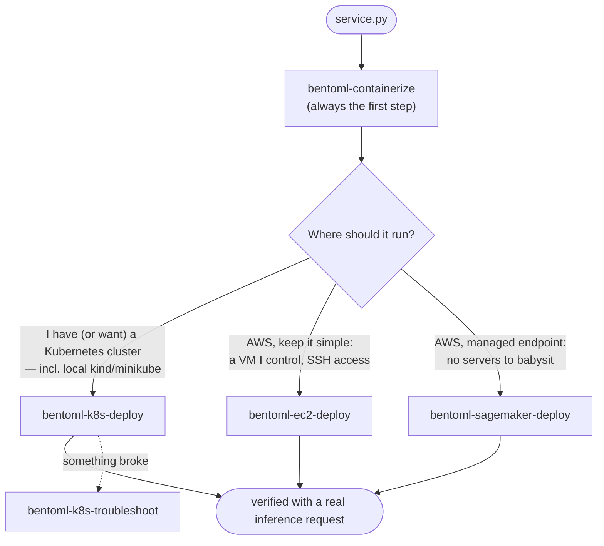

# BentoML Deployment Agent Skills

A set of [Claude Code agent skills](https://code.claude.com/docs/en/skills) for deploying
BentoML services to infrastructure **you** own — a vanilla Kubernetes cluster, plain AWS
EC2 instances, or an AWS SageMaker real-time endpoint — using a fully open-source stack:
the `bentoml` CLI, Docker, `kubectl` with plain manifests, `ssh`, and the AWS CLI. No Helm
charts, no operators or CRDs, no Yatai, no BentoCloud, no closed-source dependencies.

These skills cover **basic deployment**. Features that were part of the commercial
BentoCloud platform — scale-to-zero, inference-metric autoscaling, canary/blue-green
rollouts, model registry sync, observability dashboards — are out of scope for every
target. Where a standard building block exists (Kubernetes HPA, an AWS ALB, SageMaker
autoscaling), the skills point at it in one line and stop.

## The skills

| Skill | What it does |
|---|---|
| [`bentoml-containerize`](bentoml-containerize/SKILL.md) | Builds your local BentoML project into a Bento, containerizes it, smoke-tests the container locally, and pushes it to your registry (Docker Hub, GHCR, ECR, private, `kind`/`minikube` local load, or ttl.sh). The entry point for every deploy target. |
| [`bentoml-k8s-deploy`](bentoml-k8s-deploy/SKILL.md) | Deploys a pushed image to your Kubernetes cluster: renders plain manifests (Deployment + Service, optional Ingress) into your project's `k8s/`, applies them, and verifies with a real inference request. |
| [`bentoml-k8s-troubleshoot`](bentoml-k8s-troubleshoot/SKILL.md) | Diagnostic runbook for Kubernetes deployments that went wrong: ImagePullBackOff, CrashLoopBackOff, OOM, Pending, probe failures, unreachable services, inference 4xx/5xx. |
| [`bentoml-ec2-deploy`](bentoml-ec2-deploy/SKILL.md) | Runs a pushed image under Docker on one or more plain EC2 instances — your existing instances over SSH, or a fresh instance provisioned via the AWS CLI. Includes ECR auth, verification, and teardown. |
| [`bentoml-sagemaker-deploy`](bentoml-sagemaker-deploy/SKILL.md) | Adapts your service to SageMaker's bring-your-own-container contract (port 8080, `GET /ping`, `POST /invocations`) with a small reviewed patch, pushes to ECR, and creates a real-time endpoint with the AWS CLI. Includes verification and teardown. |

A typical session chains them: **containerize → one deploy target → (troubleshoot if
needed)**. The EC2 and SageMaker skills carry their own troubleshooting sections;
`bentoml-k8s-troubleshoot` is Kubernetes-only.

## Which target should I choose?



| | Kubernetes (`bentoml-k8s-deploy`) | EC2 (`bentoml-ec2-deploy`) | SageMaker (`bentoml-sagemaker-deploy`) |
|---|---|---|---|
| **What you need** | A cluster you can reach with `kubectl` (cloud, on-prem, or local kind/minikube) and a registry it can pull from | An AWS account (or just SSH access to existing instances); ECR is the natural registry | An AWS account with SageMaker/ECR/IAM permissions; the image must live in ECR in the endpoint's region |
| **What you get** | A Deployment + Service (optional Ingress) with liveness/readiness/startup probes, self-healing restarts | Your container on a VM with `--restart unless-stopped`; Swagger UI and metrics on port 3000 | A managed HTTPS endpoint invoked via `aws sagemaker-runtime invoke-endpoint` (IAM-authenticated), CloudWatch logs |
| **Cost model** | Whatever your cluster already costs — these skills add nothing | Per instance-hour until you terminate: default `t3.medium` ~$0.04/hr + EBS + $0.005/hr per public IPv4 | Per instance-hour from InService until you delete the endpoint: default `ml.m5.large` ~$0.115/hr (~$83/mo) |
| **When to pick it** | You already operate Kubernetes, or want free local testing on kind/minikube | Simplest possible cloud footprint; full control of the box; no Kubernetes anywhere | You want AWS to run the servers, and IAM auth + CloudWatch out of the box |
| **Scaling story** | `replicas` in the manifest; standard CPU-based HPA works (one-line pointer, nothing more) | Manual: loop the deploy over N hosts; load balancing (ALB) is out of scope beyond a pointer | Fixed instance count in the endpoint config; autoscaling is out of scope beyond a pointer |
| **Trade-offs to know** | You own cluster operations; Ingress/LoadBalancer depend on what your cluster provides | Plain HTTP on a raw port, **no authentication** unless your service adds it; you patch and secure the VM | Hard platform limits: 60 s per request, 6 MB request/response; requires a small patch to `service.py` (shown as a diff first); no public unauthenticated URL |

Honest defaults: if you just want to see your service running today with zero cloud
spend, use `bentoml-containerize` with the kind/minikube path plus `bentoml-k8s-deploy`
on a local cluster. If a request can exceed 60 seconds or 6 MB, SageMaker real-time
endpoints are the wrong target regardless of other preferences.

## Prerequisites

| Prerequisite | containerize | k8s-deploy | k8s-troubleshoot | ec2-deploy | sagemaker-deploy |
|---|---|---|---|---|---|
| Python + `bentoml` ≥ 1.4 | required | — | — | — | required (build happens here too) |
| Docker daemon running | required | — | — | on the instance only (installed by user-data on new instances; offered with confirmation on existing ones) | required (build + push) |
| `kubectl` + cluster access | — | required | required | — | — |
| AWS CLI v2 + valid credentials | only for ECR pushes | — | — | required for provisioning mode and for ECR images; not needed for existing instance + non-ECR image | required |
| `ssh` client | — | — | — | required | — |
| A container registry | chosen here | cluster must be able to pull from it | — | instance must be able to pull from it | must be ECR, same region as the endpoint |

Every skill runs its own preflight checks and stops with a clear message if something is
missing — you do not need to pre-verify this table by hand.

## Installation

Claude Code discovers skills in two places:

- `~/.claude/skills/` — **personal**: available in every project on your machine.
- `<your-project>/.claude/skills/` — **per-project**: committed to the project's repo and
  shared with everyone who works on it.

(If you are working inside the BentoML repository itself, the skills are already active —
they live in this repo's `.claude/skills/`.)

### Install from a clone

```console
$ git clone --depth 1 https://github.com/bentoml/BentoML.git /tmp/bentoml
$ mkdir -p ~/.claude/skills
$ cp -r /tmp/bentoml/.claude/skills/bentoml-* ~/.claude/skills/
$ ls ~/.claude/skills
bentoml-containerize  bentoml-ec2-deploy  bentoml-k8s-deploy  bentoml-k8s-troubleshoot  bentoml-sagemaker-deploy
```

For a per-project install, copy into your project instead and commit:

```console
$ mkdir -p ~/my-ml-project/.claude/skills
$ cp -r /tmp/bentoml/.claude/skills/bentoml-* ~/my-ml-project/.claude/skills/
$ cd ~/my-ml-project && git add .claude/skills && git commit -m "Add BentoML deployment skills"
```

### Or: fetch only the skills (sparse checkout)

Avoids downloading the whole BentoML repo, and gives you a checkout you can `git pull`
to update later:

```console
$ git clone --depth 1 --filter=blob:none --sparse https://github.com/bentoml/BentoML.git bentoml-skills
$ cd bentoml-skills
$ git sparse-checkout set .claude/skills
$ cp -r .claude/skills/bentoml-* ~/.claude/skills/
```

### Verify Claude Code picked them up

Start `claude` and type `/` — the skills appear as slash commands (transcript below is
illustrative; your listing will include other skills too):

```console
$ claude
> /bentoml
  /bentoml-containerize       Build a local BentoML project into a Bento, containerize it...
  /bentoml-ec2-deploy         Deploy a containerized BentoML service directly onto... EC2...
  /bentoml-k8s-deploy         Deploy a containerized BentoML service to a vanilla Kubernetes...
  /bentoml-k8s-troubleshoot   Diagnose and fix BentoML services deployed to Kubernetes...
  /bentoml-sagemaker-deploy   Deploy a BentoML service to an AWS SageMaker real-time...
```

You can also just ask in natural language — the skills trigger on matching requests:

```console
> deploy my BentoML service to my Kubernetes cluster

⏺ Loading skill: bentoml-containerize
  Checking prerequisites: bentoml CLI... docker daemon... found ./service.py
  ...
```

If nothing appears, check the directory layout: each skill must be a directory containing
a `SKILL.md` (e.g. `~/.claude/skills/bentoml-k8s-deploy/SKILL.md`), and Claude Code must
be restarted after installing.

### Update later

Pull the latest and re-copy. Remove the old copies first so files deleted upstream do not
linger:

```console
$ cd bentoml-skills && git pull
$ rm -rf ~/.claude/skills/bentoml-*
$ cp -r .claude/skills/bentoml-* ~/.claude/skills/
```

## Cost warning (read this before the AWS targets)

**EC2 instances and SageMaker endpoints bill by the hour until you tear them down** —
whether or not they serve a single request.

- **EC2**: the instance bills until `terminate-instances`. A *stopped* instance still
  bills its EBS volume, and every public IPv4 address bills $0.005/hr (~$3.65/mo).
- **SageMaker**: the endpoint bills per instance-hour from the moment it is InService
  until `delete-endpoint`. A forgotten default `ml.m5.large` endpoint costs roughly
  $80–90/month. Deleting the endpoint is what stops billing; the model and endpoint
  config are free.

The skills are built around this: **every mutating AWS CLI command is shown to you
verbatim with a cost note, and nothing runs without your explicit confirmation.** Both
AWS skills track every resource they create in a session and end with a **Teardown**
section that removes exactly those resources and nothing else. If you keep something
running on purpose, the skills tell you what it costs and how to stop it later.

Kubernetes deployments add no spend beyond your existing cluster.

## What each skill will ask you

The skills ask up front (in as few rounds as possible), always showing defaults you can
accept in one go. Below are the actual questions, sourced from each skill's workflow.

### `bentoml-containerize`

| Question | Default | Example | How to choose |
|---|---|---|---|
| Which registry? | — (always asked) | `GHCR` | Docker Hub / GHCR / ECR / private for real clusters; **kind/minikube local load** for a local cluster (no registry, nothing to push); **ttl.sh** for anonymous, ephemeral throwaway tests. Pick **ECR** if the target is EC2 or SageMaker (SageMaker *requires* ECR in the endpoint's region). |
| Target CPU architecture? | build machine's arch | `amd64` | Must match the nodes that will run the image — most clouds and all standard SageMaker `ml.*` instances are `amd64`; a mismatch crashes with `exec format error`. Building on Apple Silicon for an amd64 target adds `--opt platform=linux/amd64`. |

It may additionally ask for runtime env var **values** (e.g. `HF_TOKEN` for gated
Hugging Face models) during the build/smoke test — names get passed on to the deploy
skill; values are never baked into the image.

### `bentoml-k8s-deploy`

First question, always: **which kubectl context?** There is no default — the skill never
assumes your current context is the intended cluster, even if it is the only one, and
then pins `--context` on every command. Then, in one round:

| Parameter | Default | Example | How to choose |
|---|---|---|---|
| Image reference | — (required) | `ghcr.io/acme/summarization:v1` | Full pushed ref from `bentoml-containerize`, or the locally loaded name for kind/minikube. |
| Service name | derived (bento name, DNS-1035-sanitized) | `text-stats` | Lowercase letters/digits/`-`, must start with a letter, ≤ 63 chars. Accept the derived name unless you have a naming scheme. |
| Namespace | `default` | `ml-services` | The skill offers to create a dedicated one. |
| Replicas | `1` | `2` | Start at 1; scale after it works. |
| CPU request / limit | `500m` / `2` | `1` / `4` | Starting point for CPU inference. |
| Memory request / limit | `1Gi` / `4Gi` | `8Gi` / `16Gi` | Size to the model — OOMKilled pods almost always mean the limit is below model memory (~1.5–2x weights on disk). |
| GPU per pod | none | `1` | Only if the cluster advertises `nvidia.com/gpu` (the skill checks). |
| Plain env vars | none | `LOG_LEVEL=debug` | Non-sensitive config only. |
| Secrets | none | `HF_TOKEN` | Tokens/keys — created imperatively as a Kubernetes Secret, never written into manifests. |
| Private registry? | detected/asked | yes → pull secret | Needed if the cluster must authenticate to pull. |
| Exposure | `port-forward` | `Ingress` | port-forward for testing; NodePort / LoadBalancer / Ingress depending on what the cluster supports (the skill checks before recommending). |

### `bentoml-k8s-troubleshoot`

Not a deployment, so almost nothing to configure:

| Question | Why |
|---|---|
| Namespace | Where the deployment lives (same answer you gave the deploy skill). |
| App name | The `app.kubernetes.io/name` label value, e.g. `text-stats`. |

It shows you the **current** kubectl context and namespace and gets your confirmation
before any mutating command; read-only diagnostics run freely after that.

### `bentoml-ec2-deploy`

One question round covering:

| Question | Default | Example | How to choose |
|---|---|---|---|
| Image reference | — (required) | `123456789012.dkr.ecr.us-east-1.amazonaws.com/text-stats:v1` | From `bentoml-containerize`; ECR is the natural registry here. |
| Registry access | — | ECR | ECR / other private / public — determines the auth step. |
| Runtime env var names | none | `HF_TOKEN` | Values are expanded from your local shell env at `docker run` time, never written to files or user-data. |
| Image architecture | from handoff | `amd64` | Must match the instance family: `t3.*`/`m5.*` = amd64, `t4g.*`/`m7g.*` = arm64. |
| Container/service name | bento name, hyphenated | `text-stats` | Names the container on the host. |
| **Mode** | — (required) | B | **A** — you provide existing instance(s): SSH host, user (`ec2-user`/`ubuntu`), key path. **B** — the skill provisions a new instance via the AWS CLI. |
| ECR auth path (ECR images only) | — | instance profile | **Instance profile** (preferred for Mode B; must be created before launch) or **token over SSH** (works anywhere, only option that doesn't modify a Mode A instance; tokens expire after 12 h). |
| AWS region | your `aws configure` default, confirmed | `us-east-1` | Never assumed; for ECR images it must match the region in the image ref. |

Mode B additionally asks:

| Question | Default | How to choose |
|---|---|---|
| Key pair | reuse existing, or create new (free) | If created, the `.pem` is shown exactly once — the skill saves it locally. |
| Port-3000 scope | your IP | Your detected public IP (confirmed — VPNs skew it), **SSH-tunnel only** (no inbound 3000 rule), or `0.0.0.0/0` — the last only after an explicit warning that it exposes an unauthenticated inference API to the internet. |
| Instance type | `t3.medium` (~$0.04/hr) | Size RAM to the model; `t4g.medium` for arm64 images; GPU types cost 10–25x more and need a GPU AMI. |
| Root volume | 30–50 GiB gp3 | Bento images bake models in — the 8 GiB AMI default is usually too small. At least 2x the image size. |

### `bentoml-sagemaker-deploy`

| Question | Default | Example | How to choose |
|---|---|---|---|
| AWS region | your `aws configure` default, confirmed | `us-east-1` | Never assumed. The ECR image, model, and endpoint must all be in this region. |
| Approve the service patch | — (diff shown first) | yes | A small additive patch to `service.py` adds `GET /ping` and a `POST /invocations` alias; existing routes keep working. A wrapper-file variant exists if you don't want `service.py` touched. |
| IAM execution role | reuse an existing SageMaker role | `arn:aws:iam::…:role/MySageMakerRole` | Any role trusting `sagemaker.amazonaws.com` with ECR pull + CloudWatch permissions (e.g. `AmazonSageMakerFullAccess`). If none exists, the skill creates a minimal one — with your confirmation. |
| Instance type / count | `ml.m5.large` × 1 (~$0.115/hr) | `ml.g4dn.xlarge` | CPU default; the reference has a sizing/cost table. All standard `ml.*` types are amd64. |
| Startup health-check timeout | 600 s (configurable 60–3600) | `900` | Raise it if model loading takes many minutes. |
| Extra container env vars | none | `LOG_LEVEL=info` | Set via the model's `Environment` map — visible to anyone who can `describe-model`, so no secrets here; bake models into the image instead (the BentoML default). |
| **Final confirmation before `create-endpoint`** | — | explicit "yes" | Billing starts here and runs until teardown; the skill states the hourly and monthly cost first. |

## End-to-end walkthrough

A minimal CPU-only service, containerized and deployed to a local kind cluster (zero
cloud cost — the same flow works for any target). `service.py`:

```python
import bentoml

my_image = bentoml.images.Image(python_version="3.11")


@bentoml.service(image=my_image)
class TextStats:
    @bentoml.api
    def analyze(self, text: str) -> dict:
        words = text.split()
        return {
            "words": len(words),
            "chars": len(text),
            "unique_words": len({w.lower() for w in words}),
        }
```

The session (illustrative transcript — output abridged, tags and timings will differ):

```console
$ cd ~/projects/text-stats && ls
service.py

$ claude
> containerize my BentoML service and deploy it to my kind cluster

⏺ Loading skill: bentoml-containerize
  Preflight: bentoml 1.4.x OK · docker daemon OK (x86_64) · found ./service.py
  Two questions:
  1. Which registry? (Docker Hub / GHCR / ECR / private / kind-minikube load / ttl.sh)
  2. Target CPU architecture? (amd64 / arm64)

> kind load, amd64

⏺ bentoml build            → text_stats:lyt7deofjkmparqe
  bentoml containerize     → image text_stats:lyt7deofjkmparqe
  Smoke test (docker run -p 3007:3000):
    GET  /readyz  → 200
    POST /analyze {"text": "the quick brown fox"}
                  → {"words": 4, "chars": 19, "unique_words": 4}      ✓ plausible
  kind load docker-image text_stats:lyt7deofjkmparqe --name kind

⏺ Loading skill: bentoml-k8s-deploy
  Contexts: kind-kind (current), prod-eks — which one should I deploy to?

> kind-kind

⏺ Parameters (accept or change):
    service name: text-stats   namespace: default   replicas: 1
    cpu: 500m/2   memory: 1Gi/4Gi   exposure: port-forward
    imagePullPolicy: IfNotPresent  (kind-loaded image — must not be Always)

> accept

⏺ Wrote k8s/deployment.yaml, k8s/service.yaml
  About to apply: context=kind-kind  namespace=default  image=text_stats:lyt7deofjkmparqe
  Proceed?

> yes

⏺ kubectl --context kind-kind apply -n default -f k8s/
  rollout status: deployment "text-stats" successfully rolled out
  port-forward svc/text-stats 3100:3000 → GET /readyz → READY
  POST /analyze {"text": "deployed to kubernetes"}
                → {"words": 3, "chars": 22, "unique_words": 3}        ✓ correct

  Reach the service with:
    kubectl --context kind-kind port-forward svc/text-stats -n default 3000:3000
    → http://127.0.0.1:3000   (Swagger UI at /, Prometheus metrics at /metrics)
```

Note the last step: the skills never declare success on a 200 status alone — they always
make **one real inference request and judge the response content**.

For a cloud target, the only change is the registry answer (e.g. ECR) and the deploy
skill invoked afterwards (`/bentoml-ec2-deploy` or `/bentoml-sagemaker-deploy` instead of
the Kubernetes deploy).

## Conventions the skills follow

- **Port 3000, `/livez`, `/readyz`** — BentoML containers serve HTTP on port 3000 with
  those health endpoints (plus Prometheus metrics at `/metrics` and Swagger UI at `/`).
  Kubernetes manifests probe `/livez` (liveness) and `/readyz` (readiness/startup, with a
  generous ~10-minute startupProbe budget for model loading); EC2 verification polls
  `/readyz`. The one exception is **SageMaker**, whose platform contract is port 8080 +
  `GET /ping` + `POST /invocations` — the skill meets it with `BENTOML_PORT=8080` and a
  small, reviewed service patch rather than a different image.
- **Verification is content-based.** Every deploy skill ends with a real inference
  request derived from your `@bentoml.api` methods and judges the **response body**, not
  the status code. Port-forwards and SSH tunnels use uncommon local ports (3100/3200) and
  liveness-check the tunnel process, so a dev server squatting on local port 3000 can
  never produce a fake success.
- **Kubernetes manifests** are written to your project's `k8s/` directory and labeled
  `app.kubernetes.io/name: <service>` + `app.kubernetes.io/managed-by: bentoml-k8s-deploy`.
  EC2 resources the skill provisions are tagged `managed-by=bentoml-ec2-deploy`.
- **Secrets hygiene, per target**: Kubernetes secrets are created imperatively
  (`kubectl create secret ... --from-literal`) — no secret value is ever written into a
  manifest or any file. On EC2, secrets are passed as `-e` flags expanded from your local
  shell env — never into files or instance user-data. On SageMaker, the skill warns that
  the model `Environment` map is visible via `describe-model` and steers you to baking
  models into the image instead. Nowhere are secret values baked into image layers.
- **Cluster/region confirmation**: `bentoml-k8s-deploy` asks which kubectl context to use
  (never assuming the current one), pins `--context` on every command, and never switches
  your current context. `bentoml-k8s-troubleshoot` instead confirms the **current**
  context and namespace with you before any mutating command. The AWS skills confirm the
  region explicitly and pass `--region` on every command.
- **Mutations are confirmed, and destructive scope is bounded.** Every mutating AWS CLI
  command is shown verbatim with a cost note before running; every mutating SSH command
  echoes the target host first. No skill deletes or modifies resources it did not create
  in the current session — teardown sections operate on exactly the tracked list of
  created resources, nothing else.
