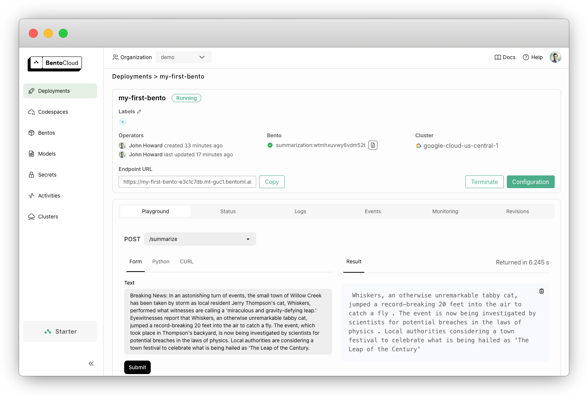

<picture>
    <source media="(prefers-color-scheme: dark)" srcset="https://github.com/bentoml/BentoML/assets/489344/d3e6c95d-d224-49a5-9cff-0789f094e127">
    <source media="(prefers-color-scheme: light)" srcset="https://github.com/bentoml/BentoML/assets/489344/de4da660-6aeb-4e5a-bf76-b7177435444d">
    
</picture>

## Unified Model Serving Framework

🍱 Build model inference APIs and multi-model serving systems with any open-source or custom AI models. 👉 [Join our Slack community!](https://l.bentoml.com/join-slack)

[](https://github.com/bentoml/BentoML?tab=Apache-2.0-1-ov-file)
[](https://github.com/bentoml/bentoml/releases)
[](https://github.com/bentoml/BentoML/actions/workflows/ci.yml?query=branch%3Amain)
[](https://twitter.com/bentomlai)
[](https://l.bentoml.com/join-slack)

## What is BentoML?

BentoML is a Python library for building online serving systems optimized for AI apps and model inference.

- **🍱 Easily build APIs for Any AI/ML Model.** Turn any model inference script into a REST API server with just a few lines of code and standard Python type hints.
- **🐳 Docker Containers made simple.** No more dependency hell! Manage your environments, dependencies and model versions with a simple config file. BentoML automatically generates Docker images, ensures reproducibility, and simplifies how you deploy to different environments.
- **🧭 Maximize CPU/GPU utilization.** Build high performance inference APIs leveraging built-in serving optimization features like dynamic batching, model parallelism, multi-stage pipeline and multi-model inference-graph orchestration.
- **👩‍💻 Fully customizable.** Easily implement your own APIs or task queues, with custom business logic, model inference and multi-model composition. Supports any ML framework, modality, and inference runtime.
- **🚀 Ready for Production.** Develop, run and debug locally. Seamlessly deploy to production with Docker containers or [BentoCloud](https://www.bentoml.com/).

## Getting started

Install BentoML:

```
# Requires Python≥3.9
pip install -U bentoml
```

Define APIs in a `service.py` file.

```python
from __future__ import annotations

import bentoml

@bentoml.service(
    resources={"cpu": "4"}
)
class Summarization:
    def __init__(self) -> None:
        import torch
        from transformers import pipeline

        device = "cuda" if torch.cuda.is_available() else "cpu"
        self.pipeline = pipeline('summarization', device=device)

    @bentoml.api(batchable=True)
    def summarize(self, texts: list[str]) -> list[str]:
        results = self.pipeline(texts)
        return [item['summary_text'] for item in results]
```

Run the service code locally (serving at http://localhost:3000 by default):

```bash
pip install torch transformers  # additional dependencies for local run

bentoml serve service.py:Summarization
```

Now you can run inference from your browser at http://localhost:3000 or with a Python script:

```python
import bentoml

with bentoml.SyncHTTPClient('http://localhost:3000') as client:
    summarized_text: str = client.summarize([bentoml.__doc__])[0]
    print(f"Result: {summarized_text}")
```

### Deploying your first Bento

To deploy your BentoML Service code, first create a `bentofile.yaml` file to define its dependencies and environments. Find the full list of bentofile options [here](https://docs.bentoml.com/en/latest/reference/bentoml/bento-build-options.html).

```yaml
service: 'service:Summarization' # Entry service import path
include:
  - '*.py' # Include all .py files in current directory
python:
  packages: # Python dependencies to include
    - torch
    - transformers
docker:
  python_version: "3.11"
```

Then, choose one of the following ways for deployment:

<details>

<summary>🐳 Docker Container</summary>

Run `bentoml build` to package necessary code, models, dependency configs into a Bento - the standardized deployable artifact in BentoML:

```bash
bentoml build
```

Ensure [Docker](https://docs.docker.com/) is running. Generate a Docker container image for deployment:

```bash
bentoml containerize summarization:latest
```

Run the generated image:

```bash
docker run --rm -p 3000:3000 summarization:latest
```

</details>

<details>

<summary>☁️ BentoCloud</summary>

[BentoCloud](www.bentoml.com) provides compute infrastructure for rapid and reliable GenAI adoption. It helps speed up your BentoML development process leveraging cloud compute resources, and simplify how you deploy, scale and operate BentoML in production.

[Sign up for BentoCloud](https://cloud.bentoml.com/signup) for personal access; for enterprise use cases, [contact our team](https://www.bentoml.com/contact).

```bash
# After signup, run the following command to create an API token:
bentoml cloud login

# Deploy from current directory:
bentoml deploy .
```



</details>

For detailed explanations, read the [Hello World example](https://docs.bentoml.com/en/latest/get-started/hello-world.html).

## Examples

- LLMs: [Llama 3.2](https://github.com/bentoml/BentoVLLM/tree/main/llama3.2-90b-instruct), [Mixtral](https://github.com/bentoml/BentoVLLM/tree/main/mixtral-8x7b-instruct), [Solar](https://github.com/bentoml/BentoVLLM/tree/main/solar-10.7b-instruct), and [Mistral](https://github.com/bentoml/BentoVLLM/tree/main/mistral-7b-instruct).
- Image Generation: [Stable Diffusion 3 Medium](https://github.com/bentoml/BentoDiffusion/tree/main/sd3-medium), [Stable Video Diffusion](https://github.com/bentoml/BentoDiffusion/tree/main/svd), [Stable Diffusion XL Turbo](https://github.com/bentoml/BentoDiffusion/tree/main/sdxl-turbo), [ControlNet](https://github.com/bentoml/BentoDiffusion/tree/main/controlnet), and [LCM LoRAs](https://github.com/bentoml/BentoDiffusion/tree/main/lcm).
- Embeddings: [SentenceTransformers](https://github.com/bentoml/BentoSentenceTransformers) and [ColPali](https://github.com/bentoml/BentoColPali)
- Audio: [ChatTTS](https://github.com/bentoml/BentoChatTTS), [XTTS](https://github.com/bentoml/BentoXTTS), [WhisperX](https://github.com/bentoml/BentoWhisperX), [Bark](https://github.com/bentoml/BentoBark)
- Computer Vision: [YOLO](https://github.com/bentoml/BentoYolo) and [ResNet](https://github.com/bentoml/BentoResnet)
- Advanced examples: [Function calling](https://github.com/bentoml/BentoFunctionCalling), [LangGraph](https://github.com/bentoml/BentoLangGraph), [CrewAI](https://github.com/bentoml/BentoCrewAI)

Check out the [full list](https://docs.bentoml.com/en/latest/examples/overview.html) for more sample code and usage.

## Advanced topics

- [Model composition](https://docs.bentoml.com/en/latest/get-started/model-composition.html)
- [Workers and model parallelization](https://docs.bentoml.com/en/latest/build-with-bentoml/parallelize-requests.html)
- [Adaptive batching](https://docs.bentoml.com/en/latest/get-started/adaptive-batching.html)
- [GPU inference](https://docs.bentoml.com/en/latest/build-with-bentoml/gpu-inference.html)
- [Distributed serving systems](https://docs.bentoml.com/en/latest/build-with-bentoml/distributed-services.html)
- [Concurrency and autoscaling](https://docs.bentoml.com/en/latest/scale-with-bentocloud/scaling/autoscaling.html)
- [Model loading and Model Store](https://docs.bentoml.com/en/latest/build-with-bentoml/model-loading-and-management.html)
- [Observability](https://docs.bentoml.com/en/latest/build-with-bentoml/observability/index.html)
- [BentoCloud deployment](https://docs.bentoml.com/en/latest/get-started/cloud-deployment.html)

See [Documentation](https://docs.bentoml.com) for more tutorials and guides.

## Community

Get involved and join our [Community Slack 💬](https://l.bentoml.com/join-slack), where thousands of AI/ML engineers help each other, contribute to the project, and talk about building AI products.

To report a bug or suggest a feature request, use
[GitHub Issues](https://github.com/bentoml/BentoML/issues/new/choose).

### Contributing

There are many ways to contribute to the project:

- Report bugs and "Thumbs up" on [issues](https://github.com/bentoml/BentoML/issues) that are relevant to you.
- Investigate [issues](https://github.com/bentoml/BentoML/issues) and review other developers' [pull requests](https://github.com/bentoml/BentoML/pulls).
- Contribute code or [documentation](https://docs.bentoml.com/en/latest/index.html) to the project by submitting a GitHub pull request.
- Check out the [Contributing Guide](https://github.com/bentoml/BentoML/blob/main/CONTRIBUTING.md) and [Development Guide](https://github.com/bentoml/BentoML/blob/main/DEVELOPMENT.md) to learn more.
- Share your feedback and discuss roadmap plans in the `#bentoml-contributors` channel [here](https://l.bentoml.com/join-slack).

Thanks to all of our amazing contributors!

<a href="https://github.com/bentoml/BentoML/graphs/contributors">
  
</a>

### Usage tracking and feedback

The BentoML framework collects anonymous usage data that helps our community improve the product. Only BentoML's internal API calls are being reported. This excludes any sensitive information, such as user code, model data, model names, or stack traces. Here's the [code](https://github.com/bentoml/BentoML/blob/main/src/bentoml/_internal/utils/analytics/usage_stats.py) used for usage tracking. You can opt-out of usage tracking by the `--do-not-track` CLI option:

```bash
bentoml [command] --do-not-track
```

Or by setting the environment variable:

```bash
export BENTOML_DO_NOT_TRACK=True
```

### License

[Apache License 2.0](https://github.com/bentoml/BentoML/blob/main/LICENSE)
