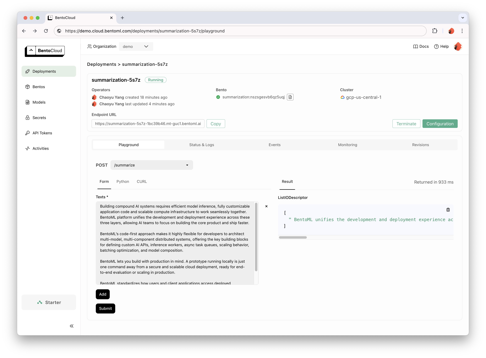

<div align="center">
  
  <h1 align="center">BentoML: The Unified Model Serving Framework</h1>
  <a href="https://pypi.org/project/bentoml"></a>
  <a href="https://github.com/bentoml/BentoML/actions/workflows/ci.yml?query=branch%3Amain"></a>
  <a href="https://twitter.com/bentomlai"></a>
  <a href="https://join.slack.bentoml.org"></a>
  <p>BentoML is an open-source framework for model serving. Developers use BentoML to build model inference APIs and multi-model serving systems with any open-source or custom proprietary AI models.</p>
  <i><a href="https://l.bentoml.com/join-slack">👉 Join our Slack community!</a></i>
</div>

## Highlights

- **The easiest way to build APIs for any AI/ML models.** Turn any model inference script into a REST API server with just a few lines of code.
- **Docker containers made simple, no more dependency hell.** Manage your environments, dependencies and models with ease. BentoML helps ensure reproducibility, automatically generates Docker images, and simplifies running inference across development, testing, and production environments.
- **Get the most out of your CPU/GPU compute resources, ensuring optimal API throughput and latency.** Leverage serving optimization features including dynamic batching, model parallelism, multi-stage pipeline serving, and multi-model orchestration.
- **Customize for your specific needs.** Highly flexible for implementing custom API spec, pre/post-processing, model inference logic, and model composition, all with Python code. Support any ML framework, modality, and inference runtime.
- **Build for Production.** Run and debug locally. When ready, deploy with Docker containers or [BentoCloud](https://www.bentoml.com/).

## Getting started

Install BentoML:

```
# Requires Python≥3.8
pip install bentoml torch transformers
```

Define APIs in a `service.py` file.

```python
import bentoml
from transformers import pipeline
from typing import List

@bentoml.service
class Summarization:
    def __init__(self):
        self.pipeline = pipeline('summarization')

    @bentoml.api(batchable=True)
    def summarize(self, texts: List[str]) -> List[str]:
        results = self.pipeline(texts)
        return list(map(lambda res: res['summary_text'], results))
```

Run the service code locally (serving at http://localhost:3000 by default):

```bash
bentoml serve service.py:Summarization
```

Now you can run inference in your browser at http://localhost:3000 or with a Python client:

```python
import bentoml

with bentoml.SyncHTTPClient('http://localhost:3000') as client:
    text_to_summarize: str = input("Enter text to summarize: ")
    summarized_text: str = client.summarize([text_to_summarize])[0]
    print(f"Summarized text: {summarized_text}")
```

### Deploying your first Bento

To deploy your BentoML Service code, first create a `bentofile.yaml` file to define its dependencies and environments. Find the full list of bentofile options [here](https://docs.bentoml.com/en/latest/guides/build-options.html).

```yaml
service: "service:Summarization" # Entry service import path
include:
  - "*.py" # Include all .py files in current directory
python:
  packages: # Python dependencies to include
  - torch
  - transformers
```

Then, choose one of the following ways for deployment:

<details>

<summary>Docker Container</summary>

Run `bentoml build` to package necessary code, models, dependency configs into a Bento - the standardized deployable artifact in BentoML:

```bash
bentoml build
```

Ensure [Docker](https://docs.docker.com/) is running. Generate a Docker container image for deployment:

```bash
bentoml containerize summarization:latest
```

Follow the printed instructions and run the generated image:

```bash
docker run --rm -p 3000:3000 summarization:latest
```

</details>

<details>

<summary>BentoCloud</summary>

BentoCloud is the AI inference platform for fast moving AI teams. It lets you easily deploy your BentoML code in a fast-scaling infrastructure. [Sign up for BentoCloud](https://cloud.bentoml.com/signup) for personal access; for enterprise use cases, [contact our team](https://www.bentoml.com/contact).

```bash
# After signup, follow login instructions upon API token creation:
bentoml cloud login --api-token <your-api-token>

# Deploy from current directory:
bentoml deploy .
```



</details>

For detailed explanations, read [Quickstart](https://docs.bentoml.com/en/latest/get-started/quickstart.html).

## Use cases

- LLMs: [Llama 3](https://github.com/bentoml/BentoVLLM/tree/main/llama3-8b-instruct), [Mixtral](https://github.com/bentoml/BentoVLLM/tree/main/mixtral-8x7b-instruct), [Solar](https://github.com/bentoml/BentoVLLM/tree/main/solar-10.7b-instruct), [Mistral](https://github.com/bentoml/BentoVLLM/tree/main/mistral-7b-instruct), and [more](https://github.com/bentoml/BentoVLLM)
- Image Generation: [Stable Diffusion](https://github.com/bentoml/BentoSD2Upscaler), [Stable Video Diffusion](https://github.com/bentoml/BentoSVD), [Stable Diffusion XL Turbo](https://github.com/bentoml/BentoSDXLTurbo), [ControlNet](https://github.com/bentoml/BentoControlNet/), [LCM LoRAs](https://github.com/bentoml/BentoLCM)
- Text Embeddings: [SentenceTransformers](https://github.com/bentoml/BentoSentenceTransformers)
- Audio: [XTTS](https://github.com/bentoml/BentoXTTS), [WhisperX](https://github.com/bentoml/BentoWhisperX), [Bark](https://github.com/bentoml/BentoBark)
- Computer Vision: [YOLO](https://github.com/bentoml/BentoYolo)
- Multimodal: [BLIP](https://github.com/bentoml/BentoBlip), [CLIP](https://github.com/bentoml/BentoClip)

See the [examples](./examples/) folder for more use cases.

## Advanced topics

- [Model composition](https://docs.bentoml.com/en/latest/guides/model-composition.html)
- [Workers and model parallelization](https://docs.bentoml.com/en/latest/guides/workers.html)
- [Adaptive batching](https://docs.bentoml.com/en/latest/guides/adaptive-batching.html)
- [GPU inference](https://docs.bentoml.com/en/latest/guides/gpu-inference.html)
- [Distributed serving systems](https://docs.bentoml.com/en/latest/guides/distributed-services.html)
- [Concurrency](https://docs.bentoml.com/en/latest/guides/concurrency.html) and [autoscaling](https://docs.bentoml.com/en/latest/bentocloud/how-tos/autoscaling.html)
- [Model packaging and Model Store](https://docs.bentoml.com/en/latest/guides/model-store.html)
- [Observability](https://docs.bentoml.com/en/latest/guides/observability/index.html)
- [BentoCloud deployment](https://docs.bentoml.com/en/latest/guides/deployment.html)

See [the BentoML documentation](https://docs.bentoml.com/en/latest/index.html) for more topics.

## Community

Get involved and join our [Community Slack 💬](https://l.bentoml.com/join-slack), where thousands of AI/ML engineers help each other, contribute to the project, and talk about building AI products.

To report a bug or suggest a feature request, use
[GitHub Issues](https://github.com/bentoml/BentoML/issues/new/choose).

### Contributing

There are many ways to contribute to the project:

- Report bugs and "Thumbs up" on [issues](https://github.com/bentoml/BentoML/issues) that are relevant to you.
- Investigate [issues](https://github.com/bentoml/BentoML/issues) and review other developers' [pull requests](https://github.com/bentoml/BentoML/pulls).
- Contribute code or [documentation](https://docs.bentoml.com/en/latest/index.html) to the project by submitting a GitHub pull request.
- Check out the [Contributing Guide](https://github.com/bentoml/BentoML/blob/main/CONTRIBUTING.md) and [Development Guide](https://github.com/bentoml/BentoML/blob/main/DEVELOPMENT.md) to learn more.
- Share your feedback and discuss roadmap plans in the `#bentoml-contributors` channel [here](https://l.bentoml.com/join-slack).

Thanks to all of our amazing contributors!

<a href="https://github.com/bentoml/BentoML/graphs/contributors">
  
</a>

### Usage tracking and feedback

The BentoML framework collects anonymous usage data that helps our community improve the product. Only BentoML's internal API calls are being reported. This excludes any sensitive information, such as user code, model data, model names, or stack traces. Here's the [code](https://github.com/bentoml/BentoML/blob/main/src/bentoml/_internal/utils/analytics/usage_stats.py) used for usage tracking. You can opt-out of usage tracking by the `--do-not-track` CLI option:

```bash
bentoml [command] --do-not-track
```

Or by setting the environment variable:

```bash
export BENTOML_DO_NOT_TRACK=True
```

### License

[Apache License 2.0](https://github.com/bentoml/BentoML/blob/main/LICENSE)
