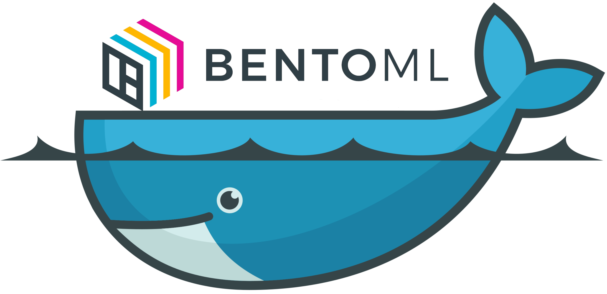

## Table of Content
- [Annoucement](#announcement)
- [Notes](#notes)
- [TLDR](#tldr)
- [Developing](#developing)

## Announcement

The `latest` tag for `model-server` and `yatai-service` has been deprecated on Docker Hub.

Current tag format will also be deprecated. Make sure to update `@env(docker_base_image)` if you are
using BentoML's `model-server` images.

With the removal of `latest` tags, the following usecase is **NOT A BUG**:

```shell
» docker pull bentoml/model-server
Error response from daemon: manifest for bentoml/model-server:latest 
not found: manifest unknown: manifest unknown
```

## Notes
- Dockerfiles in `./generated` directory must have their build context set to **the directory of this README.md** directory to  add `entrypoint.sh` as well as other helpers files. 
- Every Dockerfile is managed via `manifest.yml` and maintained via `manager.py`, which will render the Dockerfile from `Jinja` templates under `./templates`.

An example to generate BentoML's AMI base image with `python3.8` that can be used to install `BentoService` and run on AWS Sagemaker:

```shell
» export PYTHON_VERSION=3.8
  
# DOCKER_BUILDKIT=1 is optional
» DOCKER_BUILDKIT=1 docker build -f ./generated/model-server/amazonlinux2/runtime/Dockerfile \
                            --build-args PYTHON_VERSION=${PYTHON_VERSION} -t bentoml-docker . 
```

## TLDR

For each linux distributions, there will be three type of releases:

| Release Type | Functionality | Supported OS |
|--------------|---------------| -------------|
| `devel`      | nightly build directly from `master` branch | `debian buster`, `centos{7,8}` |
| `cudnn`      | runtime + CUDA and CUDNN  for GPU support | devel supported OS |
| `runtime`    | contains BentoML latest releases from PyPI | devel supported OS + `amazonlinux2`, `alpine3.14` |

Image tags will have the following format:

```markdown
<release_type>-<python_version>-<distros>-<suffix>
   │             │                │        │
   │             │                │        └─> additional suffix, differentiate runtime and cudnn releases
   │             │                └─> formatted <dist><dist_version>, e.g: ami2, slim, centos7
   │             └─> Supported Python version: python3.6 | python3.7 | python3.8
   └─>  Release type: devel or official BentoML release (e.g: 0.13.0)                                           
```

_example of available [tags](https://hub.docker.com/repository/docker/bentoml/model-server/tags?page=1&ordering=last_updated)_:
- `model-server:devel-python3.7-slim`
- `model-server:0.13.0-python3.8-centos8-cudnn`
- `model-server:0.13.0-python3.7-ami2-runtime`

## Developing

[DEV.md](docs/DEV.md) contains more details on generation workflow and management logics.

To add new distros support or new CUDA version, you first have to update `manifest.yml`, add templates with correct format under `./templates`, then run `manager.py` to re-generate new Dockerfiles.

You can use the provided [`Dockerfile`](https://github.com/bentoml/BentoML/blob/master/docker/Dockerfile) to have a fully installed environment.
```shell

# Build the helper docker images. Refers to Makefile for more information.
» DOCKER_BUILDKIT=1 docker build -t bentoml-docker -f Dockerfile .

# Run the built container with correct users permission for the generated file.
» docker run --user $(id -u):$(id -g) -it -v $(pwd):/bentoml bentoml-docker bash 

# Use the provided alias below depending on each tasks.
#
# If you are re-generate Dockerfile you might want to use manager_dockerfiles 
# so that the generated file can have correct permission.
#
# If you are building and pushing Docker images you might want to use manager_images 
# AS ROOT in order to connect to your docker socket mounted to the container
#
» alias manager_dockerfiles="docker run --rm -u $(id -u):$(id -g) -v $(pwd):/bentoml bentoml-docker python3 manager.py "

» alias manager_images="docker run --rm -v $(pwd):/bentoml -v /var/run/docker.sock:/var/run/docker.sock bentoml-docker python3 manager.py "

# Check manager flags
» manager_dockerfiles --helpfull

# To develop manifest files and update schema validation
» manager_dockerfiles --bentoml_version 0.13.0 --validate

# Generate all dockerfiles from templates, and dump all build metadata to metadata.json
» manager_dockerfiles --bentoml_version 0.13.0 --generate dockerfiles

# Build all images
» manager_images --bentoml_version 0.13.0 --generate images

# Build images for specific releases
» manager_images --bentoml_version 0.13.0 --generate images --releases runtime

# Push all images to defined registries under manifest.yml.
» manager_images --bentoml_version 0.13.0 --push_to_hub --releases cudnn
```