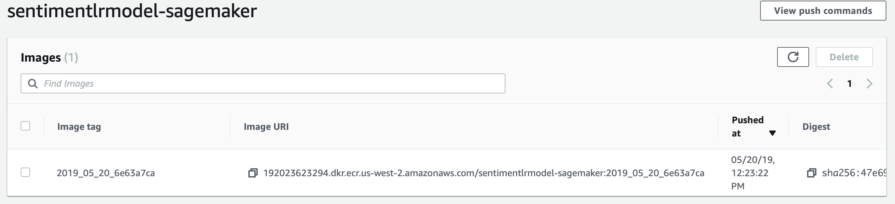
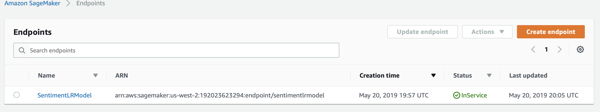
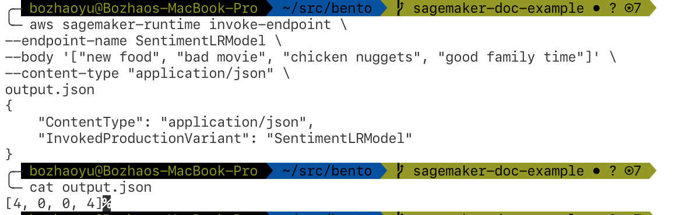
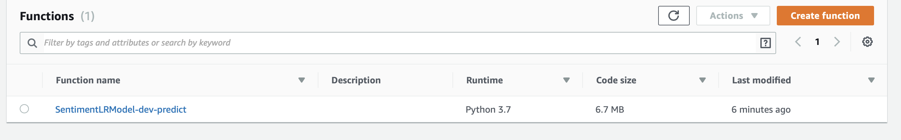
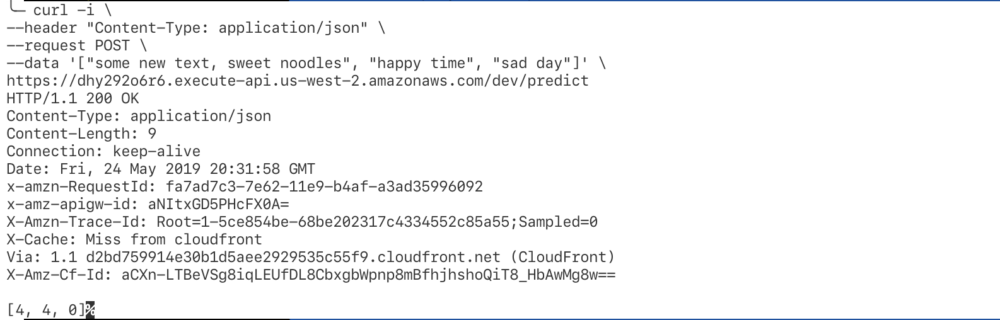

Deployments
===========

Overview
********

BentoML helps deploy bento archive as REST API server to cloud services.
Using the ``bentoml deploy`` command, we can easily deploy to different
cloud services.

|

Deploying to AWS Sagemaker
**************************

AWS Sagemaker is a service for training and serving machine learning models.
With BentoML, you can deploy any custom model to Sagemaker without writing
additional code.

.. code:: bash

    $ bentoml deploy my/bento_archive_path/sentimentLR --platform aws-sagemaker --region us-west2

BentoML will build docker image compatible with Sagemaker locally and push the
image to AWS ECR (Elastic container registry).

After pushing the image to ECR.  BentoML will create configuration and model
for Sagemaker and create endpoint afterward.

Once the endpoint is `InService`, we can make request against it.

|

Deploying to AWS Lambda
***********************

Lambda is a serverless service offer by AWS. Serverless services offer
abilities to scale automatically base on demands, and reduce administrative
operation tasks for users. Deploy to AWS Lambda use the same ``bentoml deploy``
command. For platform, you can choose between ``aws-lambda`` for python 3
project or ``aws-lambda-py2`` for python 2 project.

.. code-block:: bash

    $ bentoml deploy my/bento_archive_path/sentimentLR --platform aws-lambda --region us-west2

After successful deployment, the deployed REST api service will show up in the
AWS lambda's dashboard as a function.

We can make HTTP POST request to the function and get result back from it.

|

Deploying with Docker
*********************

.. code-block:: bash

    $ cd my/bento_archive_path/irisclassifier
    $ docker build . -t iris-classifier-docker-tag

Now we have the docker image, we can push it to our docker image registry, and
from there we can deploy to AWS fargate or any kubernetes cluster.

Deploying with Kubernetes
*************************

Kubernetes is a popular container orchestration system that companies are
using for operation their applications and services. It can run on-prem
or any cloud providers. Since kubernetes can be highly customizable to
work with different configuration and needs, we will provide an simple
example for it.

After building the docker image and pushed it to a docker image registry,
we can use that image to deploy a service to kubernetes cluster. After
applying the configurations to the kubernetes cluster, It will create
a service and expose an endpoint for us to make request with.

.. code-block:: yaml

    apiVersion: extensions/v1beta1
    kind: Deployment
    metadata:
      name: iris-classifier
      namespace: default
    spec:
      replicas: 1
      selector:
        matchLabels:
          name: iris-classifier
      template:
        metadata:
          labels:
            name: iris-classifier
        spec:
          containers:
            - name: iris-classifier
              image: iris-classifier-docker-tag
              imagePullPolicy: Always
              ports:
                - containerPort: 5000
                  protocol: TCP

    ------------

    apiVersion: v1
    kind: Service
    metadata:
      name:iris-classifier
      namespace: default
      labels:
        name: iris-classifier
        app: iris-classifier
    spec:
      ports:
        - port: 80
          name: http
          protocol: TCP
          targetPort: 5000
      selector:
        name: iris-classifier
      type: NodePort
