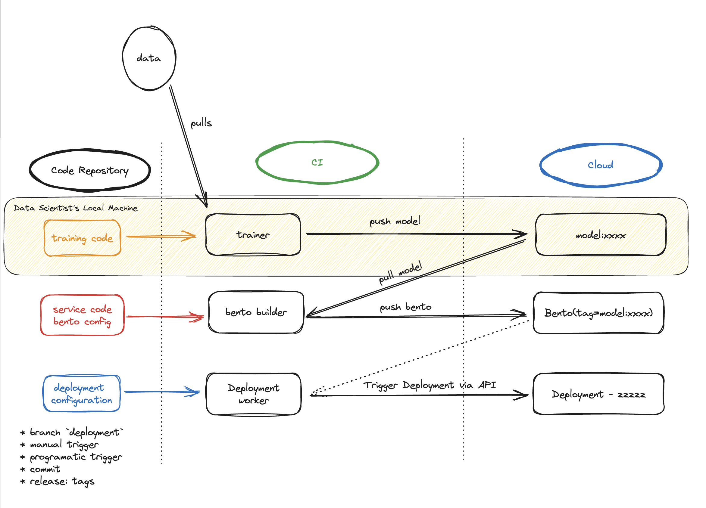

=============================
Bento building and deployment
=============================

Bentos are the distribution unit in the BentoML ecosystem, containing all the necessary files for building AI applications,
such as models, source code, and dependencies. Once you build a Bento and fully test it, you can deploy it on BentoCloud for better management and scaling.
To accelerate the application delivery lifecycle and facilitate the coordination between different team members, you can follow some development best practices.

This page contains a list of best practices for building and deploying Bentos.

Create an automated CI/CD workflow
----------------------------------

Automated Continuous Integration (CI) and Continuous Deployment (CD) workflows streamline the process of integrating code changes from
multiple contributors and ensuring they are ready for production. Leveraging CI/CD offers benefits such as faster time-to-market,
enhanced code quality, and reduced manual intervention, making it an effective tool for application development.

To set up an automated CI/CD workflow on GitHub for Bento Deployments, consider the following GitHub Actions.

* `setup-bentoml-action <https://github.com/bentoml/setup-bentoml-action>`_: Bootstraps BentoML and any required tools to run BentoML in a CI process.
* `build-bento-action <https://github.com/bentoml/build-bento-action>`_: Builds Bentos either from a GitHub repository or from a specified context path.
* `deploy-bento-action <https://github.com/bentoml/deploy-bento-action>`_: Builds and pushes a Bento to BentoCloud by default and optionally creates a new Deployment or updates an existing Deployment on BentoCloud.
* `containerize-push-action <https://github.com/bentoml/containerize-push-action>`_: Creates and pushes Bento images to any container registry (for example, Docker Hub, GHCR, ECR, and GCR).

Depending on your specific needs, you might choose a single action or combine multiple for a comprehensive workflow.
Consider this `BentoCloud CI/CD example <https://github.com/bentoml/bentocloud-cicd-example>`_ of building a text summarization application built upon a Transformer model.
This example uses some of the GitHub Actions workflows mentioned above and includes:

* `models.py <https://github.com/bentoml/bentocloud-cicd-example/blob/main/models.py>`_: Downloads the model that powers the application from Hugging Face for the first time.
  It retrieves the model tag from the ``bentofile.yaml`` file and checks if the model with the tag exists locally; if not, it pulls it from BentoCloud.
* `requirements.txt <https://github.com/bentoml/bentocloud-cicd-example/blob/main/requirements.txt>`_: Dependencies required to run the application.
* `bentofile.yaml <https://github.com/bentoml/bentocloud-cicd-example/blob/main/bentofile.yaml>`_: Specifies the configurations used to build the Bento.
* `service.py <https://github.com/bentoml/bentocloud-cicd-example/blob/main/service.py>`_: Specifies the BentoML Service to define the serving logic and expose the API endpoint.
* `deployment.json <https://github.com/bentoml/bentocloud-cicd-example/blob/main/deployment.json>`_: The JSON configuration used to create or update the application's Bento Deployment on BentoCloud.

Two automated workflows, **Build Bento** and **Deploy to BentoCloud**, are available to simplify the Bento building and deployment processes respectively. The following diagram presents the general workflow from model training to cloud deployment.

Build Bento
^^^^^^^^^^^

The `Build Bento <https://github.com/bentoml/bentocloud-cicd-example/blob/main/.github/workflows/build.yml>`_ workflow is designed to automate the process of building a Bento
whenever there are changes pushed to the ``main`` branch, excluding those made to the ``deployment.json`` file. Specifically, this workflow does the following with the help of `deploy-bento-action <https://github.com/bentoml/deploy-bento-action>`_:

1. Pull the model specified in ``bentofile.yaml`` from BentoCloud. This is done by running ``bentoml models pull``, which pulls the model specified in ``bentofile.yaml`` if the model does not exist locally.
   If you have a new model version, make sure it has already been uploaded to BentoCloud using ``bentoml models push`` and you can then update ``bentofile.yaml`` or ``models.py`` to trigger the workflow.
2. Build a new Bento based on the new model or the new configuration.
3. Push this new Bento to BentoCloud.
4. As the deployment option is set to ``skip``, this workflow does not create or update any Deployment on BentoCloud. To do so, create a separate pull request to update the Bento tag in ``deployment.json``, which triggers the “Deploy to BentoCloud” workflow.

Deploy to BentoCloud
^^^^^^^^^^^^^^^^^^^^

The `Deploy to BentoCloud <https://github.com/bentoml/bentocloud-cicd-example/blob/main/.github/workflows/deploy.yml>`_ workflow is designed to automate the deployment process on BentoCloud whenever there's a change to the ``deployment.json`` file in the repository.
You can use it to update your Deployment's configuration (for example, the maximum and the minimum number of replicas allowed for scaling).

.. note::

   Make sure the Bento Deployment specified in the ``deployment.json`` file is already created on BentoCloud when you use this workflow.
   It only updates the existing Deployment instead of creating a new one.

We recommend you carefully consider the conditions that will trigger deployments and updates to Bentos on BentoCloud when designing an automated CI/CD workflow.
Factors such as file modifications or branch changes can serve as deployment triggers. See `Plan your deployment strategy wisely`_ to learn more.

Use orchestration tools
-----------------------

Machine learning models often need to evolve over time, especially when they're exposed to new or changing data. Regular retraining ensures your models remain accurate and relevant.

For a seamless integration, consider an orchestration job that updates the model tag within the ``bentofile.yaml`` file. Once this modification is committed to the code repository,
it can trigger the pipeline described earlier, ensuring that your application always utilizes the most up-to-date model.

Incorporate tests
-----------------

You can integrate unit and end-to-end tests into the CI process, which are triggered once new Bentos are built.
See :ref:`concepts/bento:Test Bentos` to learn more.

Preview changes with tags
-------------------------

In software development, it's a common practice to generate previews for each pull request made against the primary codebase (``main``).
These previews let contributors and reviewers test and visualize changes directly before they are merged. Adopting a similar approach with BentoCloud can greatly enhance your model deployment workflow.
You can create a minimal Deployment, embedding a tag within the Bento metadata as ``Stage: Preview-<gitSHA>``.
This ensures that every change can be independently reviewed and tested, streamlining the process of integrating updates.

.. _deployment-strategy:

Plan your deployment strategy wisely
------------------------------------

Effective deployment is more than just pushing changes. You may also want to select the right strategy that aligns with your team's workflow,
your application's requirements, and the overall project lifecycle. In terms of deployment automation, consider the following:

* **Automatic deployment with each commit to** ``main``. Deploying Bentos automatically with each commit to the ``main`` branch ensures that your application
  is always up-to-date with the latest changes. This strategy is beneficial for projects that have rigorous testing in place and require frequent updates.
  It guarantees that once changes pass all checks and reviews, they're immediately deployed, ensuring your users always have access to the latest features and fixes.
* **Semi-automatic deployment**. This option provides a balance between automation and manual oversight. They are triggered based on specific conditions, allowing teams to have more control over when and what gets deployed. Semi-automatic deployment triggers include:

  * **Modifications to** ``deployment.json``: Deployments can be triggered based on the ``deployment.json`` file, ensuring that only updates to the configuration lead to a new deployment.
  * **New pushes to the** ``deployment`` **branch**: Instead of deploying from the ``main`` branch, consider a dedicated ``deployment`` branch. Changes are merged into this branch when they are ready for deployment, separating feature development from the deployment process.
  * **Release tags**: Deployments can be triggered based on release tags. This approach is especially useful for version-controlled applications. When a new version is ready, a tag is created, prompting the deployment process. This ensures that only stable, vetted versions of the application get deployed.
  * **Manual CI job triggers**: Sometimes, the best approach is human judgment. Allowing team members to manually trigger deployment jobs ensures that deployments only happen when the team is confident about the changes. This method is particularly useful during critical periods or when deploying significant or potentially disruptive updates.
