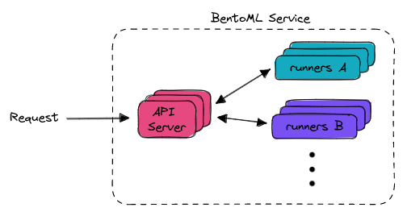

================
Scale for Growth
================

In the previous parts of our 'Getting Started' series:

- :doc:`Getting Started -- Build AI Application <build>`
- :doc:`Getting Started -- Ship To Production <ship>`

We've shown you how to build your application with BentoML and deploy it using BentoCloud. Now, in this final article, we'll explain how BentoCloud makes scaling your application straightforward. BentoCloud is a fully managed platform that aims to relieve users of infrastructure concerns, allowing you to pay only for what you use.

-------------------
Resource Management
-------------------

~~~~~~~~~~~~~~~~~~~~~~
Auto Scaling Instances
~~~~~~~~~~~~~~~~~~~~~~

BentoCloud is built distributedly, taking full advantage of the auto scaling capabilities provided by its  `Horizontal Pod Autoscaler <https://kubernetes.io/docs/tasks/run-application/horizontal-pod-autoscale/>`_ (HPA). 
We've set up a range of metrics that trigger the autoscaler, while also giving expert users the freedom to override these default scaling policies. This can be done via a JSON editor or directly through the BentoCloud API.

.. image:: ../../_static/img/bentocloud/scale-autoscale.png

For those seeking advanced scaling behaviour, your services can scale according to `custom metrics <https://kubernetes.io/docs/tasks/run-application/horizontal-pod-autoscale/#scaling-on-custom-metrics>`_. 
This feature is exclusively available to users with **Enterprise** plan.

~~~~~~~~~~
Scale-To-Zero
~~~~~~~~~~

When you deploy a Bento, you can opt for an on-demand function mode of deployment. 
This is BentoML's serverless approach, ideally suited for use cases where ML models are large, such as high-resolution image models or large language models. 
Instances can scale down to zero when not in use, offering a cost-effective solution, especially when using pricier GPU instances.

.. image:: ../../_static/img/bentocloud/scale-serverless.png

~~~~~~~~~~~~~~~
Traffic Control
~~~~~~~~~~~~~~~

You can adjust timeouts and queue management strategies for each component of a deployment (**Runners** and **API Servers**).
Queuing request allowing requests to be served more reliably, during cold-start and service overload. 
The figure below illustrates how a BentoML Service works.

These settings can be found under the `Advanced` tab when creating a new deployment. This flexibility allows teams to align their service to meet business SLOs (Service Level Objectives) and engineering SLAs (Service Level Agreements).

.. image:: ../../_static/img/bentocloud/scale-traffic-control.png

~~~~~~~~~~~~~~~
Instance Rightsizing
~~~~~~~~~~~~~~~
BentoCloud offers the flexibility to define the instance sizes for your **API Server** and **Runners** independently. 
This allows you to optimize your resource allocation based on your specific needs. 
For example, you might choose to have a greater number of smaller nodes for your **API Server**, which handles many small tasks concurrently. 
In contrast, for **Runners** that often require more computational power for data processing or machine learning tasks, you may opt for fewer but larger-sized nodes.

----------
Next Steps
----------

Through the **BUILD, SHIP, and SCALE** series, we've showcased the key features of BentoCloud. 

Next up, you can:

- Explore sample projects in :ref:`Bento Gallery <bento-gallery>`.
- Check out some of our How-Tos
    - :doc:`Manage Models and Bentos </bentocloud/how-tos/manage-models-and-bentos>`
    - :doc:`Deploy Bentos </bentocloud/how-tos/deploy-bentos>`
- Start Building your :doc:`BentoML application </index>`

