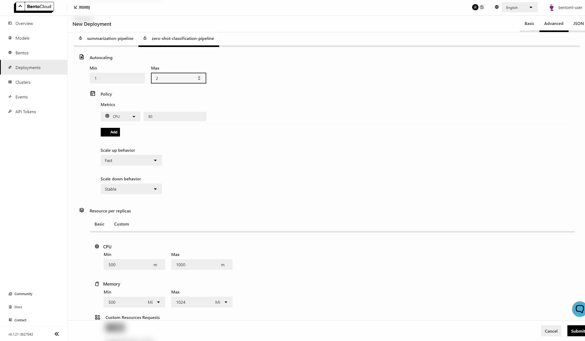
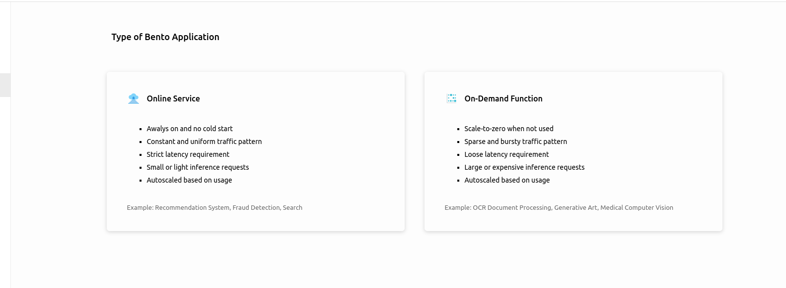

================
Scale for Growth
================

In the previous parts of our 'Getting Started' series:

* :doc:`/bentocloud/getting-started/build`
* :doc:`/bentocloud/getting-started/ship`

We've shown you how to build your application with BentoML and deploy it using BentoCloud. Now, in this final article, we'll explain how BentoCloud makes scaling your application straightforward. BentoCloud is a fully managed platform that aims to relieve users of infrastructure concerns, allowing you to pay only for what you use.

-------------------
Resource Management
-------------------

~~~~~~~~~~~~~~~~~~~~~~
Auto Scaling Instances
~~~~~~~~~~~~~~~~~~~~~~

BentoCloud is designed with scalability at its core. Scaling operations can be performed based on various parameters including CPU or GPU usage, or metrics related to traffic volume. The platform's advanced configuration settings enable a wide range of scaling behaviors, accommodating needs from rapid scaling for high-growth scenarios to stable scaling for consistent demand levels. Importantly, BentoCloud operates on a pay-as-you-go model, ensuring users are only charged for the resources they have actually utilized, promoting cost-efficiency and flexibility.

For those seeking advanced scaling behaviour, your services can scale according to `custom metrics <https://kubernetes.io/docs/tasks/run-application/horizontal-pod-autoscale/#scaling-on-custom-metrics>`_.
This feature is exclusively available to users with **Enterprise** plan.

~~~~~~~~~~
Scale-To-Zero
~~~~~~~~~~

BentoCloud supports deploying applications as on-demand functions, enhancing its flexibility and resource efficiency. In this deployment mode, instances can scale down to zero when there's no usage on the API server or runners, minimizing idle resources. To ensure high reliability during a cold start, BentoCloud queues requests, preventing potential overloads. This deployment strategy is particularly advantageous for applications handling a large number of models and sporadic requests, as only those models actively in use are allocated resources. Additionally, this mode of operation provides significant cost efficiency, especially for GPU-accelerated instances, by tailoring resource allocation to real-time demand.

~~~~~~~~~~~~~~~
Traffic Control
~~~~~~~~~~~~~~~

You can adjust timeouts and queue management strategies for each component of a deployment (**Runners** and **API Servers**).
Queuing request allowing requests to be served more reliably, during cold-start and service overload.
The figure below illustrates how a BentoML Service works.

.. image:: ../../_static/img/bentocloud/scale-traffic-control.png

These settings can be found under the `Advanced` tab when creating a new deployment. This flexibility allows teams to align their service to meet business SLOs (Service Level Objectives) and engineering SLAs (Service Level Agreements).

~~~~~~~~~~~~~~~
Instance Rightsizing
~~~~~~~~~~~~~~~
BentoCloud offers the flexibility to define the instance types and sizes for your **API Server** and **Runners** independently.
This allows you to optimize your resource allocation based on your specific needs.
For example, you might choose to have a greater number of smaller nodes for your **API Server**, which handles many small tasks concurrently.
In contrast, for **Runners** that often require more computational power for data processing or model inference, you may opt for fewer but GPU accelerated nodes.

----------
Next Steps
----------

Through the **BUILD, SHIP, and SCALE** series, we've showcased the key features of BentoCloud.

Next up, you can:

- Explore sample projects in :ref:`Bento Gallery <bento-gallery>`.
- Check out some of our How-Tos
    - :doc:`Manage Models and Bentos </bentocloud/how-tos/manage-models-and-bentos>`
    - :doc:`Deploy Bentos </bentocloud/how-tos/deploy-bentos>`
- Start Building your :doc:`BentoML application </index>`
