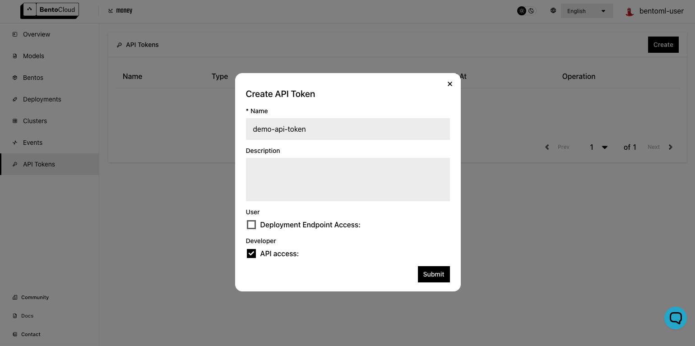

==================
Ship to Production
==================

BentoCloud offers a full suite of MLOps lifecycle management tools right off the bat, enabling developers and ML practitioners to zero in on **BUILDING** while we take care of the intricate infrastructure work.

The topics covered in this article are:

- **Deploy** your Bento into production within minutes
- Manage application versioning and deployment revisions
- Integrate with popular **MLOps** ecosystem tooling
- Activate **GPU** acceleration with a simple click
- Utilize out-of-the-box DevOps and ML **Observability**

Having crafted a Bento as illustrated in the preceding section, :doc:`/bentocloud/getting-started/build`, we now progress to the next stage: launching it into production using BentoCloud.

.. note::
    BentoML offers various deployment alternatives, for more details visit :doc:`/concepts/deploy`.

-------------------
Acquiring API Token
-------------------

To transfer your model from the local store to BentoCloud, you'll first need to secure an API Token. Navigate to `<https://cloud.bentoml.com/api_tokens>`_ and click on `Create`.

Next, log in via the BentoML CLI in your terminal using the following command:

.. code-block:: bash

    bentoml yatai login --api-token <your-api-token> --endpoint <https://cloud.bentoml.com>

If the login is successful, you should see the following output:

.. code-block:: bash

    Successfully logged in as user "user" in organization "mybentocloud".

.. note::
    BentoCloud organizations function as collaborative workspaces where your team can effectively manage models and bentos. Additionally, these organizations facilitate the management and monitoring of active deployments, enabling you to track the creations of your team efficiently.

------------------
Pushing Your Bento
------------------

After successfully logging in, you're ready to launch your meticulously built Bento into BentoCloud. Run the following command:

.. code-block:: bash

    bentoml push <BENTO_TAG>

In case you've forgotten your Bento's tag, simply run ``bentoml list``. You should see an output similar to the following:

.. code-block:: bash

    Tag                                        Size      Creation Time
    clip-api-service:z2u7b7h3iwhtolpj          3.70 GiB  2023-05-26 05:48:12
    clip-api-service:shnbulx3hwhtolpj          1.59 GiB  2023-05-26 04:49:47
    transformers-nlp-service:xzenqqxu225nxa3e  1.25 GiB  2023-05-18 01:29:05
    transformer-nlp-service:t4nq34xjxsfx6x33   1.97 GiB  2023-05-03 22:13:08
    multi-tasks-nlp:nz3wxxhjxsfx6x33           1.97 GiB  2023-05-03 22:11:47

After successfully pushing your Bento, navigate to `<https://cloud.bentoml.com/bento_repositories>`_ and you'll find your Bento deployed in BentoCloud!

.. image:: ../../_static/img/bentocloud/ship-pushed-bento.png

--------------------
Deploying your Bento
--------------------

Bento can be deployed in two ways: as an Online Service or as a Serverless Function. The choice depends on your specific use-case. You can learn more about the implications and best scenarios for each method in :doc:`/concepts/deploy`.

In this tutorial, we'll proceed with the "Online Service" mode:

.. image:: ../../_static/img/bentocloud/create-deployment.png

Please follow these steps:

1. Choose the appropriate **Cluster**.
2. Give your **deployment** a unique name, for instance, ``my-first-deployment``.
3. Choose the desired **Bento Repository** and select the correct **Bento Version**.

After setting up, wait for the deployment status to turn green. This indicates your Bento is successfully deployed and ready to serve.

.. note::
    In the **Advanced** Configuration section, users gain detailed control over various aspects of their resources. These include traffic management, deployment and scaling policies, user-defined variables, and BentoML configuration. The **JSON** configuration provides a data-oriented way to represent the deployment, which is particularly useful for programmatic deployments conducted through the Python client or CLI.

~~~~~~~~~~~~~~~~~~~~~~~~~~~~~~~~
Interacting with Your Deployment
~~~~~~~~~~~~~~~~~~~~~~~~~~~~~~~~

Now it's time to test out your newly deployed service! Visit your `Deploymnet URL` and you'll be greeted with a Swagger UI. This interface lets you conveniently send requests to your deployment for testing.

Feel free to click `Try it out` with the input sample data. Alternatively, you can send a request directly from your terminal using `cURL`:

.. code-block:: bash

    curl -X 'POST' \
      'http://<your-deployment-url>/summarize' \
      -H 'accept: text/plain' \
      -H 'Content-Type: text/plain' \
      -d 'Your Text Here'

--------------------
Team Collaboration
--------------------

Scaling isn't limited to handling larger workloads; it's also about fostering collaboration within and across teams.
BentoCloud facilitates this process through its **Model and Bento Repositories**.

These repositories provide a platform for team members to **publish**, **share**, and **distribute** their work with ease. You can also **import pre-trained models** from popular repositories such as HuggingFace's model hub.

Furthermore, it promotes **reusability** as different teams can leverage the same models for different projects, enhancing efficiency and consistency in model deployment.

------------------------
Versioning and Revisions
------------------------

Within the dynamic field of Machine Learning, systems typically evolve in two ways:

1. **Code Changes**:
Much like traditional software development, engineers modify the code base, implementing bug fixes, new features, and updates to data processing routines.

2. **Data/Model Changes**:
Without altering any code, Machine Learning practitioners may retrain an existing model with a different dataset. This adjustment can result in the system producing different output behavior.

Both types of changes merit the creation of a newly built Bento. In BentoML, Bentos are **uniquely referenced** with the **name** and **versioned** according to their **tags**, allowing you to track the evolution of your projects over time. You can also assign additional **labels** to each version, providing extra granularity for downstream deployment filtering.

The same principles apply to **Deployments**. You can iteratively create new revisions of your service with various configurations, such as a new bento version or different resource settings. If a new deployment exhibits undesired behavior, you have the flexibility to revert back to a previous, stable version at any time.

.. image:: ../../_static/img/bentocloud/ship-versioning.png

-------------
Observability
-------------

On the BentoCloud platform, you have the capability to monitor the status and health of both deployments and models. For application-level monitoring, the platform provides access to logs, metrics, and traces for each individual deployment, providing you with a comprehensive overview of application performance. For model-level monitoring, you can collect inference data with the :ref:`model monitoring API <guides/monitoring:Build an ML Application with monitoring API>` and track model drift over time using a monitoring platform of your choice.
For a more detailed understanding of the observability offerings of BentoCloud, see :doc:`Observability </bentocloud/topics/observability>`

-----------
Wrapping Up
-----------

This article has guided you through the process of deploying your ML application using BentoCloud.

Next up, in our :doc:`following article <scale>`, we'll explore how BentoCloud supports the scaling of your application.
