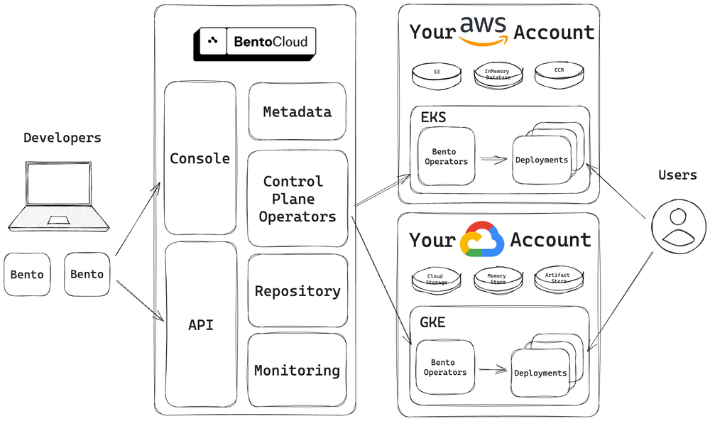

====================
Bring Your Own Cloud
====================

BentoCloud's Bring Your Own Cloud (BYOC) option, part of the Enterprise plan, combines the advantages of both self-hosting and fully managed services. This means it not only ensures data privacy and security for you and but also helps you offload operations and maintenance burdens.

BentoCloud's BYOC offers a full featured AI inference platform which can be deployed into any organization's private cloud environment for maximum control and customization.

Architecture
------------

BYOC allows you to fully own your data infrastructure and network while we manage them for you. You can choose to host your services in any cloud account from providers such as AWS, Google Cloud, Microsoft Azure, or Oracle Cloud Infrastructure. The architecture diagram below illustrates the BYOC setup:

In the BYOC model, Bento operators and Deployments are deployed in your Virtual Private Cloud (VPC), ensuring that all data is securely stored in your own environment.
To create the necessary cloud resources required by operators within your account, BentoCloud requires relevant permissions to execute infrastructure-as-code automation.
This procedure automates the creation of resources like:

- Kubernetes clusters (for example, AWS EKS and Google Cloud GKE)
- Object storage (for example, AWS S3 and Google Cloud Storage)
- Key-value stores (for example, InMemory Database and Memory Store)

Once the BYOC setup is ready, developers can deploy Bentos through the BentoCloud Console or the BentoML CLI. The BentoCloud Control Plane, deployed outside of your private environment,
interacts with remote operators within your Kubernetes cluster, ensuring accurate and real-time state synchronization and updates according to the configurations defined.

Why BYOC?
---------

BYOC provides you with greater autonomy over your data infrastructure, catering to critical requirements in privacy, flexibility, and cost-effectiveness.

Data privacy
^^^^^^^^^^^^

Data privacy has become increasingly important in the age of AI. Generative AI, such as large language models (LLMs), often processes vast amounts of data that might include sensitive information. BYOC ensures your data and models remain within your VPC and that you can still use them with the latest foundational models and AI inference technologies.

Cost efficiency
^^^^^^^^^^^^^^^

BYOC instantiates computational resources in the same environment as your data, effectively minimizing the hefty egress charges that might incur due to data transfer out of your cloud account. For businesses that process vast volumes of data on a regular basis, executing model inference within your cloud environment can lead to substantial cost savings.

Credits and discounts
^^^^^^^^^^^^^^^^^^^^^

If you're involved with a startup or an incubator program, you likely qualify for cloud credits and discounts from leading cloud service providers. To maximize the benefit of these credits and discounts, you must build an infrastructure that integrates with all these providers. BentoCloud's BYOC automatically generates cloud resources with your permissions and install operators for the different providers. This offers you a consistent interface to manage Deployments across all cloud platforms and you are able to leverage any available credits or discounts on them.

GPU availability
^^^^^^^^^^^^^^^^

For AI applications, GPUs are both a necessity and a rarity. With BentoCloud's BYOC, you can select the cloud provider offering the most abundant and optimal GPU resources, while also considering pricing or discount factors for better cost efficiency.

No vendor lock-in
^^^^^^^^^^^^^^^^^

BentoCloud's architecture is built with standard cloud components, ensuring it's compatible with all general-purpose cloud providers. This design ensures your infrastructure stays independent from any specific cloud vendor, granting you the freedom to adapt, switch, or expand your cloud strategy as your needs evolve.

Get started
-----------

As a part of the Enterprise plan, the BentoCloud BYOC deployment option is available to both new and existing customers.
You can choose to deploy it on AWS, Google Cloud, Microsoft Azure, Oracle Cloud Infrastructure, and other cloud platforms.
If you are interested in the plan, visit the `BentoML website <https://www.bentoml.com>`_ or `contact us <https://www.bentoml.com/contact>`_.
