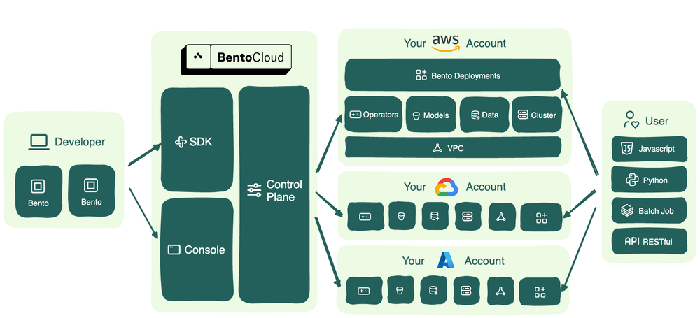

====================
Bring your own cloud
====================

BentoCloud provides Bring Your Own Cloud (BYOC) as a part of the Enterprise plan, which allows you to run BentoCloud services within your
private cloud environment. This means the BentoCloud Control Plane and the Data Plane are separated, enabling you to stay closer to your data
and meet any data compliance requirements. In addition, you are also able to leverage any available cloud credits and discounts.

Architecture
------------

With BYOC, the data infrastructure and network are owned by you and managed by us. You can choose any of your cloud accounts.
We support platforms like AWS, Google Cloud, Microsoft Azure, and Oracle Cloud Infrastructure. The following diagram presents the BYOC architecture:

When you choose BYOC, Bento operators and Deployments are deployed in your Virtual Private Cloud (VPC), ensuring that all data is securely stored in your own environment.
To create the necessary cloud resources required by operators within your account, BentoCloud requires relevant permissions to execute infrastructure-as-code automation.
This procedure automates the creation of resources like:

- Kubernetes clusters (for example, AWS EKS and Google Cloud GKE)
- Object storage (for example, AWS S3 and Google Cloud Storage)
- Key-value stores (for example, InMemory Database and Memory Store)

Once the BYOC setup is ready, developers can deploy Bentos through the BentoCloud Console or the BentoML CLI. The BentoCloud Control Plane, deployed outside of your private environment,
interacts with remote operators within your Kubernetes cluster, ensuring accurate and real-time state synchronization and updates according to the configurations defined.

Why BYOC?
---------

BYOC provides you with greater autonomy over your data infrastructure, catering to critical requirements in privacy, flexibility, and cost-effectiveness.

Data privacy
^^^^^^^^^^^^

Data privacy has become increasingly important in the age of artificial intelligence (AI). Generative AI, such as large language models (LLM),
often processes vast amounts of data that might include sensitive information. BYOC guarantees your data remains within your VPC,
thus ensuring your sensitive data never leaves the network.

Cost efficiency
^^^^^^^^^^^^^^^

The BYOC deployment option positions computational resources close to your data, effectively minimizing the hefty egress charges that might incur
due to data transfer out of your cloud account. For businesses that process vast volumes of data on a regular basis, executing model inference within your
cloud environment can lead to substantial cost savings.

Credits and discounts
^^^^^^^^^^^^^^^^^^^^^

If you're involved with a startup or an incubator program, you likely qualify for cloud credits and discounts from leading cloud service providers.
To maximize the benefit of these credits and discounts, you must build an infrastructure that integrates with all these providers.
BentoCloud BYOC automatically generates cloud resources with your permissions and install operators for the different providers.
This offers you a consistent interface to manage Deployments across all cloud platforms and you are able to leverage any available credits or discounts on them.

GPU availability
^^^^^^^^^^^^^^^^

For AI applications, GPUs are both a necessity and a rarity. With BYOC, you can select the cloud provider offering the most abundant and optimal GPU resources,
while also considering pricing or discount factors for better cost efficiency.

No vendor lock-in
^^^^^^^^^^^^^^^^^

BentoCloud's architecture is built upon standard non-proprietary cloud utilities, ensuring compatibility with all general-purpose cloud providers.
This design ensures that your infrastructure stays independent from any specific cloud vendor, granting you the freedom to adapt, switch, or expand your cloud strategy as your needs evolve.
Such adaptability not only secures your operations for the future but also ensures you aren't tethered to a single provider's ecosystem.

Get started
-----------

As a part of the Enterprise plan, the BentoCloud BYOC deployment option is available to both new and existing customers.
You can choose to deploy it on AWS, Google Cloud, Microsoft Azure, Oracle Cloud Infrastructure, and other cloud platforms.
If you are interested in the plan, visit the `BentoCloud website <https://www.bentoml.com/cloud>`_ or `contact us <mailto:contact@bentoml.com>`_.
