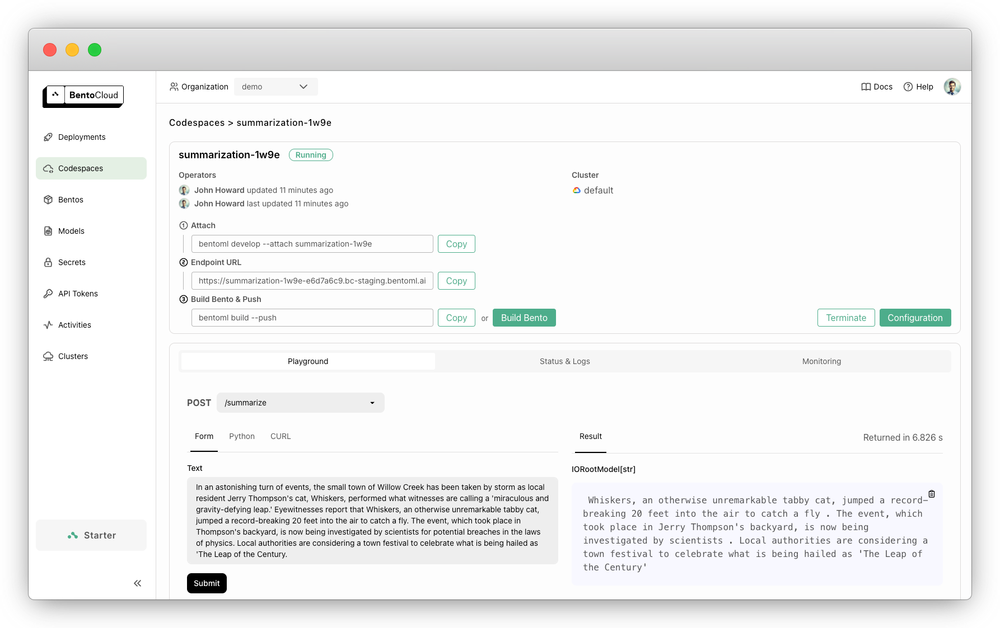

=======================
Develop with Codespaces
=======================

Codespaces provide a cloud-based development environment that allows you to run AI applications directly on BentoCloud as you develop. With access to various instance types, including GPUs, Codespaces make it easy to develop multi-Service, GPU-powered applications.

By connecting your local IDE to a remote Codespace, you can see real-time changes on BentoCloud, as the Codespace automatically hot-reloads when it detects local updates. This ensures your development environment mirrors production, so you can build with confidence.

Create a Codespace
------------------

1. Navigate to the directory where your ``bentofile.yaml`` file is located. You can use the :doc:`Quickstart project </get-started/quickstart>` as an example.
2. Run the following command to create a Codespace:

   .. code-block:: bash

      bentoml code

3. (Optional) If your project requires secure environment variables like API keys, we recommend you create :doc:`secrets </bentocloud/how-tos/manage-secrets>` for them. For example:

   .. code-block:: bash

      bentoml secret create huggingface HF_TOKEN=<your_hf_token>
      bentoml code --secret huggingface

4. Follow the on-screen instructions to create a new Codespace (or attach to an existing one) as prompted. Once created, you can view it in the **Codespaces** section of BentoCloud.

   .. image:: ../../_static/img/bentocloud/how-to/codespaces/codespace-on-bentocloud.png

Test your application
---------------------

Once the Codespace is up and running, you can test your application by calling its exposed endpoint.

While developing with your Codespace, the following changes will be automatically synchronized between your local environment and the Codespace. This means any local code updates will be reflected in the remote Codespace, automatically triggering a reload.

- BentoML Service code, including adding or deleting Services
- Models
- System packages
- Python requirements

Codespace logs will stream directly to your terminal, giving you real-time feedback on your application's performance. You can also debug the application using the provided endpoint URL on the Codespace details page.

Note that the following changes cannot be synchronized:

- Python version (Codespaces currently use Python 3.11)
- Base image and Docker options

Build your Bento
----------------

Once development is complete, you can build your Bento directly from a Codespace. To do this, click the **Build Bento** button.

After the build is successful, you can view the Bento and create a Deployment with it.

After development
-----------------

To exit the Codespace from your terminal, press ``Ctrl+C``. Note that this **DOES NOT** terminate the remote Codespace automatically. To terminate a remote Codespace, run the following command:

.. code-block:: bash

   bentoml deployment terminate <codespace_name>

Reattach to an existing Codespace
---------------------------------

To reattach to a previously created Codespace, use the following command:

.. code-block:: bash

   bentoml code --attach <codespace_name>

This will synchronize the remote Codespace with your current local code.
