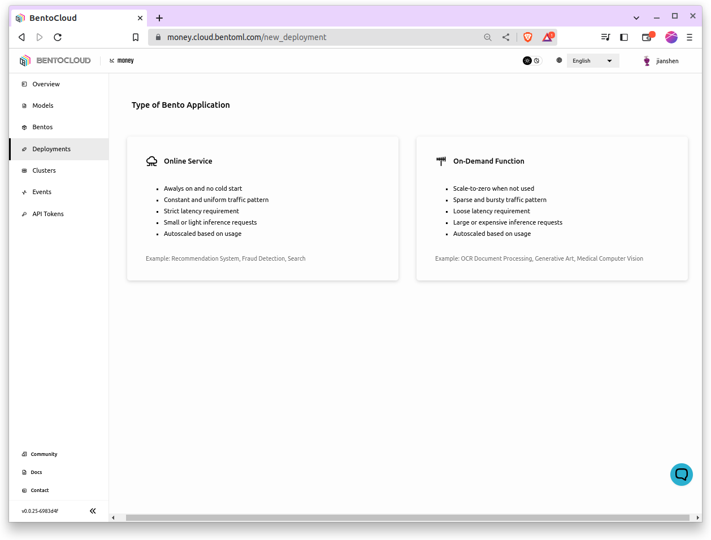
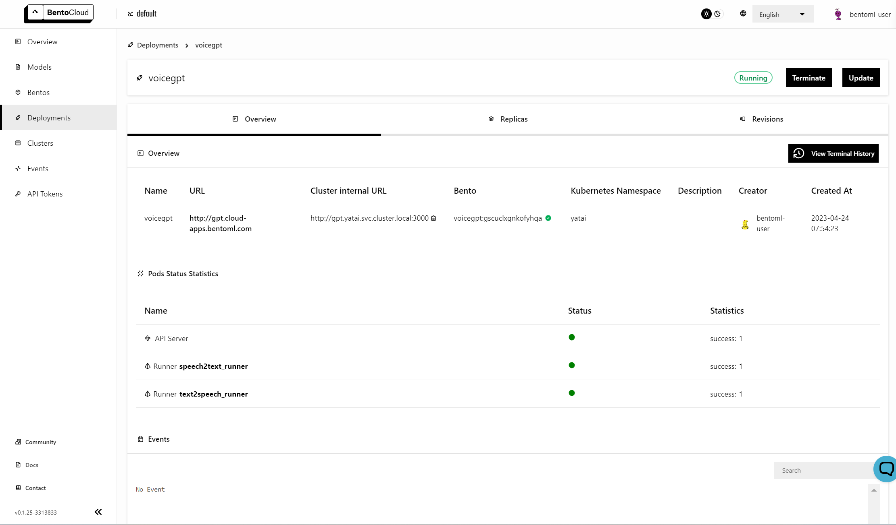

================
Deploy Bentos
================

Deploying a machine learning model can be quite a task. However, BentoCloud simplifies the process by enabling you to serve your model as an online service or on-demand function. This guide will walk you through how to deploy a Bento on BentoCloud.

Deployment Mode
==============

There are two modes of deployment on BentoCloud:

--------------
Online Service
--------------

The online service mode of deployment offered by BentoCloud is ideal for low-latency serving scenarios. To ensure requests can be promptly addressed, instances in this mode are never scaled down to zero, maintaining a ready state for immediate processing. Furthermore, requests are directly routed to the serving instances of the API Server and Runners, bypassing any queuing mechanisms. This direct routing mechanism ensures minimum latency, providing an efficient and swift response to incoming requests.

----------------------
On-Demand Function
----------------------

The on-demand function mode of deployment offered by BentoCloud is particularly suited for situations that prioritize cost-efficiency and reliability. In scenarios where requests are sporadic, this mode enables instances to scale down to zero, thereby conserving resources. This feature proves particularly beneficial for GPU-accelerated instances, which are generally more expensive to maintain. To ensure maximum reliability, especially during periods of cold-start or overload, requests are queued prior to processing. This mechanism enables the system to handle bursts of requests effectively, thus enhancing the robustness and dependability of your application under varying load conditions.

Building Your Bento
===================

1. To build your machine learning application into a Bento, check out this :doc:`/concepts/bento` in BentoML’s doc.
2. To push your Bento to BentoCloud, do ``bentoml push <name>:<tag>``.  See :doc:`manage-models-and-bentos` for more details.

Deploying Your Bento
====================

1. Navigate to the Deployment section on your BentoCloud dashboard. Click the  `Create` button in the upper right corner.
2. Choose the deployment type (Online Service or On-Demand Function)

3. Name your deployment, select the Bento you want to deploy, and specify other details like the number of instances, the amount of memory, and more.

.. image:: ../../_static/img/bentocloud/create-deployment.png

4. Click the 'Submit' button.

Under the hood, the Bento is being built into an OCI Image to be deployed in BentoCloud. The deployment might take a few minutes, depending on your configuration.

Viewing your Deployment
=======================

After your Bento is deployed, you can check the status of the deployment by:

1. Navigating to the `Deployment <http://cloud.bentoml.com/deployment>`_ page of your BentoCloud dashboard.
2. Selecting the deployment you're interested in.

This will display various details about your deployment, such as its status, health, URL, number of instances, and more.

Interacting with Your Deployment
================================

Now that your model is deployed, you can send requests to it. Here's an example of how to send a request to your deployed model using ``curl``:

For HTTP-based servers, include the token in the header of your HTTP request like this:

.. code-block:: bash

   curl "http://flan.bentocloud.com/predict" \
     -H "Content-Type: application/json" \
     -H "Authorization: Bearer $YOUR_TOKEN" \
     --data '{"prompt": "What state is Los Angeles in?", "max_length": 100}'

The exact way you interact with your deployment will depend on the :doc:`Service </concepts/service>`
endpoints and the :ref:`io-descriptors` of the endpoint.
