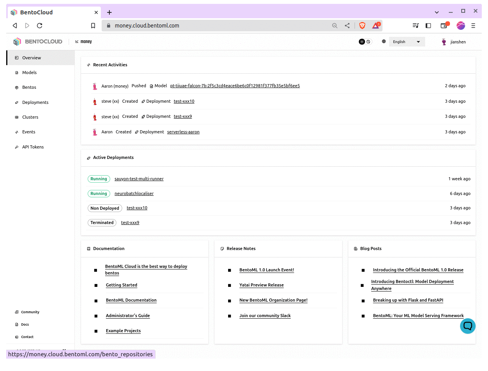

================
Deploy Bentos
================

Deploying a machine learning model can be quite a task. However, BentoCloud simplifies the process by enabling you to serve your model as an online service or on-demand function. This guide will walk you through how to deploy a Bento on BentoCloud.

Online Service vs On-Demand Function
=====================================

There are two modes of deployment on BentoCloud:

1. **Online Service:** This type of deployment spins up a persistent server that serves your model and is ideal for cases where low latency responses are crucial. A minimum of one running instance is required.
2. **On-Demand Function:** In this mode, instances are created when requests come in and are shut down when idle. During cold start, requests will be queued while the instance is spinning up. This approach is cost-effective for sporadic workloads, and for larger models like LLMs and Image models, as GPU instances can scale to zero when not in use.

Building Your Bento
===================

1. To build your machine learning application into a Bento, check out this :doc:`/concepts/bento` in BentoML’s doc.
2. To push your Bento to BentoCloud, do ``bentoml push <name>:<tag>``.  See :doc:`manage-models-and-bentos` for more details.

Deploying Your Bento
====================

1. Navigate to the Deployment section on your BentoCloud dashboard. Click the  `Create` button in the upper right corner.
2. Choose the deployment type (Online Service or On-Demand Function)

.. image:: ../../_static/img/bentocloud/type-of-deployment.png

3. Name your deployment, select the Bento you want to deploy, and specify other details like the number of instances, the amount of memory, and more.

.. image:: ../../_static/img/bentocloud/create-deployment.png

4. Click the 'Submit' button.

Under the hood, the Bento is being built into an OCI Image to be deployed in BentoCloud. The deployment might take a few minutes, depending on your configuration.

Viewing your Deployment
=======================

After your Bento is deployed, you can check the status of the deployment by:

1. Navigating to the `Deployment <http://cloud.bentoml.com/deployment>`_ page of your BentoCloud dashboard.
2. Selecting the deployment you're interested in.

This will display various details about your deployment, such as its status, health, URL, number of instances, and more.

Interacting with Your Deployment
================================

Now that your model is deployed, you can send requests to it. Here's an example of how to send a request to your deployed model using ``curl``:

For HTTP-based servers, include the token in the header of your HTTP request like this:

.. code-block:: bash

   curl "http://flan.bentocloud.com/predict" \
     -H "Content-Type: application/json" \
     -H "Authorization: Bearer $YOUR_TOKEN" \
     --data '{"prompt": "What state is Los Angeles in?", "max_length": 100}'

The exact way you interact with your deployment will depend on the :doc:`Service </concepts/service>` 
endpoints and the :ref:`io-descriptors` of the endpoint.
