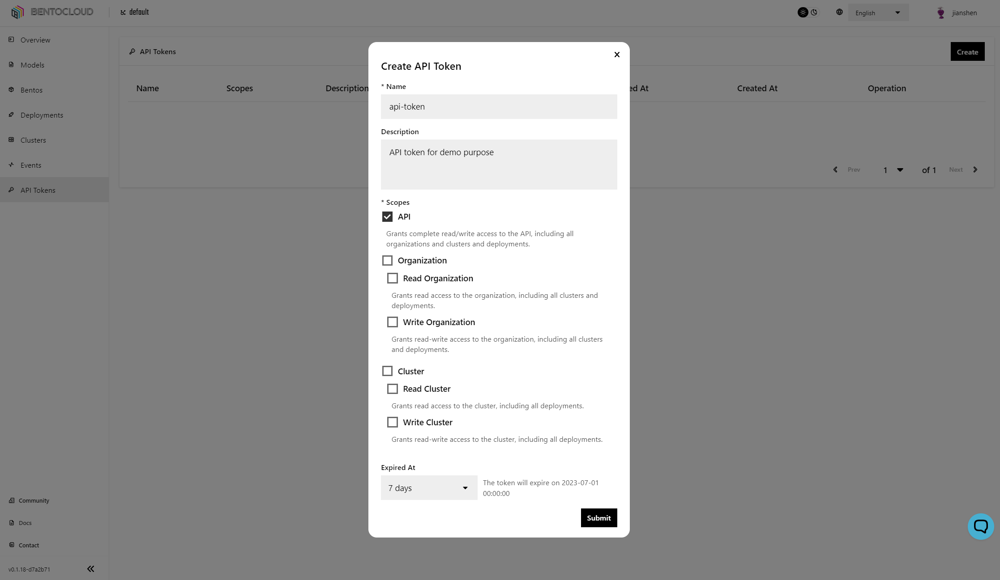

======================
Manage Access Tokens
======================

In BentoCloud, API tokens serve as the means of authorization for two distinct scopes: **BentoCloud resources** and **Bento deployment** authorization. The scope of BentoCloud resources includes authorization for APIs that facilitate the pushing and pulling of models and bentos, along with actions related to creating, updating, and terminating deployments. On the other hand, the deployment scope encapsulates the authorization required for invoking deployed Bento applications.

Access Tokens for BentoCloud Resources
======================================

These tokens allow you to:

- Manage BentoCloud cluster configurations.
- Handle Identity and Access Management (IAM).
- Manage models, Bentos, and deployments.

Creating API Tokens
-------------------

Visit the `API Tokens <http://cloud.bentoml.com/api_tokens>`_ page to view and manage your API tokens.
To create a new token:

1. Click the `Create` button in the top-right corner of the page.

1. In the dialog box that appears, select the desired scope for the token
   and set an expiration date if needed. It's a best practice to always
   set an expiration date for access tokens.

Using the API Token
-------------------

Interact with BentoCloud programmatically via the BentoML Command Line
Interface (CLI). Log in using the following command:

.. code-block:: bash

   bentoml yatai login --api-token <your-api-token> --endpoint <your-bentocloud-endpoint>

If the login is successful, you'll see this output:

.. code-block:: bash

   Successfully logged in as user "user" in organization "mybentocloud".

For additional information on the CLI, see :doc:`Reference - CLI </reference/cli>`.

Access Tokens for Deployed API Servers
======================================

Each deployment in BentoCloud allows you to control access to your resources.
You can make resources:

- **Public** - accessible to anyone on the Internet.
- **Protected** - accessible to anyone on the Internet, provided they have a valid token.

Creating API Tokens
-------------------

You can find the API Tokens tab on each deployment page.
Here, you can view the metadata associated with each API token. To create a new token:

1. Click the `Create` button in the top-right corner.
2. Select the scopes and expiration.
3. Click submit.

Using the API Token
-------------------

These tokens are used as part of the Basic Authentication Scheme.

For HTTP-based servers, include the token in the header of your HTTP request like this:

.. code-block:: bash

   curl "http://app-name.organization.cloud-apps.bentoml.com" \
     -H "Content-Type: application/json" \
     -H "Authorization: Basic $YOUR_TOKEN" \
     --data '{"prompt": "What state is Los Angeles in?", "max_length": 100}'

For gRPC servers, include it in the metadata of your gRPC call:

.. code-block:: python

   import grpc

   creds = grpc.ssl_channel_credentials()
   auth_creds = grpc.access_token_call_credentials('<your-api-token>')
   channel = grpc.secure_channel('<your-deployed-api-endpoint>', creds)
   stub = <YourGRPCServiceStub>(channel)

Always ensure your tokens are managed wisely to secure your resources.
