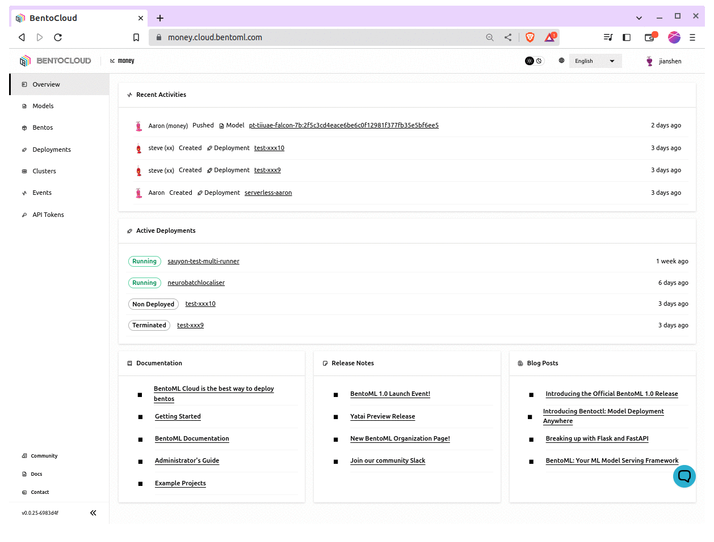

========================
Manage models and Bentos
========================

BentoML provides both a local Model Store and a Bento Store to host your models and Bentos, respectively. Once you've pushed these entities to BentoCloud,
they are stored in remote repositories. This setup helps teams manage them in a unified way, making it easier to share and collaborate with team members.

This document explains how to pull and push models and Bentos.

Prerequisites
-------------

- You have :doc:`installed BentoML </quickstarts/install-bentoml>`.
- You have logged in to BentoCloud. See :doc:`Manage Access Tokens <manage-access-token>` to learn more.

Pull and push models
--------------------

* **Pull a model**: To fetch a specific version of a model from BentoCloud, run:

  .. code-block:: bash

     bentoml models pull <model_name>:<tag>

* **Push a model**: To upload a new version of an existing model to BentoCloud, run:

  .. code-block:: bash

     bentoml models push <model_name>:<tag>

The **Models** page displays all available models on BentoCloud.

Pull and push Bentos
--------------------

* **Pull a Bento**: To fetch a specific version of a Bento from BentoCloud, run:

  .. code-block:: bash

     bentoml pull <bento_name>:<tag>

* **Push a Bento:** To upload a new version of an existing Bento to BentoCloud, run the following command. Note that you can push a Bento directly to BentoCloud without manually pushing the model packaged in the Bento. When you push a Bento to BentoCloud, the associated model is automatically uploaded.

  .. code-block:: bash

     bentoml push <bento_name>:<tag>

The **Bentos** page displays all available Bentos on BentoCloud.

.. image:: ../../_static/img/bentocloud/manage-bentos.gif
   :alt: manage-bentos.gif
