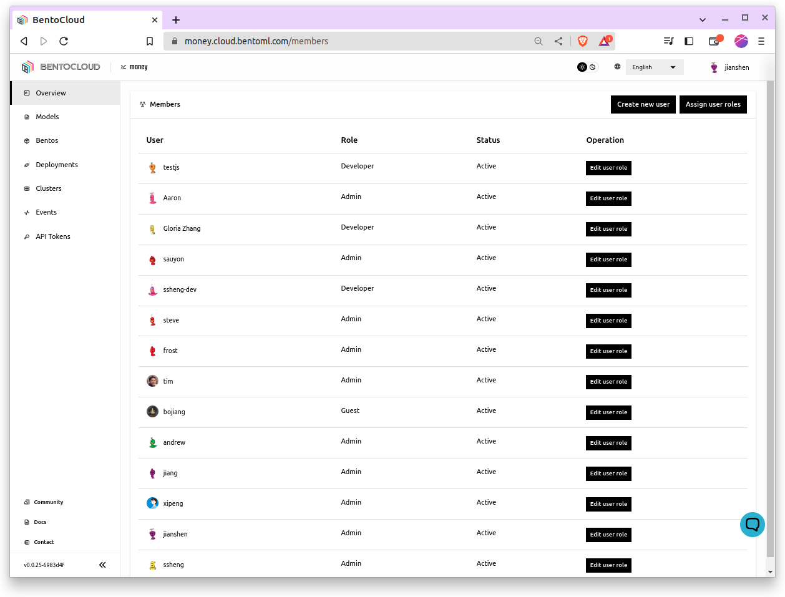

================
Manage Users
================

BentoCloud provides flexible user management options that help you control and customize access to your resources.
This guide walks you through how to manage users, understand their roles, and permissions within BentoCloud.

Managing Users
==============

BentoCloud provides a straightforward interface for managing users. Here's how you can add, modify, or remove users from your organization.

Via UI
------

1. **Creating a User:** Navigate to the  `Members <http://cloud.bentoml.com/members>`_ page within the BentoCloud dashboard. Click 'Create new user' and fill in the necessary details, including email, role, and any other required fields.
2. **Modifying a User:** From the `Members <http://cloud.bentoml.com/members>`_ page, click `Edit user role` on the row of the user you want to modify. Update the user's details or permissions and click 'Submit.'
3. **Removing a User:** From the `Members <http://cloud.bentoml.com/members>`_ page, click on the user you want to remove. Select 'Delete User' to remove the user from your organization.

Via CLI
-------
*(Coming Soon)*

Alternatively, you can manage users programmatically using BentoCloud CLI.
This is especially useful when you need to automate user management as part of your CI/CD pipeline or when you're dealing with a large number of users.

Best Practices
==============
Admins are advised to practice good security habits when managing users. Here are some best practices to follow:

* Regularly review user roles and permissions
* Enforce strong password policies
* Promptly remove access for users who no longer need it.
