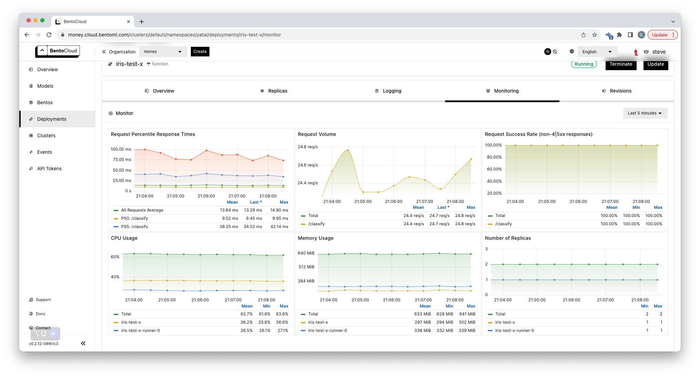

Observability
================

DevOps observability
--------------------

DevOps observability encapsulates **metrics**, **logging**, and **tracing**.
BentoCloud automatically collects and visualizes all engineering **metrics** related to the deployment within the ``Dashboard`` tab in your respective ``Deployment`` page.
Additionally, a **built-in log viewer** lets you examine the logs of your app and its infrastructure.
These **logs** can be queried, downloaded, or routed into downstream log processing frameworks for more in-depth analysis.
**Tracing** is an ongoing development within BentoCloud and will be supported in future releases.

For Enterprise Users, you will have access to a dedicated Grafana service where you can use full Grafana capabilities for monitoring and alerting.

ML observability
----------------

As Machine Learning applications continue to proliferate and democratize, a new concept has emerged: ML Observability. This involves tracking the evolution of input data and model quality over time, to identify potential **feature drift** and **model drift**. For a deeper understanding of ML Monitoring, see `A Guide To ML Monitoring And Drift Detection <https://bentoml.com/blog/a-guide-to-ml-monitoring-and-drift-detection>`__.

BentoCloud enables you to conveniently configure your ML Monitoring Data for shipment to:

- OLAP databases such as BigQuery, Redshift, Snowflake, and others.
- Third-party Observability Platforms like Arize AI.

For detailed instructions on establishing ML Observability with BentoCloud, refer to our :ref:`monitoring-data-collectors-plugins`

Integration with Ops tooling
----------------------------

Whether it's DevOps, DataOps, or MLOps, they all share a core principle in software engineering. These methodologies focus on unifying software development (Dev) and software operation (Ops), improving collaboration and communication, and automating processes to accelerate software delivery.

BentoML is a Python-first library. This means that it aligns seamlessly with the standard Python CI libraries such as pytest, tox, and unittest, among others.

Orchestration frameworks like Airflow and Kubeflow also integrate smoothly with BentoML. Visit :doc:`/integrations/index` to see the full list of frameworks that BentoML supports. Moreover, don't miss this `article <https://www.union.ai/blog-post/unionml-0-2-0-integrates-with-bentoml>`__ written by UnionML, showcasing the delightful integration between BentoML and `Flyte <https://flyte.org/>`__!
