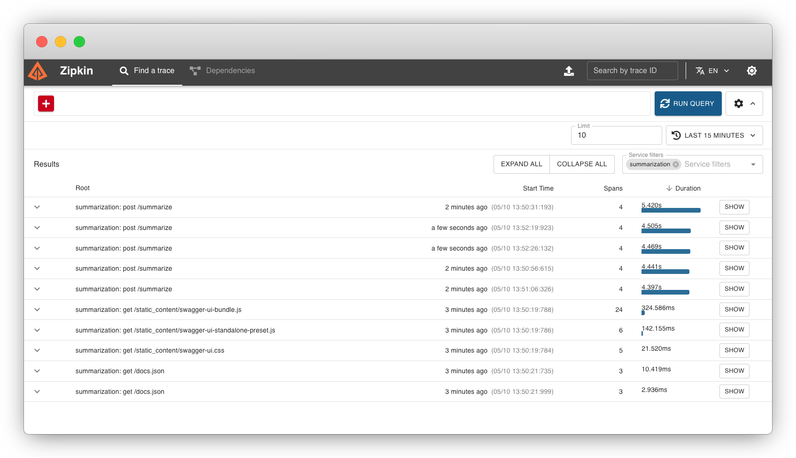
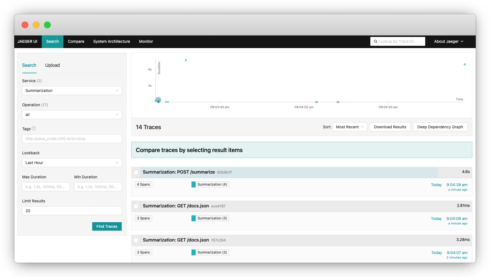

=======
Tracing
=======

Tracing offers a continuous view of an application's behavior, tracking the flow of data as they move through different components of the application. BentoML provides built-in tracing support through OpenTelemetry, allowing users to export traces with `Zipkin <https://zipkin.io/>`_, `Jaeger <https://www.jaegertracing.io/>`_, and `OTLP exporter <https://opentelemetry.io/>`_.

This document explains how to configure tracing in BentoML.

Why do you need tracing?
------------------------

Debugging models and services in production can be challenging. Traditional logging approaches often fall short when tracking issues across multiple services or components. Additionally, logs alone might not provide enough context or information to identify the root cause of a problem.

Tracing, on the other hand, offers several key benefits:

- **Comprehensive visibility**: Tracing provides a holistic view of an application's flow, allowing developers to follow requests as they move through various components.
- **Performance monitoring**: Tracing helps identify performance bottlenecks by showing where time is being spent within the application.
- **Cross-service correlation**: Tracing helps track requests across multiple services, which is useful in distributed systems and microservice architectures.

Install dependencies
--------------------

Before configuring tracing in BentoML, install the corresponding packages.

.. tab-set::

    .. tab-item:: Zipkin

        .. code-block:: bash

        	pip install "bentoml[tracing-zipkin]"

    .. tab-item:: Jaeger

        .. code-block:: bash

        	pip install "bentoml[tracing-jaeger]"

    .. tab-item:: OTLP

        .. code-block:: bash

        	pip install "bentoml[tracing-otlp]"

Configure exporters
-------------------

You configure a tracing exporter for a BentoML Service using the ``tracing`` field within the ``@bentoml.service`` decorator, where you define some common configurations, followed by the specific configurations of each exporter type.

Common configurations are shared values among the exporters, which means they will be applied to the corresponding exporter set via ``exporter_type``. Here is an example:

.. code-block:: python

	import bentoml

	@bentoml.service(
	    resources={"cpu": "2"},
	    traffic={"timeout": 10},
	    tracing={
	        # Common configurations
	        "exporter_type": "jaeger",
	        "sample_rate": 1.0,
	        "timeout": 5,
	        "max_tag_value_length": 256,
	        "excluded_urls": "readyz",
	        "jaeger": {
	            # Specific configurations of the exporter
	    }
	)
	class MyService:
	   # Service implementation code

Available fields in ``tracing``:

- ``exporter_type``: The tracing exporter used for the Service. Supported values are ``jaeger``, ``zipkin``, and ``otlp``.
- ``sample_rate``: By default, no traces will be collected. Set ``sample_rate`` to your desired fraction to start collecting them.
- ``timeout``: A timeout for the exporter, which waits for each batch export.
- ``max_tag_value_length``: A maximum length for string attribute values.
- ``excluded_urls``: Exclude routes from tracing. This parameter can be either a comma-separated string of routes, or a list of strings.

.. note::

	BentoML implements OpenTelemetry APIs, which means OpenTelemetry environment variables will take precedence over the configurations set in the ``@bentoml.service`` decorator.

Zipkin
^^^^^^

When using Zipkin, BentoML only supports its V2 protocol. If you are reporting to an OpenZipkin server directly, add the URL path ``/api/v2/spans`` to the server address.

Here is an example of using Zipkin as the tracing exporter:

.. code-block:: python

	import bentoml

	@bentoml.service(
	    resources={"cpu": "2"},
	    traffic={"timeout": 60},
	    tracing={
	        "exporter_type": "zipkin",
	        "sample_rate": 1.0,
	        "zipkin": {
	            "endpoint": "http://localhost:9411/api/v2/spans",
	            "local_node_ipv4": "192.168.0.1",
	            "local_node_ipv6": "2001:db8::c001",
	            "local_node_port": 31313,
	        }
	   }
	)
	class MyService:
	    # Service implementation code

Available fields for Zipkin, which are passed through the `OpenTelemetry Zipkin Exporter <https://opentelemetry-python.readthedocs.io/en/latest/exporter/zipkin/zipkin.html>`_:

- ``endpoint``: The endpoint URL where Zipkin spans are sent.
- ``local_node_ipv4``: The local node's IPv4 address.
- ``local_node_ipv6``: The local node's IPv6 address.
- ``local_node_port``: The local node's port.

With your BentoML Service configured, `run Zipkin <https://zipkin.io/pages/quickstart>`_ before starting the Service. For example, run the latest Zipkin Docker image as below:

.. code-block:: bash

	docker run -d -p 9411:9411 openzipkin/zipkin

Start your BentoML Service and send some requests to it. You can then visit the Zipkin UI at ``http://localhost:9411/`` to view the traces:

Jaeger
^^^^^^

BentoML allows you to use Jaeger to collect traces over the Thrift protocol.

.. note::

	When it is not feasible to deploy Jaeger Agent next to the application, for example, when the application code is running as Lambda function, a collector can be configured to send spans using Thrift over HTTP. If both agent and collector are configured, the exporter sends traces only to the collector to eliminate the duplicate entries.

Here is an example of using Jaeger as the tracing exporter:

.. code-block:: python

	import bentoml

	@bentoml.service(
	    resources={"cpu": "2"},
	    traffic={"timeout": 60},
	    tracing={
	        "exporter_type": "jaeger",
	        "sample_rate": 1.0,
	        "jaeger": {
	            "protocol": "thrift",
	            "collector_endpoint": "http://localhost:14268/api/traces?format=jaeger.thrift",
	            "thrift": {
	                "agent_host_name": "localhost",
	                "agent_port": 6831,
	                "udp_split_oversized_batches": True,
	            }
	   	}
	    }
	)
	class MyService:
	    # Service implementation code

Available fields for Jaeger:

- ``protocol``: The protocol used for Jaeger.
- ``collector_endpoint``: The URL for the Jaeger collector endpoint.
- ``thrift``: A dictionary containing the specific configurations for the Thrift protocol.

  - ``agent_host_name``: The hostname of the Jaeger agent to which traces are sent.
  - ``agent_port``: The port on which the Jaeger agent listens for incoming traces.
  - ``udp_split_oversized_batches``: When it is set to ``True``, the oversized batch will be split into smaller batches over the UDP max packet size (default: ``65000``) if the given buffer is larger than the max packet size:

  .. math::

	 \text{packets} \triangleq \left\lceil \frac{\text{len}(\text{buff})}{\text{max_packet_size}} \right\rceil

With your BentoML Service configured, run Jaeger before starting the Service. For example, you can run the Jaeger `all-in-one <https://www.jaegertracing.io/docs/1.57/getting-started/>`_ Docker image as below:

.. code-block:: bash

	docker run --rm --name jaeger \
	  -e COLLECTOR_ZIPKIN_HOST_PORT=:9411 \
	  -p 6831:6831/udp \
	  -p 6832:6832/udp \
	  -p 5778:5778 \
	  -p 16686:16686 \
	  -p 4317:4317 \
	  -p 4318:4318 \
	  -p 14250:14250 \
	  -p 14268:14268 \
	  -p 14269:14269 \
	  -p 9411:9411 \
	  jaegertracing/all-in-one:1.57

Start your BentoML Service and send some requests to it. You can then visit the Jaeger UI at ``http://localhost:16686/`` to view the traces:

OTLP exporter
^^^^^^^^^^^^^

BentoML supports the OTLP exporter for easy integration with an OpenTelemetry traces receiver. Currently, BentoML only supports the HTTP protocol for the OTLP exporter, which uses Protobuf to send traces over HTTP.

Here is an example of using the OTLP exporter:

.. code-block:: python

	import bentoml

	@bentoml.service(
	    resources={"cpu": "2"},
	    traffic={"timeout": 60},
	    tracing={
	        "exporter_type": "otlp",
	        "sample_rate": 1.0,
	        "otlp": {
	            "protocol": "http",
	            "endpoint": "http://localhost:4318/v1/traces",
	            "http": {
	                "certificate_file": "/path/to/cert.pem",
	                "headers": {
	                    "Keep-Alive": "timeout=5, max=1000",
	                },
	            },
	        }
	    }
	)
	class MyService:
	...

Available fields for OTLP:

- ``protocol``: The protocol used for OTLP.
- ``endpoint``: The endpoint URL where OTLP spans are sent, namely the address of the OpenTelemetry receiver.
- ``http``: A dictionary containing specific configurations for the HTTP protocol.

  - ``certificate_file``: The path to the certificate file for secure HTTP communication.
  - ``headers``: A dictionary containing custom HTTP headers to include in the trace requests.

To start an OTLP exporter, you generally need an OpenTelemetry Collector running that can receive, process, and export telemetry data (traces, metrics, logs, etc.) to the desired backend. You can find the latest OpenTelemetry Collector releases on its `GitHub repository <https://github.com/open-telemetry/opentelemetry-collector-releases>`_ or `read its Quick Start guide <https://opentelemetry.io/docs/collector/quick-start/>`_.

The quickest way is to run the latest Docker image directly and output the tracing information to a separate file:

.. code-block:: bash

	docker run \
	  -p 127.0.0.1:4318:4318 \
	  otel/opentelemetry-collector:0.100.0 \
	  2>&1 | tee collector-output.txt

In a separate terminal, start your BentoML Service with ``otlp`` tracing configured and send some requests to it. You can then view the details of traces collected and processed by the OpenTelemetry Collector.

.. code-block:: bash
	:caption: `collector-output.txt`

	...
	Resource SchemaURL:
	Resource attributes:
	     -> telemetry.sdk.language: Str(python)
	     -> telemetry.sdk.name: Str(opentelemetry)
	     -> telemetry.sdk.version: Str(1.20.0)
	     -> service.name: Str(Summarization)
	     -> service.instance.id: Int(1)
	     -> service.version: Str(not available)
	ScopeSpans #0
	ScopeSpans SchemaURL:
	InstrumentationScope opentelemetry.instrumentation.asgi 0.41b0
	Span #0
	    Trace ID       : 55f76a6172e5ef154bef3024cb7244a4
	    Parent ID      : 80ebf4a29195d793
	    ID             : 60bb910352f8279d
	    Name           : POST /summarize http send
	    Kind           : Internal
	    Start time     : 2024-05-10 06:14:04.614485867 +0000 UTC
	    End time       : 2024-05-10 06:14:04.614835736 +0000 UTC
	    Status code    : Unset
	    Status message :
	Attributes:
	     -> http.status_code: Int(200)
	     -> type: Str(http.response.start)
	Span #1
	    Trace ID       : 55f76a6172e5ef154bef3024cb7244a4
	    Parent ID      : 80ebf4a29195d793
	    ID             : 027802ac3a807e5a
	    Name           : POST /summarize http send
	    Kind           : Internal
	    Start time     : 2024-05-10 06:14:04.615378986 +0000 UTC
	    End time       : 2024-05-10 06:14:04.615539025 +0000 UTC
	    Status code    : Unset
	    Status message :
	Attributes:
	     -> type: Str(http.response.body)
	Span #2
	    Trace ID       : 55f76a6172e5ef154bef3024cb7244a4
	    Parent ID      :
	    ID             : 80ebf4a29195d793
	    Name           : POST /summarize
	    Kind           : Server
	    Start time     : 2024-05-10 06:13:59.653244649 +0000 UTC
	    End time       : 2024-05-10 06:14:04.615805503 +0000 UTC
	    Status code    : Unset
	    Status message :
	Attributes:
	     -> http.scheme: Str(http)
	     -> http.host: Str(xx.x.xxx.x:3000)
	     -> net.host.port: Int(3000)
	     -> http.flavor: Str(1.1)
	     -> http.target: Str(/summarize)
	     -> http.url: Str(http://xx.x.xxx.x:3000/summarize)
	     -> http.method: Str(POST)
	     -> http.server_name: Str(xxx.xxx.xx.xxx:3000)
	     -> http.user_agent: Str(Mozilla/5.0 (Macintosh; Intel Mac OS X 10_15_7) AppleWebKit/537.36 (KHTML, like Gecko) Chrome/124.0.0.0 Safari/537.36)
	     -> net.peer.ip: Str(xxx.xxx.xx.xx)
	     -> net.peer.port: Int(59482)
	     -> http.status_code: Int(200)
		{"kind": "exporter", "data_type": "traces", "name": "debug"}
	2024-05-10T06:14:06.875Z	info	MetricsExporter	{"kind": "exporter", "data_type": "metrics", "name": "debug", "resource metrics": 1, "metrics": 22, "data points": 22}
	2024-05-10T06:14:06.875Z	info	ResourceMetrics #0
	...

.. note::

	OTLP does not include a UI component. To visualize OTLP data, you need to use a backend that supports OTLP and provides a UI, such as Jaeger or Zipkin.
