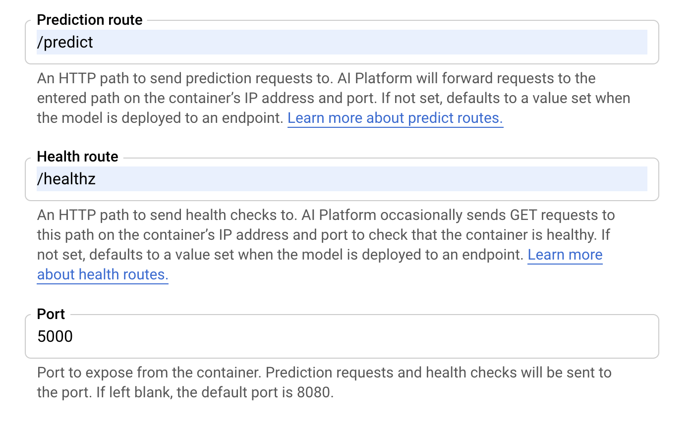
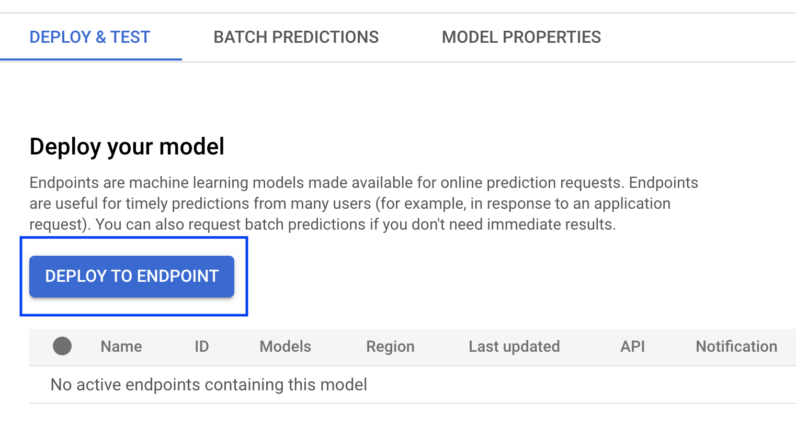
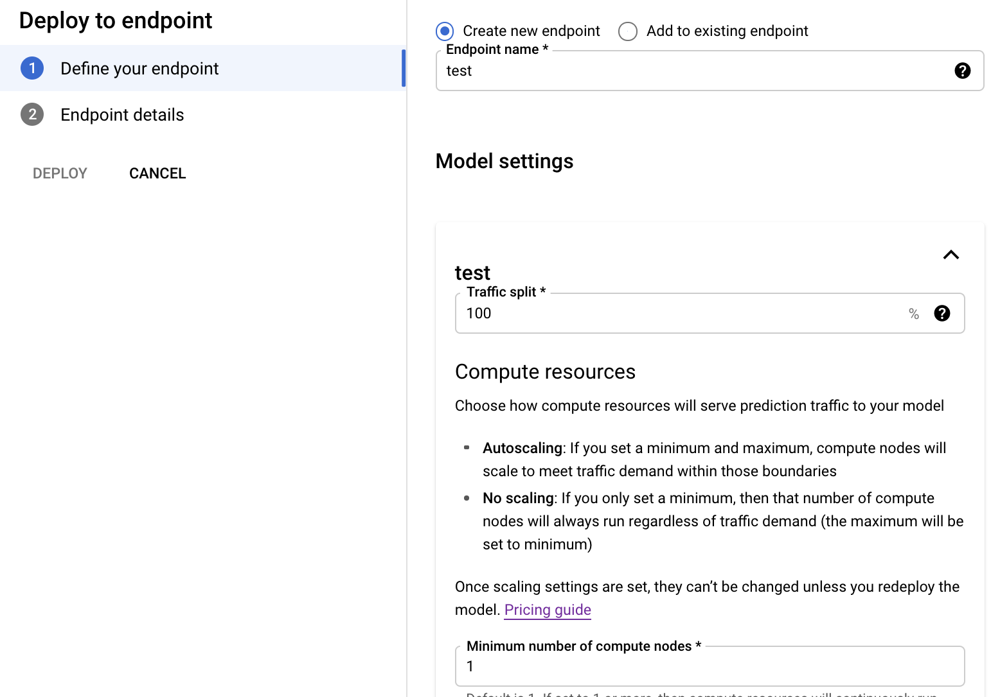

Deploying to Google Cloud AI Platform Unified
=============================================

Google Cloud AI Platform offers a solution to perform ML Inference through containers. Similar to Cloud Run,
this solution is a fully managed compute platform that automatically scales.
The benefit to use this solution instead of Cloud Run are 2:
1. Perform inference with GPUs
2. Integrates with managed solutions available in AI Platform Predictions, such as batch prediction, continuous evaluation, monitoring and explainability.

AI Platform Unified Prediction has strict requirements for the accepted input and output of a request. You can find more `here <https://cloud.google.com/ai-platform-unified/docs/predictions/custom-container-requirements>`__

This guide demonstrates how to deploy a scikit-learn based iris classifier model with
BentoML to Google Cloud AI Platform Unified. The same deployment steps are also applicable for models
trained with other machine learning frameworks, see more BentoML examples :doc:`here <../examples>`.

Prerequisites
-------------

* Google cloud CLI tool

  * Install instruction: https://cloud.googl.com/sdk/install

* Docker is installed and running on the machine.

  * Install instruction: https://docs.docker.com/install

* Python 3.7 or above and required packages `bentoml` and `scikit-learn`:

  * .. code-block:: bash

        pip install bentoml scikit-learn

===========================
Create Google cloud project
===========================

You can create a GCP project to test this deployment or use a an existing project, setting the following environment variable:

.. code-block:: bash

    $ GCP_PROJECT=[PROJECT NAME]

Alternatively you can create a dummy project following the next steps.

.. code-block:: bash

    $ gcloud components update

    All components are up to date.

.. code-block:: bash

    $ gcloud projects create irisclassifier-gcloud-aiplat

    # Sample output

    Create in progress for [https://cloudresourcemanager.googleapis.com/v1/projects/irisclassifier-gcloud-aiplat].
    Waiting for [operations/cp.6403723248945195918] to finish...done.
    Enabling service [cloudapis.googleapis.com] on project [irisclassifier-gcloud-aiplat]...
    Operation "operations/acf.15917ed1-662a-484b-b66a-03259041bf43" finished successfully.

.. code-block:: bash

    $ gcloud config set project irisclassifier-gcloud-aiplat

    Updated property [core/project]

============================================================
Build and push BentoML model service image to GCP repository
============================================================

Run the example project from the :doc:`quick start guide <../quickstart>` to create the
BentoML saved bundle for deployment:

Create a file with the following bash command which will train an iris sklearn model and package it in a Bento Service:

.. code-block:: bash

    cd /tmp
    cat > iris_classifier.py <<EOF
    from sklearn import svm
    from sklearn import datasets

    from iris_classifier import IrisClassifier

    if __name__ == "__main__":
        # Load training data
        iris = datasets.load_iris()
        X, y = iris.data, iris.target

        # Model Training
        clf = svm.SVC(gamma='scale')
        clf.fit(X, y)

        # Create a iris classifier service instance
        iris_classifier_service = IrisClassifier()

        # Pack the newly trained model artifact
        iris_classifier_service.pack('model', clf)

        # Save the prediction service to disk for model serving
        saved_path = iris_classifier_service.save()
    EOF

AI Platform Unified `expects <https://cloud.google.com/ai-platform-unified/docs/predictions/custom-container-requirements#request_requirements>`__ a Json Input with the following structure:
.. code-block::

       {
          "instances": INSTANCES,
          "parameters": PARAMETERS
       }

The BentoML predict function `needs <https://cloud.google.com/ai-platform-unified/docs/predictions/custom-container-requirements#prediction>`__ to return a JSON Dict with the following structure:
.. code-block::

    {'predictions': PREDICTIONS}

We define with the following bash command the BentoML Service:

.. code-block:: bash

    cat > main.py <<EOF
    from bentoml import env, artifacts, api, BentoService
    from bentoml.adapters import JsonInput
    from bentoml.frameworks.sklearn import SklearnModel

    @env(infer_pip_packages=True)
    @artifacts([SklearnModel('model')])
    class IrisClassifier(BentoService):
        """
        A minimum prediction service exposing a Scikit-learn model
        """

        @api(input=JsonInput(), batch=False)
        def predict(self, input: dict):
            """
            AI Platform Unified expects a Json Input with the following structure:
            {
              "instances": INSTANCES,
              "parameters": PARAMETERS
            }
            See more here: https://cloud.google.com/ai-platform-unified/docs/predictions/custom-container-requirements#request_requirements
            And returns a JSON Dict with the following structure:
            {'predictions': PREDICTIONS}
            See more here: https://cloud.google.com/ai-platform-unified/docs/predictions/custom-container-requirements#prediction
            """

            return {'predictions': self.artifacts.model.predict(input['instances'])}
    EOF

Build BentoML bundle:

.. code-block:: bash

    $ python main.py

Verify the saved bundle created:

.. code-block:: bash

    $ bentoml get IrisClassifier:latest

    # Sample output
    {
      "name": "IrisClassifier",
      "version": "20210325170627_3F9592",
      "uri": {
        "type": "LOCAL",
        "uri": "/Users/eliasecchi/bentoml/repository/IrisClassifier/20210325170627_3F9592"
      },
      "bentoServiceMetadata": {
        "name": "IrisClassifier",
        "version": "20210325170627_3F9592",
        "createdAt": "2021-03-25T17:06:28.274128Z",
        "env": {
          "condaEnv": "name: bentoml-default-conda-env\nchannels:\n- conda-forge\n- defaults\ndependencies:\n- pip\n",
          "pythonVersion": "3.7.9",
          "dockerBaseImage": "bentoml/model-server:0.10.1-py37",
          "pipPackages": [
            "bentoml==0.10.1",
            "pandas==1.2.0",
            "scikit-learn==0.24.1"
          ]
        },
        "artifacts": [
          {
            "name": "model",
            "artifactType": "SklearnModel",
            "metadata": {}
          }
        ],
        "apis": [
          {
            "name": "predict",
            "inputType": "DataframeInput",
            "docs": "\n        An inference API named `predict` with Dataframe input adapter, which codifies\n        how HTTP requests or CSV files are converted to a pandas Dataframe object as the\n        inference API function input\n        ",
            "inputConfig": {
              "orient": null,
              "typ": "frame",
              "dtype": null
            },
            "outputConfig": {
              "cors": "*"
            },
            "outputType": "DefaultOutput",
            "mbMaxLatency": 10000,
            "mbMaxBatchSize": 2000,
            "batch": true
          }
        ]
      }
    }

The BentoML saved bundle created can now be used to start a REST API Server hosting the
BentoService and available for sending test request:

.. code-block:: bash

    # Start BentoML API server:
    bentoml serve IrisClassifier:latest

.. code-block:: bash

    # Send test request:
    curl -i \
      --header "Content-Type: application/json" \
      --request POST \
      --data '{"instances":[[5.1, 3.5, 1.4, 0.2]]}' \
      http://localhost:5000/predict

Use `gcloud` CLI to build the docker image

.. code-block:: bash

    # Find the local path of the latest version IrisClassifier saved bundle
    $ saved_path=$(bentoml get IrisClassifier:latest --print-location --quiet)
    $ cd $saved_path
    $ gcloud builds submit --tag gcr.io/$GCP_PROJECT/iris-classifier

    # Sample output

    Creating temporary tarball archive of 15 file(s) totalling 15.8 MiB before compression.
    Uploading tarball of [.] to [gs://irisclassifier-gcloud-aiplat_cloudbuild/source/1587430763.39-03422068242448efbcfc45f2aed218d3.tgz]
    Created [https://cloudbuild.googleapis.com/v1/projects/irisclassifier-gcloud-aiplat/builds/9c0f3ef4-11c0-4089-9406-1c7fb9c7e8e8].
    Logs are available at [https://console.cloud.google.com/cloud-build/builds/9c0f3ef4-11c0-4089-9406-1c7fb9c7e8e8?project=349498001835]
    ----------------------------- REMOTE BUILD OUTPUT ------------------------------
    ...
    ...
    ...
    DONE
    -----------------------------------------------------------------------------------------------------------------------------------------------------------------------------------------

    ID                                    CREATE_TIME                DURATION  SOURCE                                                                                               IMAGES                                                      STATUS
    9c0f3ef4-11c0-4089-9406-1c7fb9c7e8e8  2020-04-21T00:59:38+00:00  5M22S     gs://irisclassifier-gcloud-aiplat_cloudbuild/source/1587430763.39-03422068242448efbcfc45f2aed218d3.tgz  us-central1-docker.pkg.dev/irisclassifier-gcloud-aiplat/iris-classifier (+1 more)  SUCCESS

====================================================
Deploy the image to Google Cloud AI Platform Unified
====================================================

1. Use your browser, go into the Google Cloud Console, select project `irisclassifier-gcloud-aiplat` or to the project you are using in this deployment and navigate to the AI Platform Unified page
2. Click `Models` on the bottom of the navigation bar.
3. Click on `IMPORT`
4. In the Create Model service page, insert a name for the model and select a region. Click on Continue.
5. Select `Import an existing container`. Select the image you previously pushed to GCR.
6. You will need to setup routes and ports. The following configuration will allow you to do that for BentoML:

7. Click on `Import`
8. Click on the model you just created. You will need now to create an endpoint for that. You can do that clicking in Deploy Endpoint as shown in the image.

9. You will need to give a name to the endpoint and allocate some resources to it. You can use the default values for resources and traffic split.

10. Click on `DEPLOY`

=====================================================================
Validate Google Cloud AI Platform Unified deployment with sample data
=====================================================================
Copy the ENDPOINT_ID from the deployed endpoint

.. code-block:: bash

    $ gcloud ai endpoints list

    # Sample output
    ENDPOINT_ID          DISPLAY_NAME
    887508193754741784   test

Create an Environment variable for that:

.. code-block:: bash

    $ ENDPOINT_ID=887508193754741784

Send a request:

.. code-block:: bash

    $ curl \
    -X POST \
    -H "Authorization: Bearer $(gcloud auth print-access-token)" \
    -H "Content-Type: application/json" \
    https://us-central1-aiplatform.googleapis.com/v1alpha1/projects/${GCP_PROJECT}/locations/us-central1/endpoints/${ENDPOINT_ID}:predict \
    -d '{ "instances":[[0, 1, 0, 1]] }'

    # Sample output
    {
      "predictions": [
        0
      ],
      "deployedModelId": "3013629430338682880"
    }

=============================================================
Clean up deployed service on Google Cloud AI Platform Unified
=============================================================

1. Navigate to the manage resources page in Google Cloud Console.
2. In the project list, select the project you want to delete and click the `delete` icon
3. In the dialog, type the projectID `irisclassifier-gcloud-aiplat` and then click `Shut down` to delete the project.

.. spelling::

    projectID
    explainability
