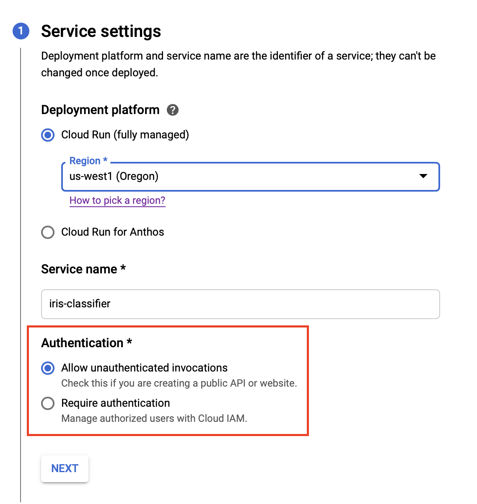
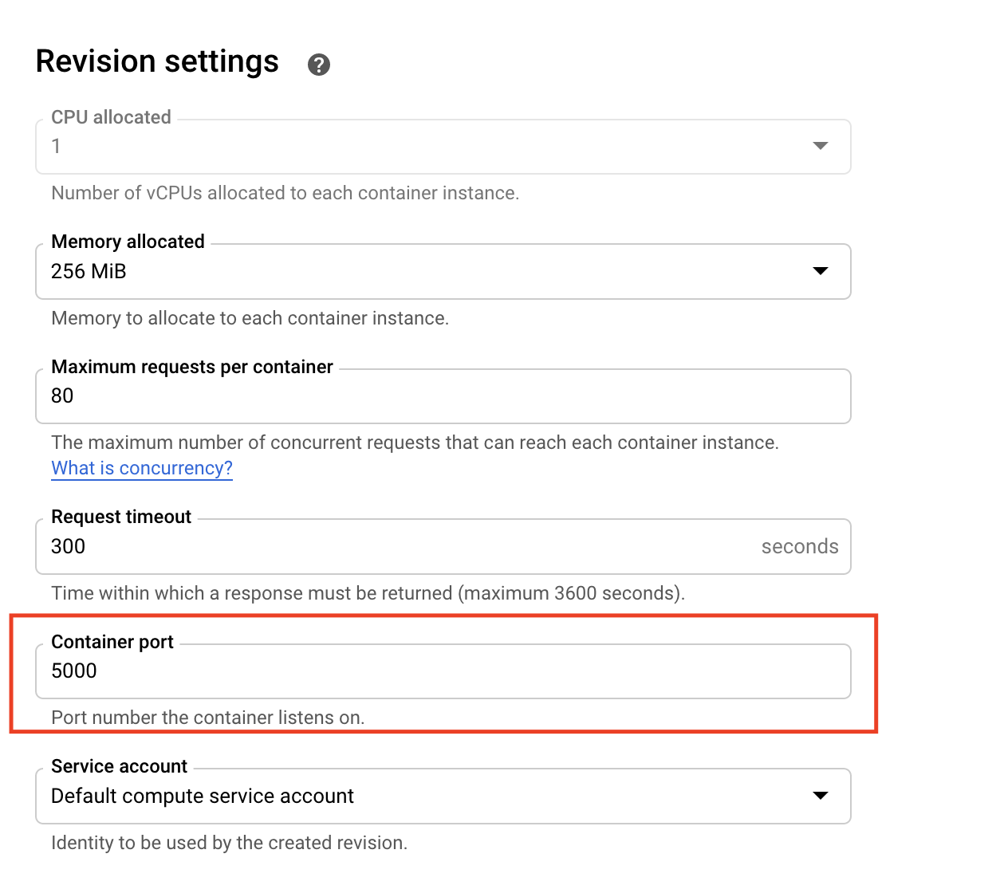
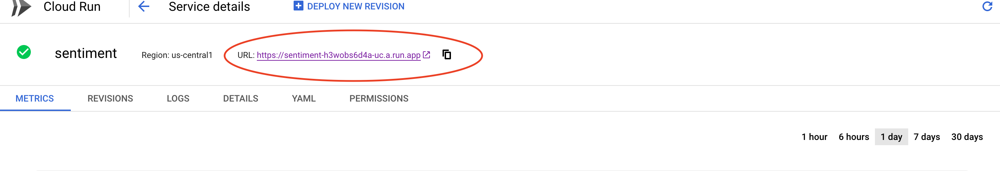

Deploying to Google Cloud Run
=============================

Google Cloud Run is a fully manged compute platform that automatically scales. It is great
alternative to run BentoService that requires more computing power. Cloud Run is serverless. It
abstracts away infrastructure management, so you can focus on building service.

Prerequisites
-------------

1. Google cloud CLI tool

  * Install instruction: https://cloud.googl.com/sdk/install

2. Docker is installed and running on the machine.

  * Install instruction: https://docs.docker.com/install

===========================
Create Google cloud project
===========================

.. code-block:: bash

    > glcoud components update

    All components are up to date.

.. code-block:: bash

    > gcloud projects create sentiment-gcloud-run

    Create in progress for [https://cloudresourcemanager.googleapis.com/v1/projects/sentiment-gcloud-run].
    Waiting for [operations/cp.7580966240072066179] to finish...done.
    Enabling service [cloudapis.googleapis.com] on project [sentiment-gcloud-run]...
    Operation "operations/acf.3d6ba408-4f5e-4859-923d-40a491b663a4" finished successfully.

.. code-block:: bash

    > gcloud config set project sentiment-gcloud-run

    Updated property [core/project]

=============================================
Build and push docker image to GCP repository
=============================================

.. code-block:: bash

    > cd /Users/bozhaoyu/bentoml/repository/SentimentLRModel/20191216231343_AEA027
    > gcloud builds submit --tag gcr.io/sentiment-gcloud-run/sentiment

    Creating temporary tarball archive of 80 file(s) totalling 8.8 MiB before compression.
    Uploading tarball of [.] to [gs://sentiment-gcloud-run_cloudbuild/source/1576610370.18-1acde23d92024652b4d6c72df4b6a8e9.tgz]
    Created [https://cloudbuild.googleapis.com/v1/projects/sentiment-gcloud-run/builds/12df8469-1242-4662-a858-e5f6b8809184].
    Logs are available at [https://console.cloud.google.com/gcr/builds/12df8469-1242-4662-a858-e5f6b8809184?project=185885650434].
    ----------------------------- REMOTE BUILD OUTPUT ------------------------------
    starting build "12df8469-1242-4662-a858-e5f6b8809184"

    FETCHSOURCE
    Fetching storage object: gs://sentiment-gcloud-run_cloudbuild/source/1576610370.18-1acde23d92024652b4d6c72df4b6a8e9.tgz#1576610373095149
    Copying gs://sentiment-gcloud-run_cloudbuild/source/1576610370.18-1acde23d92024652b4d6c72df4b6a8e9.tgz#1576610373095149...
    / [1 files][  4.8 MiB/  4.8 MiB]
    Operation completed over 1 objects/4.8 MiB.
    BUILD
    Already have image (with digest): gcr.io/cloud-builders/docker
    Sending build context to Docker daemon   9.28MB
    Step 1/12 : FROM continuumio/miniconda3:4.7.12
    4.7.12: Pulling from continuumio/miniconda3
    b8f262c62ec6: Pulling fs layer
    0a43c0154f16: Pulling fs layer
    ...
    ...
    ...
    3ee7190fd43a: Pushed
    82142827bbb1: Pushed
    latest: digest: sha256:eacca2a47d914da06c874f56efb84bb35ee08fb0c305850a4952f1bd1c7723cd size: 2225
    DONE
    --------------------------------------------------------------------------------

    ID                                    CREATE_TIME                DURATION  SOURCE                                                                                          IMAGES                                           STATUS
    12df8469-1242-4662-a858-e5f6b8809184  2019-12-17T19:19:33+00:00  4M51S     gs://sentiment-gcloud-run_cloudbuild/source/1576610370.18-1acde23d92024652b4d6c72df4b6a8e9.tgz  gcr.io/sentiment-gcloud-run/sentiment (+1 more)  SUCCESS

====================================
Deploy the image to Google Cloud Run
====================================

1. Use your browser, go into the Google Cloud Console, select project `sentiment-gcloud-run` and navigate to the CloudRun page
2. Click `Create Service` on the top of the navigation bar
3. In the Create Cloud Run service page:

**Select container image URL from the selection menu, choose allow Unauthenitcated invocations from the Authentication section**

**Expand Show Optional Revision Settings and change COntainer Port from `8080` to `5000`**

After successful deployment, you can fin the service endpoint URL at top of the page.

=====================================================
Validate Google cloud run deployment with sample data
=====================================================

Copy the service URL from the screen

.. code-block:: bash

    > curl -X \
      POST "https://sentiment-h3wobs6d4a-uc.a.run.app/predict" \
      --header "Content-Type: application/json" \
      -d '["good movie", "bad food"]'

    [4, 0]

=============================================
Clean up deployed service on Google Cloud Run
=============================================

1. Navigate to the manage resources page in Google Cloud Console.
2. In the project list, select the project you want to delete and click the `delete` icon
3. In the dialog, type the projectID `sentiment-gcloud-run` and then click `Shut down` to delete the project.