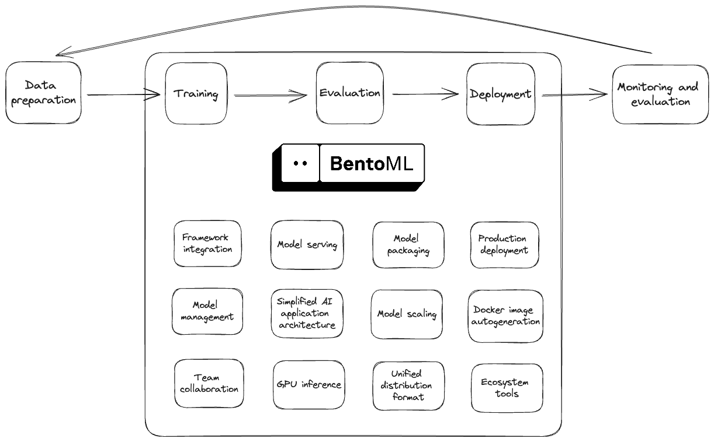

============
Introduction
============

`BentoML <https://github.com/bentoml/BentoML>`_ is a unified AI application framework for building reliable, scalable, and cost-efficient AI applications. It provides an end-to-end solution for streamlining the deployment process, incorporating everything you need for model serving, application packaging, and production deployment.

Who is BentoML for?
-------------------

BentoML is designed for teams working to bring machine learning (ML) models into production in a reliable, scalable, and cost-efficient way. In particular, AI application developers can leverage BentoML to easily integrate state-of-the-art pre-trained models into their applications. By seamlessly bridging the gap between model creation and production deployment, BentoML promotes collaboration between developers and in-house data science teams.

Why BentoML?
------------

BentoML's comprehensive toolkit for AI application development provides a unified distribution format, which features a simplified AI architecture and supports deployment anywhere.

Streamline distribution with a unified format
^^^^^^^^^^^^^^^^^^^^^^^^^^^^^^^^^^^^^^^^^^^^^

ML projects often involve different roles and complex collaboration. BentoML simplifies this process through a unified distribution format - a file archive known as a Bento. With BentoML's open standard and SDK for AI applications, you can package all the necessary packages and dependencies into a Bento.

You can manage all the Bentos in the local Bento Store and keep iterating them as your application evolves. Each Bento includes an auto-generated Dockerfile, enabling easy containerization for deployment.

Build applications with any AI models
^^^^^^^^^^^^^^^^^^^^^^^^^^^^^^^^^^^^^

BentoML provides the flexibility and ease to build any AI applications with any tools your team prefers. Whether you want to import models from any model hub or bring your own models built with frameworks such as PyTorch and TensorFlow, you can use BentoML's local Model Store to manage them and build applications on top of them.

BentoML offers native support for Large Language Model (LLM) inference, Generative AI, embedding creation, and multi-modal AI applications.

Inference optimization for AI applications
^^^^^^^^^^^^^^^^^^^^^^^^^^^^^^^^^^^^^^^^^^

BentoML's proven open-source architecture ensures high performance for your AI applications through efficient resource utilization and latency reduction techniques. It supports model inference parallelization and adaptive batching. With built-in optimization for specific model architectures (like OpenLLM for LLMs) and support for high-performance runtimes like ONNX-runtime and TorchScript, BentoML delivers faster response time and higher throughput, offering scalable and cost-efficient backbone infrastructure for any AI applications.

Simplify modern AI application architectures
^^^^^^^^^^^^^^^^^^^^^^^^^^^^^^^^^^^^^^^^^^^^

BentoML is designed with a Python-first approach, ensuring the effortless scalability of complex AI workloads. It simplifies the architecture of modern AI applications by allowing you to compose multiple models to run either concurrently or sequentially, across multiple GPUs or on a Kubernetes cluster. This flexibility extends to running and debugging your BentoML applications locally, whether you are using Mac, Windows, or Linux.

Build once. Deploy anywhere
^^^^^^^^^^^^^^^^^^^^^^^^^^^

BentoML standardizes the saved model format, Service API definition and the Bento build process, which opens up many different deployment options for ML teams. You can deploy your models virtually anywhere. Deployment options include:

- One-click deployment to `BentoCloud <https://bentoml.com/cloud>`_, a fully-managed platform specifically designed for hosting and operating AI applications.
- Containerize Bentos and deploy the images to any environment where Docker runs, such as Kubernetes.

How does BentoML work?
----------------------

In a typical ML workflow, you may need to prepare the data for your model, train and evaluate the model, serve the model in production, monitor its performance, and retrain the model for better inferences and predictions. BentoML features a streamlined path for transforming an ML model into a production-ready model serving endpoint. See the following diagram to understand the role of BentoML in the ML workflow:

The following is the basic workflow of using the BentoML framework.

1. Model registration
^^^^^^^^^^^^^^^^^^^^^

To get started, you can save your model in the BentoML :doc:`/guides/model-store`, a centralized repository for managing all local models. BentoML is compatible with a variety of models, including pre-trained models from Hugging Face or custom models trained on your custom datasets. The Model Store simplifies the process of iterating and evaluating different model versions, providing an efficient way to track and manage your ML assets.

Note that for simple use cases, you can **skip this step** and use pre-trained models directly when creating your BentoML Service.

2. Service creation
^^^^^^^^^^^^^^^^^^^

You create BentoML :doc:`/guides/services` by defining a ``service.py`` file, where you outline your model's serving logic through class-based Services. In this file, you can define multiple Services for specific tasks like data preprocessing or model predictions if necessary. Each Service can be customized to handle its own input and output logic. You can test model serving and inference by running Services locally. During deploying, each Service can be independently scaled and separately deployed for better resolution utilization.

3. Deployment
^^^^^^^^^^^^^

Before deploying your AI application, you create a ``bentofile.yaml`` file, detailing all necessary build configurations such as Python dependencies and Docker settings. After that, you can choose either of the following ways to deploy your application.

- With a single command, you :doc:`deploy your application to BentoCloud </guides/deployment>`. In this approach, your project is automatically packaged into a Bento, the standard distribution format for BentoML Services, uploaded and deployed on BentoCloud. This serverless platform offers scalable and hardware-optimized solutions for running AI applications.
- You can manually package your project into a Bento and :doc:`containerize it as a Docker image </guides/containerization>`. This Docker image can then be deployed to any Docker-compatible environment, such as Kubernetes. This method provides more flexibility in deployment and is suitable for integration into your existing container orchestration system.
