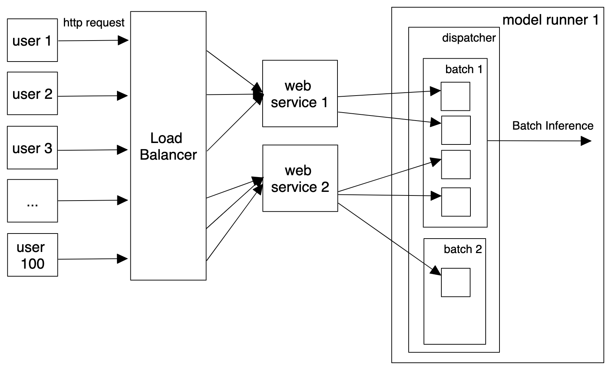

.. _adaptive-batching-page:

Adaptive Batching
=================

Batching is the term used for combining multiple inputs for submission to processing at the same time. The idea is that processing multiple messages is be faster than processing each individual message one at a time. In practice many ML frameworks have optimizations for processing multiple messages at a time because that is how the underlying hardware works in many cases.

.. epigraph::
    "While serving a TensorFlow model, batching individual model inference requests together can be important for performance. In particular, batching is necessary to unlock the high throughput promised by hardware accelerators such as GPUs."
    -- `TensorFlow documentation <https://github.com/tensorflow/serving/blob/master/tensorflow_serving/batching/README.md>`_

As an optimization for a real-time service, batching works off of 2 main concepts.

1. Batching Window: The maximum time that a service should wait to build a “batch” before releasing a batch for processing. This is essentially the max latency for processing in a low throughput system. It helps avoid the situation where if very few messages have been submitted (smaller than the max batch size) the batch must wait for a long time to be processed.
2. Max Batch Size: The maximum size that a batch can reach before the batch is release for processing. It puts a cap on the size of the batch in which should optimize for maximum throughput. The concept only applies within the maximum wait time before the batch is released.

BentoML’s adaptive batching works off of these 2 basic concepts and builds on them. Our adaptive batching adapts both the batching window and the max batch size based off of incoming traffic patterns at the time. The dispatching mechanism regresses the recent processing time, wait time and batch sizes to optimize for lowest latency.

Architecture
------------

The batching mechanism is located on the model runner. Each model runner receives inference requests and batches those requests based on optimal latency.

The load balancer will distribute the requests to each of the running API services. The API services will in turn distribute the inference requests to the model runners. The distribution of requests to the model runners is random rather than round robin by default. This is because a proper round robin distribution does not optimize for batch processing and will actually be slower in many cases than a random distribution. In the future we plan to have different distribution algorithm options.

Running with Adaptive Batching
------------------------------

There are 2 ways that adaptive batching will run depending on how you've deployed BentoML.

Standalone Mode
^^^^^^^^^^^^^^^

In the standard BentoML library, each model runner is it’s own process. In this case, the batching happens at the process level.

Distributed
^^^^^^^^^^^

For a Yatai deployment into Kubernetes, each model runner is structured as it’s own Pod. The batching will occur at the Pod level.

Configuring Batching
--------------------

The main configuration concern is the way in which each input is combined when batching occurs. We call this the “batch axis”. When configuring whether a model runner should be batching, the batch axis must be specified