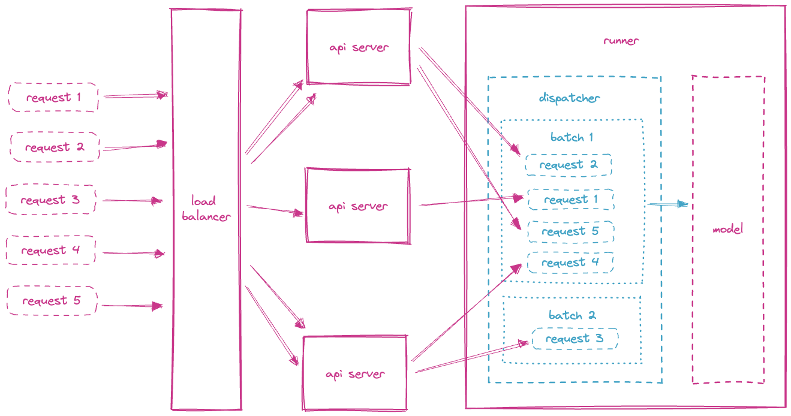
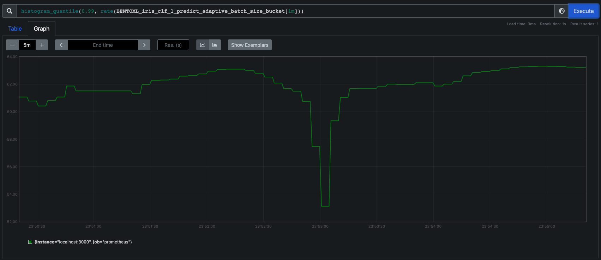

=================
Adaptive Batching
=================

Batching is the term used for combining multiple inputs for submission to processing at the same time. The idea is that processing multiple messages is be faster than processing each individual message one at a time. In practice many ML frameworks have optimizations for processing multiple messages at a time thanks to the underlying hardware optimization.

.. epigraph::
    "While serving a TensorFlow model, batching individual model inference requests together can be important for performance. In particular, batching is necessary to unlock the high throughput promised by hardware accelerators such as GPUs."
    -- `TensorFlow documentation <https://github.com/tensorflow/serving/blob/master/tensorflow_serving/batching/README.md>`_

Adaptive batching is implemented on the server-side. This is advantageous as opposed to client-side batching because it simplifies the client's logic and it is often times more efficient due to traffic volume.

As an optimization for a real-time service, batching works off of 2 main concepts.

1. *Batching Window*: The maximum time that a service should wait to build a “batch” before releasing a batch for processing. This is essentially the max latency for processing in a low throughput system. It helps avoid the situation where if very few messages have been submitted (smaller than the max batch size) the batch must wait for a long time to be processed.
2. *Batch Size*: The maximum size that a batch can reach before the batch is release for processing. It puts a cap on the size of the batch in which should optimize for maximum throughput. The concept only applies within the maximum wait time before the batch is released.

BentoML’s adaptive batching works off of these 2 basic concepts and builds on them. Our adaptive batching adapts both the batching window and the max batch size based off of incoming traffic patterns at the time. The dispatching mechanism regresses the recent processing time, wait time and batch sizes to optimize for lowest latency.

Architecture
------------

The batching mechanism is located on the model runner. Each model runner receives inference requests and batches those requests based on optimal latency.

The load balancer will distribute the requests to each of the running API services. The API services will in turn distribute the inference requests to the model runners. The distribution of requests to the model runners uses a random algorithm which provides for slightly more efficient batch sizes as opposed to round robin. Additional dispatch algorithms are planned for the future.

.. note::
    The order of the requests in a batch is not guaranteed.

Model Batch Dimensions
----------------------

If a trained model supports batched input, the model can be declared as `batchable` in the ``save_model`` signature parameter. All frameworks by default saves models as `non-batchable` to prevent any inadvertent effects. To gain better performance, it is recommended to enable batching for supported models.
In addition to declaring model as batchable, batch dimensions can also be configured in the model signature. Batch dimensions are specified as a 2-tuple representing the input and output batch dimensions respectively. By default, the batch dimension is set to `0`. Adaptive batching will only batch input on the specified batch dimension.

.. code-block:: python
    :caption: `train.py`

    bentoml.pytorch.save_model(
        name="mnist",
        model=model,
        signatures={
            "__call__": {
                "batchable": True,
                "batch_dim": (0, 0),
            },
        },
    )

Configuring Batching
--------------------

If a model supports batching, adaptive batching is enabled by default. To explicitly disable or control adaptive batching behaviors at runtime, configuration can be specified under the ``batching`` key.
Additionally, there are two configurations for customizing batching behaviors, `max_batch_size` and `max_latency_ms`.

Max Batch Size
^^^^^^^^^^^^^^

Configured through the ``max_batch_size`` key, max batch size represents the maximum size a batch can reach before releasing for inferencing. Max batch size should be set based on the capacity of the available system resources, e.g. memory or GPU memory.

Max Latency
^^^^^^^^^^^

Configured through the ``max_latency_ms`` key, max latency represents the maximum latency in milliseconds that a batch should wait before releasing for inferencing. Max latency should be set based on the service level objective (SLO) of the inference requests.

.. code-block:: yaml
    :caption: ⚙️ `configuration.yml`

    runners:
        iris_clf:
            batching:
                enabled: true
                max_batch_size: 100
                max_latency_ms: 500

Monitoring
----------

Adaptive batching size is by default exposed as a histogram metric with name, ``BENTOML_{runner}_{method}_adaptive_batch_size_bucket``, for observing and debugging adaptive batching behaviors of each model runner.

Error handling
--------------

If adaptive batching cannot keep up with rate of the incoming requests while satisfying the max
latency configuration, HTTP 503 Service Unavailable is returned. To workaround this error, consider
relaxing the max latency requirement and further scaling the underlying hardware resources.

Custom Batching
---------------

Currently, adaptive batching is only effective for certain types of parameters including(non-exhaustive) ``numpy.ndarray``, ``pandas.Series`` and framework-specific types such as ``torch.Tensor``.
Batch parameters of other types are simply collected into a list and passed to the inference function. If your model accepts parameters that are not batchable by default,
you can achieve adaptive batching by wrapping the inference function with a :ref:`Runner <concepts/runner:Custom Runner>`.

We will demonstrate this with a PyTorch example which accepts a dictionary of ``torch.Tensor`` as input.

.. code-block:: python
    :caption: `service.py`

    import bentoml
    import torch

    class MyRunnable(bentoml.Runnable):
        def __init__(self):
            super().__init__()
            # if torch.cuda.device_count():
            if torch.cuda.is_available():
                self.device_id = "cuda"
                # by default, torch.FloatTensor will be used on CPU.
                torch.set_default_tensor_type("torch.cuda.FloatTensor")
            else:
                self.device_id = "cpu"
            self.model = bentoml.pytorch.load_model("my_pytorch_model", device_id=self.device_id)
            # We want to turn off dropout and batchnorm when running inference.
            self.model.train(False)

        @bentoml.Runnable.method(batchable=True)
        def __call__(self, **batch):
            # Our model accepts a dictionary of Tensor as input, but we use ``**``
            # to deconstruct it to keyword arguments, so they can be batched rightly.
            # It works only if every parameter is "batchable" such as torch.Tensor/np.ndarray.
            # Move the tensors to the target device and pass it to the model as a dict.
            batch = {k: tensor.to(self.device_id) for k, tensor in batch.items()}
            with torch.inference_mode():
                return self.model(batch)

    # Build the runner from the runnable manually, instead of calling model.to_runner() method
    runner = bentoml.Runner(MyRunnable)
    svc = bentoml.Service(name="my_ml_service", runners=[runner])

    # Define an API endpoint for the inference
    @svc.api(input=bentoml.io.JSON(), output=bentoml.io.JSON())
    async def predict(api_input):
        # Deconstruct the input dictionary to keyword arguments for batching
        return await runner.async_run(**api_input)
