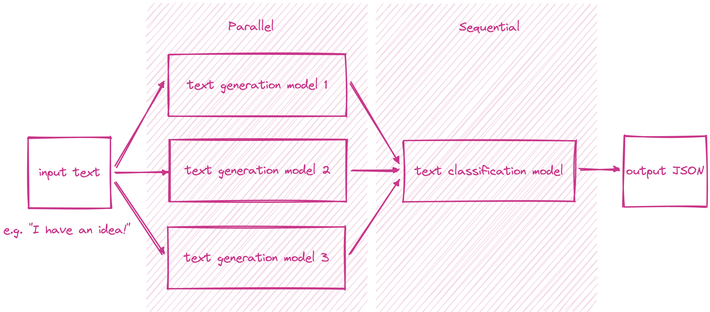
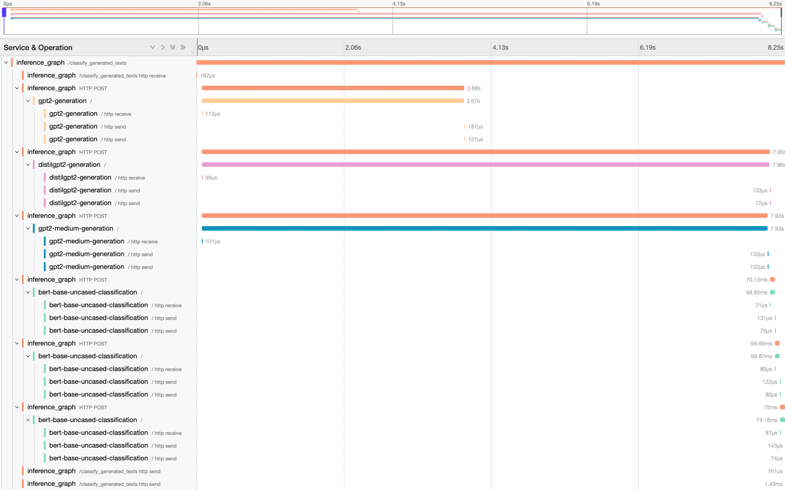

===============
Inference Graph
===============

Many ML problems require an ensemble of models to work together to solve. BentoML architecture can support any model inference graph natively in its
:ref:`Service APIs <concepts/service:Service and APIs>` definition. Users can define parallel and sequential inference graphs with any control flows
by writing simple Python code. In this guide, we will build a text generation and classification service using model inference graph. The project
source code can be found in the BentoML `inference graph <https://github.com/bentoml/BentoML/tree/main/examples/inference_graph>`_ example.

As illustrated in the diagram above, the service performs the following tasks.
# Accepts a text input.
# Passes the input to three text generation models in parallel and receives a list of three generated texts.
# Passes the list of generated texts to a text classification model iteratively and receives a list of three classification results.
# Returns the list of generated texts and classification results in a JSON output.

Declare Runners
###############

Create :ref:`Runners <concepts/runner:Using Runners>` the three text generation models and the text classification model using the ``to_runner`` function.

.. code-block:: python

    gpt2_generator = bentoml.transformers.get("gpt2-generation:latest").to_runner()
    distilgpt2_generator = bentoml.transformers.get("distilgpt2-generation:latest").to_runner()
    distilbegpt2_medium_generator = bentoml.transformers.get("gpt2-medium-generation:latest").to_runner()
    bert_base_uncased_classifier = bentoml.transformers.get("bert-base-uncased-classification:latest").to_runner()

Create Service
##############

Create a :ref:`Service <concept/service:Service and APIs>` named ``inference_graph`` and passes the runners created earlier in the ``runners`` argument.

.. code-block:: python

    svc = bentoml.Service(
        "inference_graph",
        runners=[
            gpt2_generator,
            distilgpt2_generator,
            distilbegpt2_medium_generator,
            bert_base_uncased_classifier,
        ],
    )

Define API
##########

First, define an async :ref:`API <concepts/service:Service and APIs>` named ``classify_generated_texts`` that accepts a :ref:`Text <reference/api_io_descriptors:Texts>`
input and returns :ref:`JSON <reference/api_io_descriptors:Structured Data with JSON>` output. Second, pass the input simultaneously to all three text generation
model runners through ``asyncio.gather`` and receive a list of three generated texts. Using ``asyncio.gather`` and Runner's ``async_run`` allows the
inferences to happen in parallel. Third, pass the list of generated texts to the text classification iteratively using a ``for loop`` to get the classification
score of each generated text. Finally, return the list of generated texts and classification results in a dictionary.

.. tip::

    Using asynchronous Service and Runner APIs achives better performance and throughput for IO-intensive workloads.
    See :ref:`Sync vs Async APIs <concepts/service:Sync vs Async APIs>` for more details.

.. code-block:: python

    @svc.api(input=Text(), output=JSON())
    async def classify_generated_texts(original_sentence: str) -> dict:
        generated_sentences = [
            result[0]["generated_text"]
            for result in await asyncio.gather(
                gpt2_generator.async_run(
                    original_sentence,
                    max_length=MAX_LENGTH,
                    num_return_sequences=NUM_RETURN_SEQUENCE,
                ),
                distilgpt2_generator.async_run(
                    original_sentence,
                    max_length=MAX_LENGTH,
                    num_return_sequences=NUM_RETURN_SEQUENCE,
                ),
                distilbegpt2_medium_generator.async_run(
                    original_sentence,
                    max_length=MAX_LENGTH,
                    num_return_sequences=NUM_RETURN_SEQUENCE,
                ),
            )
        ]

        results = []
        for sentence in generated_sentences:
            score = (await bert_base_uncased_classifier.async_run(sentence))[0]["score"]
            results.append(
                {
                    "generated": sentence,
                    "score": score,
                }
            )

        return results

Inference Graph Trace
#####################

The following tracing waterfall graphs demonstrates the execution flow of the inference graph. Note that the three calls to the text generation
runners happen in parallel without blocking each other and the calls to the text classification runner happen sequentially.

