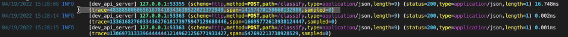
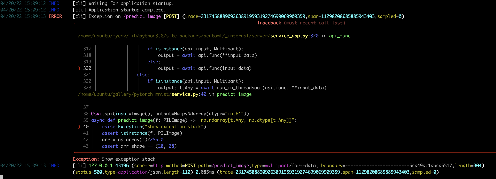

.. _logging-page:

Logging
=======

BentoML provides a powerful and detailed logging pattern out of the box. Request logs for webservices are logged along with requests to each of the model runner services. We use `RichHandler <https://rich.readthedocs.io/en/stable/logging.html>`_ to provide appropriate color coding to the logs in order to make them more easily read.

OpenTelemetry Compatible
------------------------

The BentoML logging system implements the `OpenTelemetry <https://opentelemetry.io/docs/>`_ standard for `http <https://github.com/open-telemetry/opentelemetry-specification/blob/main/specification/trace/semantic_conventions/http.md>`_ throughout the call stack to provide for maximum debuggability. Propogation of the OpenTelemetry parameters follows the standard provided `here <https://opentelemetry.lightstep.com/core-concepts/context-propagation/>`_

The following are parameters which are provided in the logs as well for correlation back to particular requests.

- `trace_id` is the id of a trace which tracks “the progression of a single request, as it is handled by services that make up an application” - `OpenTelemetry Basic Documentation <https://www.dynatrace.com/support/help/extend-dynatrace/opentelemetry/basics>`_
- `span_id is` the id of a span which is contained within a trace. “A span is the building block of a trace and is a named, timed operation that represents a piece of the workflow in the distributed system. Multiple spans are pieced together to create a trace.” - `OpenTelemetry Span Documentation <https://opentelemetry.lightstep.com/spans/>`_
- `sampled is` the number of times this trace has been sampled. “Sampling is a mechanism to control the noise and overhead introduced by OpenTelemetry by reducing the number of samples of traces collected and sent to the backend.” - `OpenTelemetry SDK Documentation <https://github.com/open-telemetry/opentelemetry-specification/blob/main/specification/trace/sdk.md>`_

Exception Logging
-----------------

Any time an error is thrown, `RichHandler <https://rich.readthedocs.io/en/stable/logging.html>`_ will log the exception stack in it’s own nicely designed format for maximum readability.

Logging Configuration
---------------------

Logs can be configured from the bentofile.yaml file for both web requests and model serving requests.

Web Service Requests
^^^^^^^^^^^^^^^^^^^^

For web requests, logging can be enabled and disabled using the `logging.access` parameter at the top level of the bentofile.yaml.

.. code-block:: yaml

    logging:
      access:
          enabled: False
          request_content_length: True
          request_content_type: True
          response_content_length: True
          response_content_type: True

In addition we provide the following parameters that can enabled or disabled in each log line. Each of these parameters comes from the http headers in the requests and response.

- `request_content_length`: Is the size of the content that is being received
- `request_content_type`: Is the type of content in the request
- `response_content_length`: Is the content length of the data that is being returned in the response
- `response_content_type`: Is the type of data being returned in the response

Model Runner Request Logging
^^^^^^^^^^^^^^^^^^^^^^^^^^^^

Depending on how you’ve configured BentoML, the webserver may be separated from the model runner. In either case, we have special logging that is enabled specifically on the model side of the request. You may configure the runner access logs under the runners parameter at the top level of the bentofile.yaml

.. code-block:: python

    runners:
        logging:
          access:
              enabled: False
              request_content_length: True
              request_content_type: True
              response_content_length: True
              response_content_type: True

Each additional parameter may be configured to be shown or not:

- `request_content_length`: Is the size of the content that is being received coming from the web service
- `request_content_type`: Is the type of content in the request coming from the web service
- `response_content_length`: Is the content length of the data that is being returned in the response to the webservice
- `response_content_type`: Is the type of data being returned in the response to the webservice