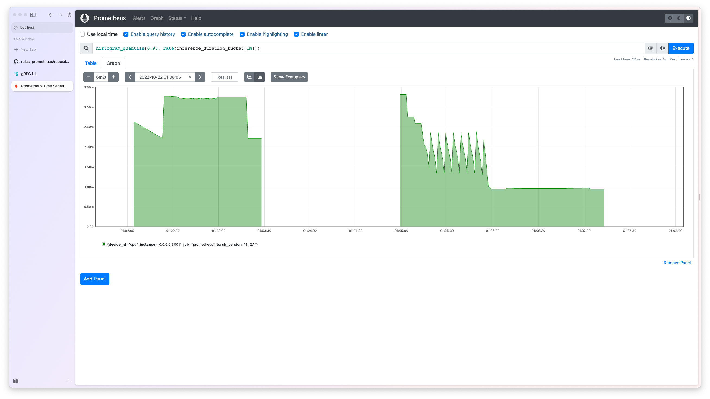

=======
Metrics
=======

Metrics are measurements of statistics about your service, which can provide information about the usage and performance of your bentos in production.

BentoML allows users to define custom metrics with `Prometheus <https://prometheus.io/docs/introduction/overview/>`_ to easily enable monitoring for their Bentos.
 
This article will dive into how to add custom metrics to monitor your BentoService and how you can incorporate custom metrics into 
either a :ref:`concepts/runner:Custom Runner` or your :ref:`Service <concepts/service:Service and APIs>`.

Having a `Prometheus server <https://prometheus.io/docs/prometheus/latest/getting_started/>`_ available will help visualize the examples in this guide.

.. note::

   This article assumes that you have a base understanding of a BentoService. If you
   are new to BentoML, please start with :ref:`the quickstart tutorial <tutorial:Tutorial: Intro to BentoML>`.

.. seealso::

   All `metrics types <https://prometheus.io/docs/concepts/metric_types/>`_ supported by Prometheus are supported in BentoML. See :ref:`reference/metrics:Metrics API` for more information on ``bentoml.metrics``.

Using Metrics in a BentoService
~~~~~~~~~~~~~~~~~~~~~~~~~~~~~~~

We will build a custom histogram to track the latency of our :ref:`pretrained NLTK runner <concepts/runner:Custom Runner>`, a custom
counter to measure the total amount of time our endpoint is invoked.

.. note::

   The source code for this custom runner is :github:`available on GitHub <bentoml/BentoML/tree/main/examples/custom_runner/nltk_pretrained_model>`.

Initialize our metrics as follow:

.. literalinclude:: ./snippets/metrics/metric_defs.py
   :language: python
   :caption: `service.py`

``inference_duration`` is a :meth:`bentoml.metrics.Histogram`, which tracks how long it
takes for our model to run inference.
The :attr:`bentoml.metrics.Histogram.buckets` argument is used to determine the granularity of histogram tracking. The range of the buckets should cover the range of values the histogram is expected track. Number of buckets is positively correlated to the the granularity of tracking. The last value of the bucket should always be the positive infinity. See Prometheus documentation on `Histogram <https://prometheus.io/docs/practices/histograms/>`_ for more details.

``polarity_counter`` is a :meth:`bentoml.metrics.Counter`, which tracks the total number
of analysis by the polarity scores.

.. epigraph::

   :bdg-info:`Note:` This also applies to any other metric type, including :meth:`bentoml.metrics.Gauge` and :meth:`bentoml.metrics.Summary`.

Create our NLTK custom runner:

.. literalinclude:: ./snippets/metrics/runner_impl.py
   :language: python
   :caption: `service.py`

This runnable implementation creates a custom NLTK runner, that use the ``inference_duration``
histogram to track the latency of polarity scores from a given sentence.

Initialize our NLTK runner, and add it to the service:

.. code-block:: python

   nltk_runner = t.cast(
      "RunnerImpl", bentoml.Runner(NLTKSentimentAnalysisRunnable, name="nltk_sentiment")
   )

   svc = bentoml.Service("sentiment_analyzer", runners=[nltk_runner])

   @svc.api(input=bentoml.io.Text(), output=bentoml.io.JSON())
   async def analysis(input_text: str) -> dict[str, bool]:
       is_positive = await nltk_runner.is_positive.async_run(input_text)
       polarity_counter.labels(polarity=is_positive).inc()
       return {"is_positive": is_positive}

Our endpoint ``analysis`` uses the ``polarity_counter`` to track the total number of
invocation for ``analysis`` by polarity scores.

.. tab-set::

    .. tab-item:: HTTP
       :sync: http

       Serve our service:

       .. code-block:: bash

          » bentoml serve-http --production

       Use the following ``prometheus.yml`` config:

       .. literalinclude:: ../../../examples/custom_runner/nltk_pretrained_model/prometheus/prometheus.http.yml
          :language: python
          :caption: `prometheus.yml`

       Startup your Prometheus server in a different terminal session:

       .. code-block:: bash

          » prometheus --config.file=prometheus.yml

       In a different terminal, send a request to our service:

       .. code-block:: bash

          » curl -X POST -F "image=@test_image.png" \
                   http://0.0.0.0:3000/predict

    .. tab-item:: gRPC
       :sync: grpc

       Serve our service:

       .. code-block:: bash

          » bentoml serve-grpc --production --enable-reflection

       Use the following ``prometheus.yml`` config:

       .. literalinclude:: ../../../examples/custom_runner/nltk_pretrained_model/prometheus/prometheus.grpc.yml
          :language: python
          :caption: `prometheus.yml`

       Startup your Prometheus server in a different terminal session:

       .. code-block:: bash

          » prometheus --config.file=prometheus.yml

       In a different terminal, send a request to our service:

       .. code-block:: bash

          » grpcurl -d @ -plaintext 0.0.0.0:3000 bentoml.grpc.v1alpha1.BentoService/Call <<EOT
            {
              "apiName": "predict",
              "serializedBytes": "..."
            }
            EOT

Visit `http://localhost:9090/graph <http://localhost:9090/graph>`_ and use the following query for 95th percentile inference latency:

.. code-block:: text

   histogram_quantile(0.95, rate(inference_duration_bucket[1m]))

.. TODO::

    * Grafana dashboard

.. admonition:: Help us improve the project!

    Found an issue or a TODO item? You're always welcome to make contributions to the
    project and its documentation. Check out the
    `BentoML development guide <https://github.com/bentoml/BentoML/blob/main/DEVELOPMENT.md>`_
    and `documentation guide <https://github.com/bentoml/BentoML/blob/main/docs/README.md>`_
    to get started.

----

.. rubric:: Notes

.. [#prometheus] `Prometheus <https://prometheus.io/>`_
