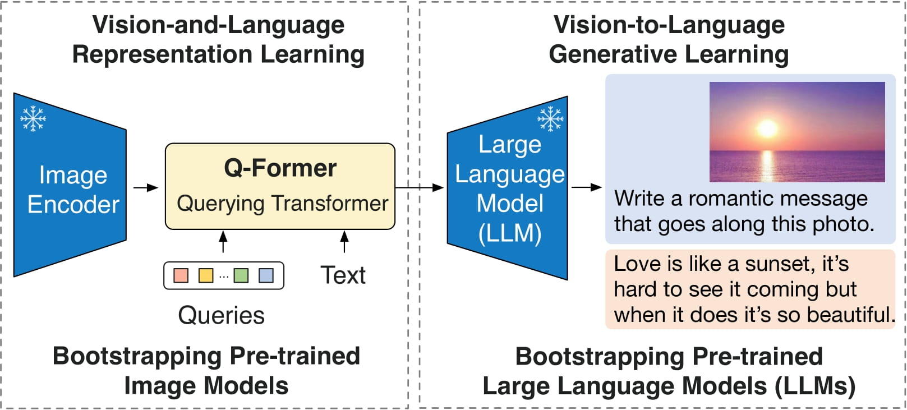

=================
Model composition
=================

Model composition refers to the practice of integrating multiple machine learning (ML) models, making it possible to orchestrate multiple inference or processing workflows within a single application. This approach not only helps facilitate the combination of different ML models but also ensures their independent configuration and scaling.

BentoML provides simple :doc:`Service APIs </guides/services>` to implement complex model composition with parallel or sequential execution for different ML scenarios, like Retrieval-augmented generation (RAG), computer vision (CV), natural language processing (NLP), and optical character recognition (OCR).

This document provides an overview of model composition with basic code examples.

When should you compose models?
-------------------------------

Consider model composition with BentoML in the following scenarios.

Multi-modal applications
^^^^^^^^^^^^^^^^^^^^^^^^

Multi-modal applications require the ability to understand, process, and derive insights from different types of data (for example, text, images, and audio) simultaneously. You can compose distinct models to build such applications, each specialized in handling a specific type of data.

A typical example of model composition for building multi-modal applications is `BLIP-2 <https://arxiv.org/abs/2301.12597>`_, a state-of-the-art model designed for tasks that involve both text and images. It integrates three distinct models, each contributing a unique capability to the system:

- A frozen pre-trained image encoder
- A lightweight Querying Transformer model (Q-Former)
- A frozen large language model (LLM) like OPT and FlanT5

    BLIP-2 architecture. Source: The `original BLIP-2 paper <https://arxiv.org/abs/2301.12597>`_.

Ensemble modeling
^^^^^^^^^^^^^^^^^

Ensemble modeling is an ML strategy to overcome the limitations of single models by combining the predictions from multiple models to produce a single, more accurate result. Key techniques in ensemble modeling include:

- **Bagging**: Train multiple models on different subsets of the training data and then average their predictions, useful for reducing variance.
- **Boosting**: Sequentially train models, where each model attempts to correct errors made by the previous ones.
- **Stacking**: Train multiple models and then use a better model that leverages the strengths of each base model to improve overall performance and combine their predictions.

Examples of ensemble modeling include Random Forest, which is a type of bagged ensemble of decision trees, and Gradient Boosting Machines (GBMs), which use boosting to produce powerful predictive models. These techniques are used across various domains, from financial forecasting to healthcare diagnostics.

Varied hardware and scaling needs
^^^^^^^^^^^^^^^^^^^^^^^^^^^^^^^^^

Different models may have unique hardware requirements and scaling behaviors, making it necessary to compose models to allocate resources efficiently. BentoML allows you to deploy :doc:`multiple Services </guides/distributed-services>`, each wrapping a model, on dedicated hardware devices (CPU and GPU servers) and independently scale them on BentoCloud.

Here is an example ``service.py`` file containing multiple models with varied hardware needs:

.. code-block:: python

    from PIL.Image import Image as PILImage
    import typing as t
    import bentoml

    @bentoml.service(resources={"gpu": 1, "memory": "4Gi"})
    class ImageModel:
        def __init__(self):
            # Simulating an image processing model initialization
            self.model = "Simulated image processing model"

        @bentoml.api
        def process_image(self, input: PILImage) -> str:
            return f"Processed image using GPU"

    @bentoml.service(resources={"cpu": "2", "memory": "2Gi"})
    class TextModel:
        def __init__(self):
            # Simulating a text processing model initialization
            self.model = "Simulated text processing model"

        @bentoml.api
        def analyze_text(self, text: str) -> str:
            return f"Analyzed text: {text} using CPU"

    @bentoml.service(resources={"cpu": "1", "memory": "1Gi"})
    class DataModel:
        def __init__(self):
            # Simulating a data analysis model initialization
            self.model = "Simulated data analysis model"

        @bentoml.api
        def process_data(self, data: t.Dict[str, t.Any]) -> t.Dict[str, t.Any]:
            return {"processed_data": data, "status": "success"}

    @bentoml.service(resources={"cpu": "4", "memory": "8Gi"})
    class InferenceOrchestrator:
        image_processor = bentoml.depends(ImageModel)
        text_analyzer = bentoml.depends(TextModel)
        data_processor = bentoml.depends(DataModel)

        @bentoml.api
        ...

In this example, the ``ImageModel``, ``TextModel``, and ``DataModel`` are defined in separated Services, each with their own hardware resource requirements (GPU for image processing, and CPU for text and data analysis) set in the ``@bentoml.service`` decorator. This means you can independently scale them when deployed on BentoCloud.

Pipeline processing
^^^^^^^^^^^^^^^^^^^

Model composition is an ideal choice when you need a sequence of processing steps (like preprocessing, prediction, post-processing). Each step can be handled by a different model optimized for that specific function. For example, in a document processing application, the task often begins with preprocessing the input, followed by the main prediction task, and ends with post-processing. Each of these steps might require different models:

- **Preprocessing**: An OCR model extracts text from images.
- **Prediction**: A text classification model categorizes the document.
- **Post-processing**: A summarization model creates a brief summary.

In addition to sequential pipelines, you may also want to run multiple models concurrently to handle different aspects of a task. This is particularly useful in scenarios like ensemble modeling (as mentioned above, predictions from multiple models are aggregated to improve accuracy), or in computer vision tasks, where image segmentation and object detection models might run in parallel to provide a composite analysis of an image.

Note that if you can use one model for all the steps directly without affecting performance, you should use one model directly. The choice depends on the specific requirements of your application.

For more information, see this paper `The Shift from Models to Compound AI Systems <https://bair.berkeley.edu/blog/2024/02/18/compound-ai-systems/>`_.

Why should you compose models?
------------------------------

Composing models in BentoML offers several benefits:

- **Improved accuracy and performance**: By leveraging the strengths of multiple specialized models, you can improve the overall accuracy and performance of the solution. One typical example is ensemble modeling, as aggregating the results from multiple models can help cancel out their individual biases and errors, leading to more accurate predictions. You can learn more `in this blog post <https://www.datacamp.com/tutorial/what-bagging-in-machine-learning-a-guide-with-examples>`_.
- **Customization and flexibility**: Model composition offers the freedom to mix and match models as needed. You can easily swap out individual components without overhauling the entire project, allowing for modular upgrades and testing.
- **Resource optimization**: You can improve resource utilization by distributing workloads across models, each optimized for specific hardware requirements.
- **Faster development and iteration (for a bigger problem)**: Teams can work on different models simultaneously, leading to quicker iterations and shorter development cycles.

How to compose models in BentoML
--------------------------------

Model composition in BentoML can involve single or multiple Services, with each model potentially serving as part of a pipeline within a Service, or as standalone components that communicate across Services. The architecture you choose depends on your specific needs. For example, a pipeline of models might be wrapped within a single Service for streamlined processing, while another separate Service might handle routing and orchestrate user requests to this inference Service.

See the following scenarios for details.

Scenario 1: Run multiple models within the same Service on the same instance
^^^^^^^^^^^^^^^^^^^^^^^^^^^^^^^^^^^^^^^^^^^^^^^^^^^^^^^^^^^^^^^^^^^^^^^^^^^^

This example defines multiple models within the same Service, with separate APIs for each and a combined API.

.. code-block:: python

    import bentoml
    from transformers import pipeline

    # Run two models in the same Service on the same hardware device
    @bentoml.service(
        resources={"gpu": 1, "memory": "4GiB"},
        traffic={"timeout": 20},
    )
    class MultiModelService:
        # Retrieve model references from the BentoML Model Store
        model_a_ref = bentoml.models.get("model_a:latest")
        model_b_ref = bentoml.models.get("model_b:latest")

        def __init__(self) -> None:
            # Initialize pipelines for each model
            self.pipeline_a = pipeline('task_a', model=self.model_a_ref.path)
            self.pipeline_b = pipeline('task_b', model=self.model_b_ref.path)

        # Define an API endpoint for processing input data with model A
        @bentoml.api
        def process_a(self, input_data: str) -> str:
            return self.pipeline_a(input_data)[0]

        # Define an API endpoint for processing input data with model B
        @bentoml.api
        def process_b(self, input_data: str) -> str:
            return self.pipeline_b(input_data)[0]

        # Define an API endpoint that combines the processing of both models
        @bentoml.api
        def combined_process(self, input_data: str) -> dict:
            result_a = self.pipeline_a(input_data)[0]
            result_b = self.pipeline_b(input_data)[0]
            return {"result_a": result_a, "result_b": result_b}

For a more practical example, see :doc:`/use-cases/diffusion-models/controlnet`.

Scenario 2: Run and scale multiple models on different instances independently
^^^^^^^^^^^^^^^^^^^^^^^^^^^^^^^^^^^^^^^^^^^^^^^^^^^^^^^^^^^^^^^^^^^^^^^^^^^^^^

Sequential
""""""""""

This example defines a sequential pipeline where output from one model is fed as input to another. This is often used in scenarios where data must be prepared to match the model's input requirements before making predictions.

.. code-block:: python

    import bentoml
    import numpy as np
    from transformers import pipeline

    @bentoml.service(resources={"cpu": 2, "memory": "2Gi"})
    class PreprocessingService:
        model_a_ref = bentoml.models.get("model_a:latest")

        def __init__(self) -> None:
            # Initialize pipeline for model
            self.pipeline_a = pipeline('task_a', model=self.model_a_ref.path)

        @bentoml.api
        def preprocess(self, input_data: np.ndarray) -> np.ndarray:
            # Dummy preprocessing steps
            data_a = self.pipeline_a(input_data)
            return data_a

    @bentoml.service(resources={"gpu": 1, "memory": "4Gi"})
    class InferenceService:
        model_b_ref = bentoml.models.get("model_b:latest")
        preprocessing_service = bentoml.depends(PreprocessingService)

        def __init__(self) -> None:
            # Initialize pipeline for model
            self.pipeline_b = pipeline('task_b', model=self.model_b_ref.path)

        @bentoml.api
        async def predict(self, input_data: np.ndarray) -> np.ndarray:
            preprocessed_data = await self.preprocessing_service.to_async.preprocess(input_data)
            # Simulate inference on preprocessed data
            data_b = self.pipeline_b(preprocessed_data)
            return data_b

Concurrent
""""""""""

This example runs two independent models concurrently to generate different types of predictions from the same input data and aggregate their results.

.. code-block:: python

    import asyncio
    import bentoml
    import numpy as np
    from transformers import pipeline

    @bentoml.service(resources={"gpu": 1, "memory": "4Gi"})
    class ModelAService:
        model_a_ref = bentoml.models.get("model_a:latest")

        def __init__(self) -> None:
            # Initialize pipeline for model
            self.pipeline_a = pipeline('task_a', model=self.model_a_ref.path)

        @bentoml.api
        def predict(self, input_data: np.ndarray) -> np.ndarray:
            # Dummy preprocessing steps
            data_a = self.pipeline_a(input_data)
            return data_a

    @bentoml.service(resources={"gpu": 1, "memory": "4Gi"})
    class ModelBService:
        model_b_ref = bentoml.models.get("model_b:latest")

        def __init__(self) -> None:
            # Initialize pipeline for model
            self.pipeline_b = pipeline('task_b', model=self.model_b_ref.path)

        @bentoml.api
        def predict(self, input_data: np.ndarray) -> np.ndarray:
            # Dummy preprocessing steps
            data_b = self.pipeline_b(input_data)
            return data_b

    @bentoml.service(resources={"cpu": 4, "memory": "8Gi"})
    class EnsembleService:
        service_a = bentoml.depends(ModelAService)
        service_b = bentoml.depends(ModelBService)

        @bentoml.api
        async def ensemble_predict(self, input_data: np.ndarray) -> np.ndarray:
            result_a, result_b = await asyncio.gather(
                self.service_a.to_async.predict(input_data),
                self.service_b.to_async.predict(input_data)
            )
            # Dummy aggregation
            return (result_a + result_b) / 2

Inference graph
"""""""""""""""

The following is a complex example of model composition within BentoML, including both parallel and sequential processing steps to for an advanced inference workflow.

.. code-block:: python

    import asyncio
    import typing as t

    import transformers

    import bentoml

    MAX_LENGTH = 128
    NUM_RETURN_SEQUENCE = 1

    @bentoml.service(
        resources={"gpu": 1, "memory": "4Gi"}
    )
    class GPT2:
        def __init__(self):
            self.generation_pipeline_1 = transformers.pipeline(
                task="text-generation",
                model="gpt2",
            )

        @bentoml.api
        def generate(self, sentence: str) -> t.List[t.Any]:
            return self.generation_pipeline_1(sentence)

    @bentoml.service(
        resources={"gpu": 1, "memory": "4Gi"}
    )
    class DistilGPT2:
        def __init__(self):
            self.generation_pipeline_2 = transformers.pipeline(
                task="text-generation",
                model="distilgpt2",
            )

        @bentoml.api
        def generate(self, sentence: str) -> t.List[t.Any]:
            return self.generation_pipeline_2(sentence)

    @bentoml.service(
        resources={"cpu": "2", "memory": "2Gi"}
    )
    class BertBaseUncased:
        def __init__(self):
            self.classification_pipeline = transformers.pipeline(
                task="text-classification",
                model="bert-base-uncased",
                tokenizer="bert-base-uncased",
            )

        @bentoml.api
        def classify_generated_texts(self, sentence: str) -> float | str:
            score = self.classification_pipeline(sentence)[0]["score"]  # type: ignore
            return score

    @bentoml.service(
        resources={"cpu": "4", "memory": "8Gi"}
    )
    class InferenceGraph:
        gpt2_generator = bentoml.depends(GPT2)
        distilgpt2_generator = bentoml.depends(DistilGPT2)
        bert_classifier = bentoml.depends(BertBaseUncased)

        @bentoml.api
        async def generate_score(
            self, original_sentence: str = "I have an idea!"
        ) -> t.List[t.Dict[str, t.Any]]:
            generated_sentences = [  # type: ignore
                result[0]["generated_text"]
                for result in await asyncio.gather(  # type: ignore
                    self.gpt2_generator.to_async.generate(  # type: ignore
                        original_sentence,
                        max_length=MAX_LENGTH,
                        num_return_sequences=NUM_RETURN_SEQUENCE,
                    ),
                    self.distilgpt2_generator.to_async.generate(  # type: ignore
                        original_sentence,
                        max_length=MAX_LENGTH,
                        num_return_sequences=NUM_RETURN_SEQUENCE,
                    ),
                )
            ]

            results = []
            for sentence in generated_sentences:  # type: ignore
                score = await self.bert_classifier.to_async.classify_generated_texts(
                    sentence
                )  # type: ignore
                results.append(
                    {
                        "generated": sentence,
                        "score": score,
                    }
                )

            return results

This ``service.py`` file does the following:

1. **Receive a prompt**: Starts by accepting an original text input, like "I have an idea!", which will be fed into the text generation models.
2. **Generate text in parallel**: The original prompt is sent simultaneously to two separate text generation models (``GPT2`` and ``DistilGPT2``). This step is parallel, meaning both models generate text based on the same input at the same time, without waiting for each other. This parallelism is implemented through ``asyncio.gather``, which schedules both asynchronous operations to run concurrently.
3. **Classify text sequentially**: After receiving the generated text from both models, each piece of text is then sequentially processed by a text classification model (``BertBaseUncased``). It evaluates the content of each generated text based on its sentiment, and assigns a classification score to them.
4. **Generate results**: Finally, the scores assigned by the classification model, along with the generated text themselves, are compiled into a single response.

.. note::

    In some cases, you may want to stream output directly from one LLM to another LLM as input to build a compound LLM system. This is not yet supported in BentoML, but it is on its roadmap. If you are interested in this topic, you are welcome to join our discussion in the `BentoML Slack community <https://l.bentoml.com/join-slack>`_ or `raise an issue in GitHub <https://github.com/bentoml/BentoML/issues/new/choose>`_.
