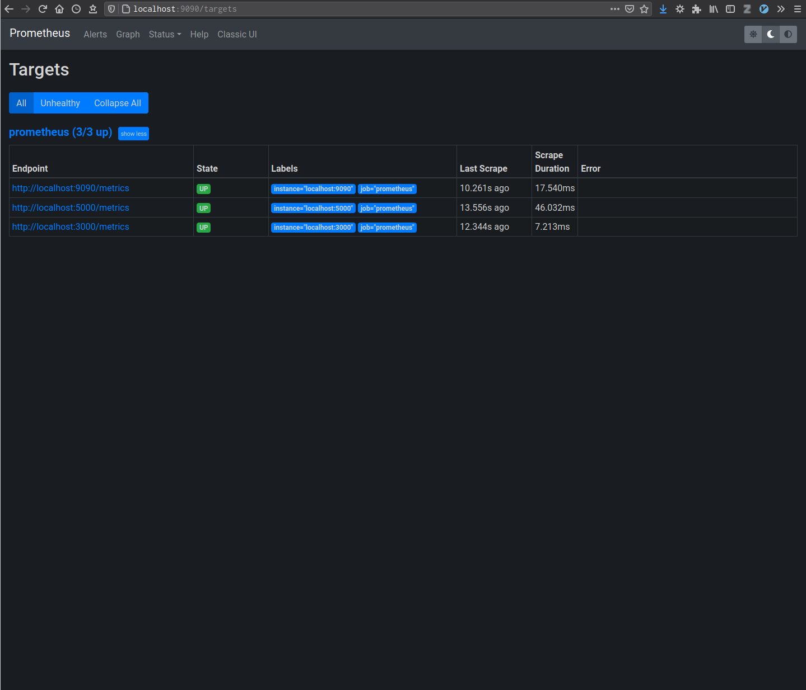
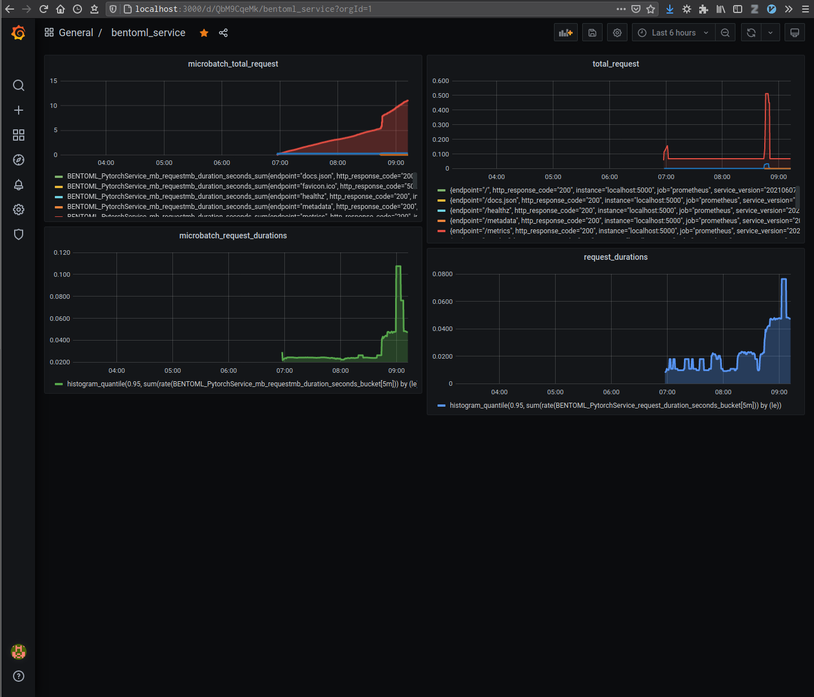
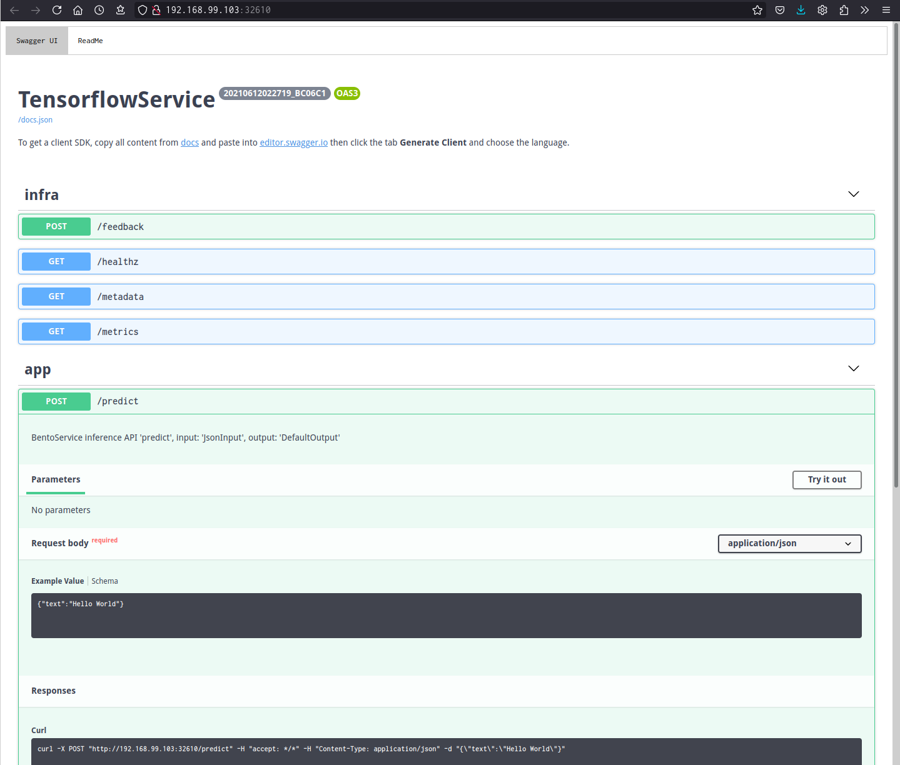
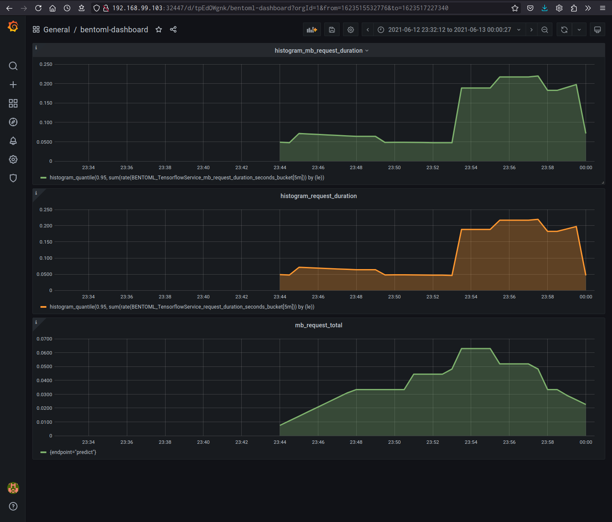
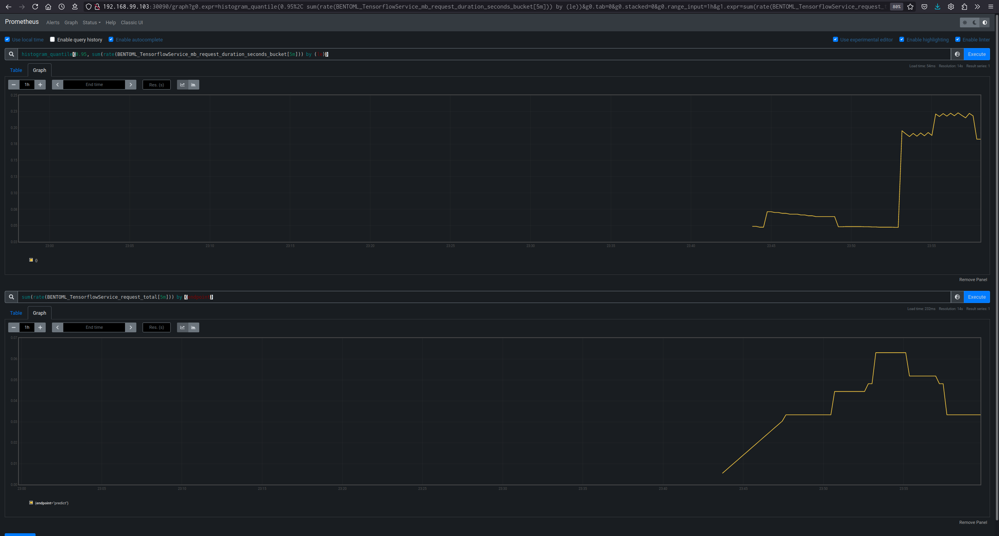

==========================
Monitoring with Prometheus
==========================

Monitoring stacks usually consist of a metrics collector, a time-series database to store metrics
and a visualization layer. A popular stack is Prometheus_ with Grafana_ used as the visualization layer
to create rich dashboards. An architecture of Prometheus and its ecosystem is shown below:

.. image:: ../_static/img/prom-architecture.png

BentoML API server comes with Prometheus support out of the box. When launching an API model server with BentoML,
whether it is running dev server locally or deployed with docker in the cloud, a ``/metrics`` endpoint will always
be available, which includes the essential metrics for model serving and the ability to create
and customize new metrics base on needs. This guide will introduce how you use Prometheus and Grafana to monitor
your BentoService.

Preface
-------

.. seealso::
     Prometheus_ and Grafana_ docs for more in depth topics.

.. note::
    This guide requires users to have a basic understanding of Prometheus' concept as well as its metrics type.
    Please refers to `Concepts <https://prometheus.io/docs/concepts/data_model/>`_ for more information.

.. note::
    Refers to `PromQL basics <https://prometheus.io/docs/prometheus/latest/querying/basics/>`_ for Prometheus query language.

.. note::
    Please refers to Prometheus' best practices for `consoles and dashboards <https://prometheus.io/docs/practices/consoles/>`_
    as well as `histogram and summaries <https://prometheus.io/docs/practices/histograms/>`_.

Local Deployment
----------------

This section will walk you through how to setup the stack locally, with the optional guide on using ``docker-compose`` for easy deployment of the stack.

Setting up Prometheus
^^^^^^^^^^^^^^^^^^^^^

It is recommended to run Prometheus with Docker . Please make sure that you have
`Docker <https://docs.docker.com/engine/install/>`_ installed on your system.

Users can take advantage of having a ``prometheus.yml`` for configuration.
Example of for monitoring BentoService is shown below:

.. code-block:: yaml

    # prometheus.yml

    global:
      scrape_interval:     15s
      evaluation_interval: 30s
      # scrape_timeout is set to the global default (10s).

    scrape_configs:
    - job_name: prometheus

      honor_labels: true
      static_configs:
      - targets:
        - localhost:9090  # metrics from prom/prometheus
        - localhost:5000  # BentoService metrics
        - localhost:3000  # YataiService metrics

.. note::
    Make sure you have targets port for your BentoService setup correctly according to your use case. For the
    demo we will use BentoService default port **5000**.

.. warning::
    Currently **8080** and **3000** is reserved while running YataiService. Thus, in order to monitor YataiService
    with Grafana, one should either set Grafana or YataiService to another port than 3000 since both services
    requires ``:3000``

We can then run Prometheus with the following:

.. code-block:: bash

    # Bind-mount your prometheus.yml from the host by running:
    » docker run --network=host -v path/to/prometheus.yml:/etc/prometheus/prometheus.yml prom/prometheus

.. note::
    When deploying users can setup ``docker-compose`` and setup a shared network in order for ``prometheus`` to scrape
    metrics from your BentoService. Please refers to :ref:`docker-compose`.

Users can check |localhost-9090|_ to make sure prometheus is currently running.
In order to check if prometheus is scraping our BentoService, |9090-target|_ should show:

.. _localhost-9090: http://localhost:9090/status
.. |localhost-9090| replace:: ``:9090/status``

.. _9090-target: http://localhost:9090/targets
.. |9090-target| replace:: ``:9090/targets``

Setting up Grafana
^^^^^^^^^^^^^^^^^^

It is also recommended use Grafana with Docker.

.. code-block:: bash

    » docker run --network=host grafana/grafana

To log in to Grafana for the first time:

    #. Open your web browser and go to |localhost-3000|_. The default HTTP port that Grafana listens to is ``:3000`` unless you have configured a different port.

    #. On the login page, enter ``admin`` for username and password.

    #. Click Log in. If login is successful, then you will see a prompt to change the password.

    #. Click OK on the prompt, then change your password.

.. _localhost-3000: http://localhost:3000
.. |localhost-3000| replace:: **localhost:3000**

.. seealso::
    `Add Prometheus Datasource on Grafana <https://grafana.com/docs/grafana/latest/datasources/prometheus/>`_.

.. seealso::::
    `Best practice while creating dashboards on Grafana <https://grafana.com/docs/grafana/latest/best-practices/best-practices-for-creating-dashboards/>`_

Users can also import `BentoService Dashboard <https://github.com/bentoml/BentoML/tree/master/docs/source/configs/grafana/provisioning/dashboards/bentoml-dashboard-1623445349552.json>`_ and
explore given BentoService metrics by `importing dashboard <https://grafana.com/docs/grafana/latest/dashboards/export-import/#import-dashboard>`_.

======================

.. warning::
    Make sure to setup `Docker Swarm <https://docs.docker.com/engine/swarm/swarm-tutorial/#set-up>`_ before proceeding.

.. _docker-compose:
.. include:: configs/README.rst
   :start-after: introduction-marker
   :end-before: not-exposed-marker

content of ``docker-compose.yml``, example dashboard can be seen `here <https://snapshot.raintank.io/dashboard/snapshot/hcYDylsRTz1Md5W4FpjkEc0Ldm5zygDr?orgId=2>`_:

.. code-block:: yaml

    version: '3.7'

    volumes:
      prometheus_data:
      grafana_data:

    networks:
      shared-network:

    services:

      prometheus:
        image: prom/prometheus
        volumes:
          - ./prometheus/:/etc/prometheus/
          - prometheus_data:/prometheus
        command:
          - '--config.file=/etc/prometheus/prometheus.yml'
          - '--storage.tsdb.path=/prometheus'
          - '--web.console.libraries=/usr/share/prometheus/console_libraries'
          - '--web.console.templates=/usr/share/prometheus/consoles'
        ports:
          - 9090:9090
        networks:
          - shared-network
        deploy:
          placement:
            constraints:
              - node.role==manager
        restart: on-failure

      grafana:
        image: grafana/grafana
        depends_on:
          - prometheus
        ports:
          - 3000:3000
        volumes:
          - grafana_data:/var/lib/grafana
          - ./grafana/provisioning/:/etc/grafana/provisioning/
        env_file:
          - ./grafana/config.monitoring
        networks:
          - shared-network
        user: "472"
        deploy:
          mode: global
        restart: on-failure

      bentoml:
        image: aarnphm/bentoml-sentiment-analysis:latest
        ports:
          - "5000:5000"
        networks:
          - shared-network
        deploy:
          mode: global
        restart: on-failure

.. seealso::
    `Alertmanager <https://prometheus.io/docs/alerting/latest/alertmanager/>`_ and `cAdvisor <https://github.com/google/cadvisor>`_ to setup alerts as well as monitor container resources.

.. seealso::
    `prom/node-exporter <https://github.com/prometheus/node_exporter>`_ for expose machine metrics.

==============================

Deploying on Kubernetes
-----------------------

.. note::
    `minikube <https://minikube.sigs.k8s.io/docs/start/>`_ and `kubectl <https://kubernetes.io/docs/tasks/tools/install-kubectl-linux/>`_ is required for this part of the tutorial.
    Users may also choose to install `virtualbox <https://www.virtualbox.org/>`_ in order to run minikube.

.. seealso::
    :doc:`../deployment/kubernetes` on how to deploy BentoService to Kubernetes.

.. code-block:: bash

    » sh -c $(curl -fsLS https://bit.ly/3cCml2I) # auto deploy the stack to local k8s

Setting up Prometheus with ``kube-prometheus``
^^^^^^^^^^^^^^^^^^^^^^^^^^^^^^^^^^^^^^^^^^^^^^

We can then implement the stack with ``Helm`` and make use of `prometheus-operator <https://github.com/prometheus-operator/prometheus-operator>`_ through kube-prometheus_:

* The Operator uses standard configurations and dashboards for Prometheus and Grafana.

* The Helm ``prometheus-operator`` chart allows you to get a full cluster monitoring solution up and running by installing aforementioned components.

.. seealso::
    kube-prometheus_

Setup ``minikube``:

.. code-block:: bash

    # setup virtualbox to be default driver
    » minikube config set driver virtualbox

    # prometheus-operator/kube-prometheus
    » minikube delete && minikube start \
        --kubernetes-version=v1.20.0 \
        --memory=6g --bootstrapper=kubeadm \
        --extra-config=kubelet.authentication-token-webhook=true \
        --extra-config=kubelet.authorization-mode=Webhook \
        --extra-config=scheduler.address=0.0.0.0 \
        --extra-config=controller-manager.address=0.0.0.0

    # check if your k8s is currently running (should return no error)
    » kubectl cluster-info

    # kube-prometheus includes a resource metrics API server, so metrics-server addon is not necessary.
    » minikube addons disable metrics-server

Then get ``helm`` repo:

.. code-block:: bash

    » helm repo add prometheus-community https://prometheus-community.github.io/helm-charts

    # then run update
    » helm repo update

Search for available prometheus chart:

.. code-block:: bash

    » helm search repo kube-prometheus

Once located the version of our stack (v16.7.0), inspect the chart to modify the settings:

.. code-block:: bash

    » helm inspect values prometheus-community/kube-prometheus-stack > ./configs/deployment/kube-prometheus-stack.values

Next, we need to change the port at which the Prometheus server service is available, by changing our service type from ``ClusterIP`` to ``NodePort``.
This enable Prometheus server to be accessible at your machine ``:30090``.

.. code-block:: yaml

      ## Configuration for Prometheus service
      ##
      service:
        annotations: {}
        labels: {}
        clusterIP: ""

        ## Port for Prometheus Service to listen on
        ##
        port: 9090

        ## To be used with a proxy extraContainer port
        targetPort: 9090

        ## List of IP addresses at which the Prometheus server service is available
        ## Ref: https://kubernetes.io/docs/user-guide/services/#external-ips
        ##
        externalIPs: []

        ## Port to expose on each node
        ## Only used if service.type is 'NodePort'
        ##
        nodePort: 30090

        ## Loadbalancer IP
        ## Only use if service.type is "LoadBalancer"
        loadBalancerIP: ""
        loadBalancerSourceRanges: []
        ## Service type
        ##
        type: NodePort # changed this line from ClusterIP to NodePort

Set ``prometheus.prometheusSpec.serviceMonitorSelectorNilUsesHelmValues`` and ``prometheus.prometheusSpec.podMonitorSelectorNilUsesHelmValues`` to ``false``.

Finally deploy Prometheus and Grafana pods using ``kube-prometheus-stack`` via Helm:

.. code-block:: bash

    » helm install prometheus-community/kube-prometheus-stack --create-namespace --namespace bentoml --generate-name --values ./configs/deployment/kube-prometheus-stack.values

    # Output
    NAME: kube-prometheus-stack-1623502925
    LAST DEPLOYED: Sat Jun 12 20:02:09 2021
    NAMESPACE: bentoml
    STATUS: deployed
    REVISION: 1
    NOTES:
    kube-prometheus-stack has been installed. Check its status by running:
      kubectl --namespace bentoml get pods -l "release=kube-prometheus-stack-1623502925"

    Visit https://github.com/prometheus-operator/kube-prometheus for instructions on how to create & configure Alertmanager and Prometheus instances using the Operator.

.. note::
    You can also provides the values in chart directly with helm ``--set``, e.g:

    * ``--set prometheus.service.type=NodePort``

    * ``--set prometheus.prometheusSpec.serviceMonitorSelectorNilUsesHelmValues=false``

Check for Prometheus and Grafana pods:

.. code-block:: bash

    » kubectl get pods -A

    NAMESPACE     NAME                                                              READY   STATUS    RESTARTS   AGE
    bentoml       alertmanager-kube-prometheus-stack-1623-alertmanager-0            2/2     Running   0          4m5s
    bentoml       kube-prometheus-stack-1623-operator-5555798f4f-nghl8              1/1     Running   0          4m22s
    bentoml       kube-prometheus-stack-1623502925-grafana-57cdffccdc-n7lpk         2/2     Running   0          4m22s
    bentoml       kube-prometheus-stack-1623502925-kube-state-metrics-7b74f6nw22w   1/1     Running   0          4m22s
    bentoml       kube-prometheus-stack-1623502925-prometheus-node-exporter-mqtcj   1/1     Running   0          4m22s
    bentoml       prometheus-kube-prometheus-stack-1623-prometheus-0                2/2     Running   1          4m5s

Check for service startup as part of the operator:

.. code-block:: bash

    » kubectl get svc -A
    NAMESPACE     NAME                                                        TYPE        CLUSTER-IP       EXTERNAL-IP   PORT(S)                        AGE
    bentoml       alertmanager-operated                                       ClusterIP   None             <none>        9093/TCP,9094/TCP,9094/UDP     5m8s
    bentoml       kube-prometheus-stack-1623-alertmanager                     ClusterIP   10.111.44.151    <none>        9093/TCP                       5m25s
    bentoml       kube-prometheus-stack-1623-operator                         ClusterIP   10.106.5.23      <none>        443/TCP                        5m25s
    bentoml       kube-prometheus-stack-1623-prometheus                       NodePort    10.96.241.205    <none>        9090:30090/TCP                 5m26s
    bentoml       kube-prometheus-stack-1623502925-grafana                    ClusterIP   10.111.205.42    <none>        80/TCP                         5m25s
    bentoml       kube-prometheus-stack-1623502925-kube-state-metrics         ClusterIP   10.106.192.117   <none>        8080/TCP                       5m26s
    bentoml       kube-prometheus-stack-1623502925-prometheus-node-exporter   ClusterIP   10.102.213.54    <none>        9100/TCP                       5m25s
    bentoml       prometheus-operated                                         ClusterIP   None             <none>        9090/TCP                       5m8s
    default       kubernetes                                                  ClusterIP   10.96.0.1        <none>        443/TCP                        21m

As we can observe the Prometheus server is available at ``:30090``. Thus, open browser at ``http://<machine-ip-addr>:30090``.
By default the Operator enables users to monitor our Kubernetes cluster.

Using Grafana
^^^^^^^^^^^^^

Users can also launch the Grafana tools for visualization.

There are two ways to dealing with exposing Grafana ports, either is recommended based on preference:

* :ref:`patching`.

* :ref:`port-forwarding` `(Official guides) <https://github.com/prometheus-operator/kube-prometheus#access-the-dashboards>`_.

.. _patching:

Patching Grafana Service
""""""""""""""""""""""""

By default, Every services in the Operator uses ``ClusterIP`` to expose the ports on which the service is accessible, including
Grafana. This can be changed to a ``NodePort`` instead, so the page is accessible from the browser, similar to what we did earlier
with Prometheus dashboard.

We can take advantage of |kubectl_patch|_ to update the service API to expose a ``NodePort`` instead.

.. _kubectl_patch: https://kubernetes.io/docs/tasks/manage-kubernetes-objects/update-api-object-kubectl-patch/
.. |kubectl_patch| replace:: ``kubectl patch``

Modify the spec to change service type:

.. code-block:: bash

    » cat << EOF | tee ./configs/deployment/grafana-patch.yaml
    spec:
      type: NodePort
      nodePort: 36745
    EOF

Use ``kubectl patch``:

.. code-block:: bash

    » kubectl patch svc kube-prometheus-stack-1623502925-grafana -n bentoml --patch "$(cat configs/deployment/grafana-patch.yaml)"

    service/kube-prometheus-stack-1623502925-grafana patched

Verify that the service is now exposed at an external accessible port:

.. code-block:: bash

    » kubectl get svc -A

    NAMESPACE              NAME                                                        TYPE        CLUSTER-IP       EXTERNAL-IP   PORT(S)                        AGE
    <snip>
    bentoml                kube-prometheus-stack-1623-prometheus                       NodePort    10.96.241.205    <none>        9090:30090/TCP                 35m
    bentoml                kube-prometheus-stack-1623502925-grafana                    NodePort    10.111.205.42    <none>        80:32447/TCP                   35m

Open your browser at ``http:<machine-ip-addr>:32447``, credentials:

* login: ``admin``

* password: ``prom-operator``.

.. _port-forwarding:

Port Forwarding
"""""""""""""""

Another method is to access Grafana with port-fowarding.

Notice that Grafana is accessible at port ``:80``. We will choose an arbitrary port ``:36745`` on our local machine to port ``:80`` on the service (-> ``:3000`` where
Grafana is listening at)

.. code-block:: bash

    » kubectl port-forward svc/kube-prometheus-stack-1623502925-grafana -n bentoml 36745:80

    Forwarding from 127.0.0.1:36745 -> 3000
    Forwarding from [::1]:36745 -> 3000
    Handling connection for 36745

.. note::
    If your cluster is setup on a cloud instance, e.g. AWS EC2, you might have to setup SSH tunnel between your local
    workstation and the instance using port forwarding to view Grafana tool in your own browser.

Point to ``http://localhost:36745/`` to see Grafana login page using the same credentials.

Setting up your BentoService
^^^^^^^^^^^^^^^^^^^^^^^^^^^^

An example BentoService on Kubernetes:

.. code-block:: bash

    ---
    ### Tensorflow Deployment
    apiVersion: apps/v1
    kind: Deployment
    metadata:
      labels:
        app: bentoml_service
      name: bentoml_service
      namespace: default
    spec:
      replicas: 1
      selector:
        matchLabels:
          app: bentoml_service
      template:
        metadata:
          labels:
            app: bentoml_service
        spec:
          containers:
            - image: aarnphm/bentoml-sentiment-analysis:latest
              imagePullPolicy: Always
              name: bentoml_service
          restartPolicy: Always
          securityContext: {}
          terminationGracePeriodSeconds: 30

.. note::
    Make sure that you also include a ``ServiceMonitor`` definition for your BentoService in order for Prometheus to scrape.

Apply the changes to enable monitoring:

.. code-block:: bash

    kubectl apply -f configs/deployment/bentoml-deployment.yml --namespace=bentoml

.. note::
    After logging into Grafana, imports the provided dashboards under ``configs/grafana/provisioning/dashboards``.

**The final results:** Deployed BentoML-Prometheus-Grafana Stack on Kubernetes

.. code-block:: bash

    » minikube service list
    |-------------|-----------------------------------------------------------|--------------|-----------------------------|
    |  NAMESPACE  |                           NAME                            | TARGET PORT  |             URL             |
    |-------------|-----------------------------------------------------------|--------------|-----------------------------|
    | bentoml     | alertmanager-operated                                     | No node port |                             |
    | bentoml     | kube-prometheus-stack-1623-alertmanager                   | No node port |                             |
    | bentoml     | kube-prometheus-stack-1623-operator                       | No node port |                             |
    | bentoml     | bentoml-service                                           | predict/5000 | http://192.168.99.103:32610 |
    | bentoml     | kube-prometheus-stack-1623-prometheus                     | web/9090     | http://192.168.99.102:30090 |
    | bentoml     | kube-prometheus-stack-1623502925-grafana                  | service/80   | http://192.168.99.102:32447 |
    | bentoml     | kube-prometheus-stack-1623502925-kube-state-metrics       | No node port |                             |
    | bentoml     | kube-prometheus-stack-1623502925-prometheus-node-exporter | No node port |                             |
    | bentoml     | prometheus-operated                                       | No node port |                             |
    |-------------|-----------------------------------------------------------|--------------|-----------------------------|

(Optional) Exposing GPU Metrics on Kubernetes
^^^^^^^^^^^^^^^^^^^^^^^^^^^^^^^^^^^^^^^^^^^^^

.. note:: This part is currently working in progress. If you have any questions related to this, please join `the BentoML Slack community <https://join.slack.com/t/bentoml/shared_invite/enQtNjcyMTY3MjE4NTgzLTU3ZDc1MWM5MzQxMWQxMzJiNTc1MTJmMzYzMTYwMjQ0OGEwNDFmZDkzYWQxNzgxYWNhNjAxZjk4MzI4OGY1Yjg>`_
    and ask in the bentoml-users channel.

.. _kube-prometheus: https://github.com/prometheus-operator/kube-prometheus#readme
.. _Prometheus: https://prometheus.io/docs/introduction/overview/
.. _Grafana: https://grafana.com/docs/grafana/latest/