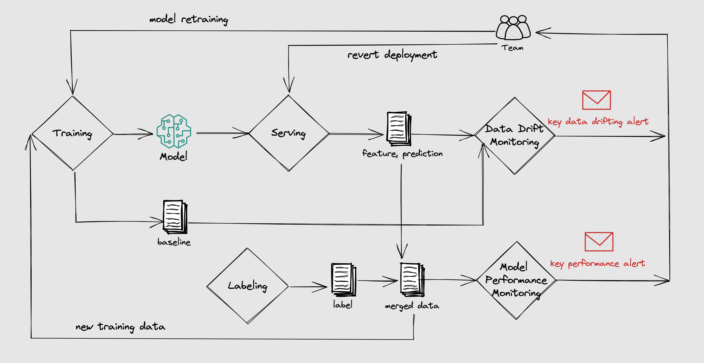

============================================
Inference Data Collection & Model Monitoring
============================================

Data-Centric Artificial Intelligence is an industrial leading paradigm that puts
data at the forefront of AI systems. It is a new way of thinking
about AI that is based on the idea that data is the most important
component of AI systems.

BentoML embraces this new paradigm by providing APIs that make a data-centric workflow easy to implement.

In this guide, we will focus on the online data collection and model monitoring. BentoML provides a unified interface for that.

The benefits of having a data collection and model monitoring workflow includes:

- Monitor key statistical business metrics.
- Identify early data drift events to determine whether retraining is required.
- Enable QA for the previous untracked metrics, such as model performance, accuracy, degradation, etc.
- Better interoperability for training or model iteration.

Build an ML Application with monitoring API
~~~~~~~~~~~~~~~~~~~~~~~~~~~~~~~~~~~~~~~~~~~

The following examples are excerpted from :github:`bentoml/BentoML/tree/main/examples/quickstart`.

Given the following service definition:

.. code-block:: python
    :caption: `service.py`

    import numpy as np
    import bentoml
    from bentoml.io import Text
    from bentoml.io import NumpyNdarray

    CLASS_NAMES = ["setosa", "versicolor", "virginica"]

    iris_clf_runner = bentoml.sklearn.get("iris_clf:latest").to_runner()

    svc = bentoml.Service("iris_classifier", runners=[iris_clf_runner])

    @svc.api(
        input=NumpyNdarray.from_sample(np.array([4.9, 3.0, 1.4, 0.2], dtype=np.double)),
        output=Text(),
    )
    async def classify(features: np.ndarray) -> str:
        results = await iris_clf_runner.predict.async_run([features])
        result = results[0]
        category = CLASS_NAMES[result]
        return category

Before we go to the production, we will only need one more step to add monitoring:

.. code-block:: python
    :caption: `service.py`
    :emphasize-lines: 17-21,27

    import numpy as np

    import bentoml
    from bentoml.io import Text
    from bentoml.io import NumpyNdarray

    CLASS_NAMES = ["setosa", "versicolor", "virginica"]

    iris_clf_runner = bentoml.sklearn.get("iris_clf:latest").to_runner()
    svc = bentoml.Service("iris_classifier", runners=[iris_clf_runner])

    @svc.api(
        input=NumpyNdarray.from_sample(np.array([4.9, 3.0, 1.4, 0.2], dtype=np.double)),
        output=Text(),
    )
    async def classify(features: np.ndarray) -> str:
        with bentoml.monitor("iris_classifier_prediction") as mon:
            mon.log(features[0], name="sepal length", role="feature", data_type="numerical")
            mon.log(features[1], name="sepal width", role="feature", data_type="numerical")
            mon.log(features[2], name="petal length", role="feature", data_type="numerical")
            mon.log(features[3], name="petal width", role="feature", data_type="numerical")

            results = await iris_clf_runner.predict.async_run([features])
            result = results[0]
            category = CLASS_NAMES[result]

            mon.log(category, name="pred", role="prediction", data_type="categorical")
        return category

The Monitor object has a ``log()`` API that allows users to log request features and prediction information. Given data type can be one of the following: ``["numerical", "categorical", "numerical_sequence"]`` with each role to be one of ``["feature", "prediction", "target"]``.

With a complete service definition, we can proceed to build the bento.

.. code-block:: bash

    $ bentoml build
    ██████╗░███████╗███╗░░██╗████████╗░█████╗░███╗░░░███╗██╗░░░░░
    ██╔══██╗██╔════╝████╗░██║╚══██╔══╝██╔══██╗████╗░████║██║░░░░░
    ██████╦╝█████╗░░██╔██╗██║░░░██║░░░██║░░██║██╔████╔██║██║░░░░░
    ██╔══██╗██╔══╝░░██║╚████║░░░██║░░░██║░░██║██║╚██╔╝██║██║░░░░░
    ██████╦╝███████╗██║░╚███║░░░██║░░░╚█████╔╝██║░╚═╝░██║███████╗
    ╚═════╝░╚══════╝╚═╝░░╚══╝░░░╚═╝░░░░╚════╝░╚═╝░░░░░╚═╝╚══════╝

    Successfully built Bento(tag="iris_classifier:6aqnksdbuouf2usu").

Deploy the service and collect monitoring data
~~~~~~~~~~~~~~~~~~~~~~~~~~~~~~~~~~~~~~~~~~~~~~

With BentoML, once we have the bento, it's easy to :ref:`deploy <concepts/deploy:Deploying Bento>` the ML application to any target.

Use ``serve`` to start the bento in production mode as a standalone server:

.. code-block:: bash

    $ bentoml serve iris_classifier

Then we can send a request to the server to get the prediction. BentoML will log the request features and predictions to the configured place.

By default BentoML will export the data to the `monitoring/<your_monitor_name>` directory. To preview:

.. code-block:: bash

    $ tail -f monitoring/iris_classifier_prediction/data/*.log
    ==> monitoring/iris_classifier_prediction/data/data.1.log <==
    {"sepal length": 6.3, "sepal width": 2.3, "petal length": 4.4, "petal width": 1.3, "pred": "versicolor", "timestamp": "2022-11-09T15:31:26.781914", "request_id": "10655923893485958044"}
    {"sepal length": 4.9, "sepal width": 3.6, "petal length": 1.4, "petal width": 0.1, "pred": "setosa", "timestamp": "2022-11-09T15:31:26.786670", "request_id": "16263733333988780524"}
    {"sepal length": 7.7, "sepal width": 3.0, "petal length": 6.1, "petal width": 2.3, "pred": "virginica", "timestamp": "2022-11-09T15:31:26.788535", "request_id": "9077185615468445403"}
    {"sepal length": 7.4, "sepal width": 2.8, "petal length": 6.1, "petal width": 1.9, "pred": "virginica", "timestamp": "2022-11-09T15:31:26.795290", "request_id": "1949956912055125154"}
    {"sepal length": 5.0, "sepal width": 2.3, "petal length": 3.3, "petal width": 1.0, "pred": "versicolor", "timestamp": "2022-11-09T15:31:26.797957", "request_id": "5892192931675972870"}
    {"sepal length": 5.1, "sepal width": 3.5, "petal length": 1.4, "petal width": 0.3, "pred": "setosa", "timestamp": "2022-11-09T15:31:26.801006", "request_id": "11124174524929195678"}
    {"sepal length": 5.4, "sepal width": 3.4, "petal length": 1.7, "petal width": 0.2, "pred": "setosa", "timestamp": "2022-11-09T15:31:26.805018", "request_id": "1977947867380701804"}
    {"sepal length": 5.4, "sepal width": 3.0, "petal length": 4.5, "petal width": 1.5, "pred": "versicolor", "timestamp": "2022-11-09T15:31:26.809391", "request_id": "5170522495321543267"}
    {"sepal length": 6.5, "sepal width": 3.2, "petal length": 5.1, "petal width": 2.0, "pred": "virginica", "timestamp": "2022-11-09T15:31:26.813963", "request_id": "746111233619919779"}
    {"sepal length": 5.4, "sepal width": 3.7, "petal length": 1.5, "petal width": 0.2, "pred": "setosa", "timestamp": "2022-11-09T15:31:26.816515", "request_id": "10451493838968794158"}

    ==> monitoring/iris_classifier_prediction/data/data.2.log <==
    {"sepal length": 5.6, "sepal width": 2.5, "petal length": 3.9, "petal width": 1.1, "pred": "versicolor", "timestamp": "2022-11-09T15:31:26.768545", "request_id": "12581333339958540887"}
    {"sepal length": 4.5, "sepal width": 2.3, "petal length": 1.3, "petal width": 0.3, "pred": "setosa", "timestamp": "2022-11-09T15:31:26.770188", "request_id": "14803218836235991321"}
    {"sepal length": 6.3, "sepal width": 2.9, "petal length": 5.6, "petal width": 1.8, "pred": "virginica", "timestamp": "2022-11-09T15:31:26.771554", "request_id": "3898998431725264845"}
    {"sepal length": 4.7, "sepal width": 3.2, "petal length": 1.6, "petal width": 0.2, "pred": "setosa", "timestamp": "2022-11-09T15:31:26.775306", "request_id": "16171654492399963820"}
    {"sepal length": 4.9, "sepal width": 3.0, "petal length": 1.4, "petal width": 0.2, "pred": "setosa", "timestamp": "2022-11-09T15:31:26.778971", "request_id": "12433921846139166785"}
    {"sepal length": 6.9, "sepal width": 3.1, "petal length": 5.4, "petal width": 2.1, "pred": "virginica", "timestamp": "2022-11-09T15:31:26.783441", "request_id": "3868728687839356795"}
    {"sepal length": 5.1, "sepal width": 3.4, "petal length": 1.5, "petal width": 0.2, "pred": "setosa", "timestamp": "2022-11-09T15:31:26.803871", "request_id": "4920762203256166127"}
    {"sepal length": 4.5, "sepal width": 2.3, "petal length": 1.3, "petal width": 0.3, "pred": "setosa", "timestamp": "2022-11-09T15:31:26.807770", "request_id": "562712759995883379"}
    {"sepal length": 5.1, "sepal width": 3.8, "petal length": 1.6, "petal width": 0.2, "pred": "setosa", "timestamp": "2022-11-09T15:31:26.810136", "request_id": "15755243536090754018"}
    {"sepal length": 6.4, "sepal width": 3.1, "petal length": 5.5, "petal width": 1.8, "pred": "virginica", "timestamp": "2022-11-09T15:31:26.812188", "request_id": "15915060852312696387"}

Shipping the collected data
~~~~~~~~~~~~~~~~~~~~~~~~~~~

BentoML has a general monitoring data collecting API. This makes it possible to ship collected data to anywhere without code changes.
For example to a data warehouse, data analyze pipelines or to a monitoring & drift detection solution.

To achieve this, we just neet to provide a deployment configuration to bentoml.

Built-in Monitoring Data Collectors
^^^^^^^^^^^^^^^^^^^^^^^^^^^^^^^^^^^

Through log files
~~~~~~~~~~~~~~~~~

The most common way to collect monitoring data is to write it to log files. Many utils like `fluentbit <https://fluentbit.io/>`_, `filebeat <https://www.elastic.co/beats/filebeat>`_, `logstash <https://www.elastic.co/logstash/>`_, etc. can be used to collect log files and ship them to a data warehouse or a monitoring system.
This is also the default way BentoML exports monitoring data:

.. code-block:: yaml
    :caption: ⚙️ `configuration.yml`

    monitoring:
      enabled: true
      type: default
      options:
        log_path: path/to/log/file

For Docker deployments, user can mount the log directory to a volume to persist the log files.
For K8s deployments, user can mount the log directory, and deploy a fluentbit daemonset or sidecar container to collect the log files to target destinations.

Through a OTLP endpoint
~~~~~~~~~~~~~~~~~~~~~~~

.. code-block:: yaml
    :caption: ⚙️ `configuration.yml`

    monitoring:
      enable: true
      type: otlp
      options:
        endpoint: http://localhost:5000
        insecure: true
        credentials: null
        headers: null
        timeout: 10
        compression: null
        meta_sample_rate: 1.0,

For some deployment platforms, it's not easy to collect log files. For example, AWS Lambda doesn't support log files. In this case, BentoML can export monitoring data to an OTLP endpoint.
Some log collectors like fluentbit also supports OTLP input.

Plugins and Third-party Monitoring Data Collectors
^^^^^^^^^^^^^^^^^^^^^^^^^^^^^^^^^^^^^^^^^^^^^^^^^^

BentoML also supports plugins and third-party monitoring data collectors. User can write a custom monitoring data collector and publish it as a python package.
Unlike built-ins are more protocol specific for general use cases,
plugins could be more platform specific.

.. note::
    To use plugins, you need to install the plugin and include it in the dependencies section of the bentofile.
    For example, it is required to add `bentoml-plugins-arize` to the `python:packages` to use the Arize plugin.
    See :ref:`the build command<concepts/bento:The Build Command>` for more details.

Arize AI
~~~~~~~~

For end-to-end solutions for data/model monitoring, BentoML colaborates with `Arize AI <https://arize.com/docs/>`_ to provide a plugin for Arize.
If you don't want to deploy a pipeline by yourself but still need data and model monitoring for the bussiness, Arize AI is a good choice.

Arize AI provides a unified platform for data scientists, data engineers, and ML engineers to monitor, analyze, and debug ML models in production.
And the `bentoml-plugins-arize` makes it easy to work with BentoML.

.. code-block:: yaml
    :caption: ⚙️ `configuration.yml`

    monitoring:
        enable: true
        type: bentoml_plugins.arize.ArizeMonitor
        options:
            space_key: <your_space_key>
            api_key: <your_api_key>
            # ... more arize options
            # see https://docs.arize.com/arize/data-ingestion/api-reference/python-sdk/arize.init#keyword-arguments
            # and https://docs.arize.com/arize/sending-data-to-arize/data-ingestion-methods/sdk-reference/python-sdk/arize.log

You could also join the BentoML community and develop your own monitoring data collector by implementing the `bentoml.monitoring.MonitorBase` interface.

The full project described in this page can be found at :examples:`Examples: monitoring example for classification tasks <monitoring/task_classification>`.
