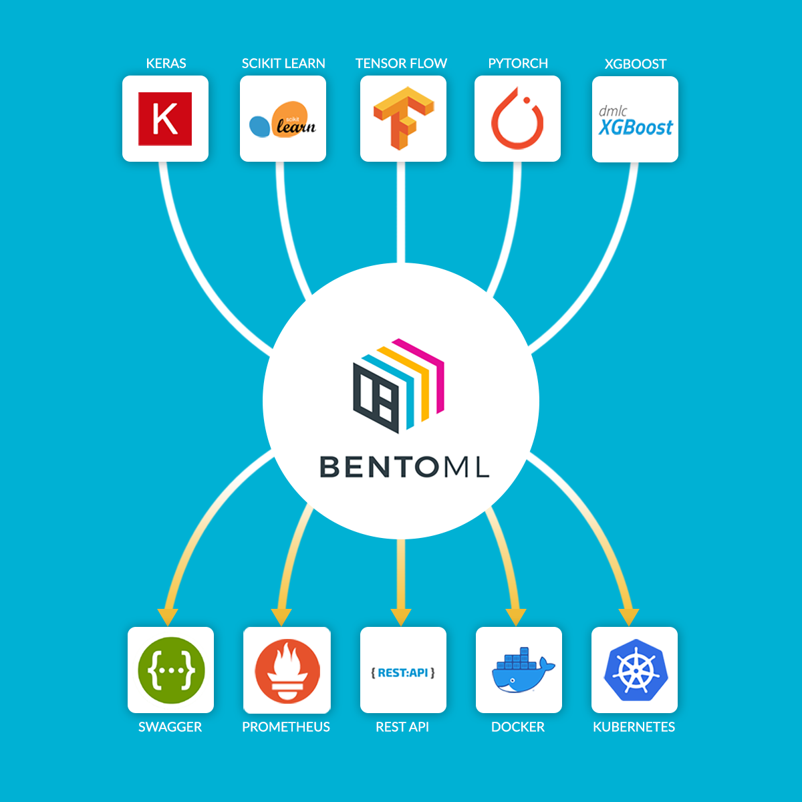

.. BentoML documentation master file, created by
   sphinx-quickstart on Fri Jun 14 11:20:19 2019.
   You can adapt this file completely to your liking, but it should at least
   contain the root `toctree` directive.

===================

.. image:: _static/img/bentoml.png
    :alt: BentoML
    :target: https://github.com/bentoml/BentoML

BentoML Documentation
====================

`BentoML <https://github.com/bentoml/BentoML>`_
is an open-source framework for **high-performance machine learning model serving**.
It makes it easy to build production API endpoints for trained ML models and supports 
all major machine learning frameworks, including Tensorflow, Keras, PyTorch, XGBoost,
scikit-learn, fastai, etc.

BentoML comes with a high-performance API model server with adaptive micro-batching 
support, bringing the advantage of batch processing to online serving workloads. It also
provides batch serving, model registry and cloud deployment functionality, which gives
ML teams an end-to-end model serving solution with baked-in DevOps best practices.

💻 Get started with BentoML: :ref:`Quickstart Guide <getting-started-page>`.

👩‍💻 Star/Watch/Fork the `BentoML Github Repository <https://github.com/bentoml/BentoML>`_.

👉 To follow development updates and discussion, join the
`BentoML mailing list <https://groups.google.com/forum/#!forum/bentoml>`_ and the 
`Bentoml Slack community <https://join.slack.com/t/bentoml/shared_invite/enQtNjcyMTY3MjE4NTgzLTU3ZDc1MWM5MzQxMWQxMzJiNTc1MTJmMzYzMTYwMjQ0OGEwNDFmZDkzYWQxNzgxYWNhNjAxZjk4MzI4OGY1Yjg>`_

What does BentoML do?
---------------------

TLDR:

* Create API endpoint serving trained models with just a few lines of code
* Support all major machine learning training frameworks
* High-Performance online API serving with adaptive micro-batching support
* Model Registry for teams, providing Web UI dashboard and CLI/API access
* Flexible deployment orchestration with DevOps best practices baked-in, supporting Docker, Kubernetes, Kubeflow, Knative, AWS Lambda, SageMaker, Azure ML, GCP and more

Why BentoML
-----------

Getting Machine Learning models into production is hard. Data Scientists are not experts
in building production services and DevOps best practices. The trained models produced
by a Data Science team are hard to test and hard to deploy. This often leads us to a 
time consuming and error-prone workflow, where a pickled model or weights file is handed
over to a software engineering team.

BentoML is an end-to-end solution for model serving, making it possible for Data Science
teams to build production-ready model serving endpoints, with common DevOps best
practices and performance optimizations baked in.

Check out `Frequently Asked Questions <https://docs.bentoml.org/en/latest/faq.html>`_ 
page on how does BentoML compares to Tensorflow-serving, Clipper, AWS SageMaker, MLFlow,
etc.

___________

.. toctree::
   :maxdepth: 2

   quickstart
   concepts
   examples
   frameworks
   guides/index
   deployment/index
   api/index
   cli
   faq
