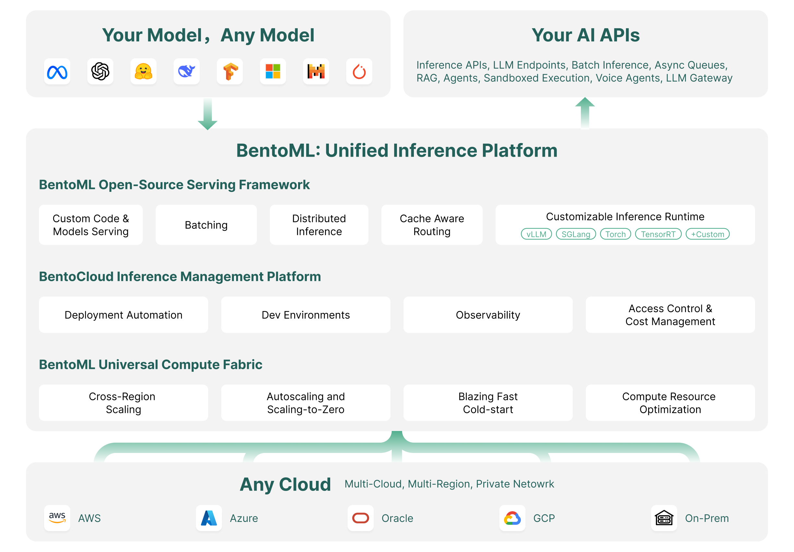

=====================
BentoML Documentation
=====================

|github_stars| |pypi_status| |actions_status| |documentation_status| |join_slack|

----

BentoML is a **Unified Inference Platform** for deploying and scaling AI systems with any model, on any cloud.

Featured examples
-----------------

.. grid:: 1 2 2 2
    :gutter: 3
    :margin: 0
    :padding: 3 4 0 0

    .. grid-item-card:: :doc:`Deploy an open-source LLM endpoint </examples/vllm>`
        :link: /examples/vllm
        :link-type: doc

        Serve large language models with OpenAI-compatible APIs and vLLM inference backend.

    .. grid-item-card:: :doc:`Document Q&A with RAG </examples/rag>`
        :link: /examples/rag
        :link-type: doc

        Deploy private RAG systems with open-source embedding and large language models.

    .. grid-item-card:: :doc:`Serve diffusion models </examples/sdxl-turbo>`
        :link: /examples/sdxl-turbo
        :link-type: doc

        Deploy image generation APIs with flexible customization and optimized batch processing.

    .. grid-item-card:: :doc:`Deploy ComfyUI pipelines </examples/comfyui>`
        :link: /examples/comfyui
        :link-type: doc

        Automate reproducible workflows with queued execution using ComfyUI pipelines.

    .. grid-item-card:: `Build a phone calling agent <https://github.com/bentoml/BentoTwilioConversationRelay>`_
        :link: https://github.com/bentoml/BentoTwilioConversationRelay

        Build a phone calling agent with end-to-end streaming capabilities using open-source models and Twilio.

    .. grid-item-card:: :doc:`/examples/shieldgemma`
        :link: /examples/shieldgemma
        :link-type: doc

        Protect your LLM API endpoint from harmful input using Google's safety content moderation model.

    .. grid-item-card:: :doc:`More examples 👉</examples/overview>`
        :link: /examples/overview
        :link-type: doc

        Explore what developers are building with BentoML.

What is BentoML
---------------

BentoML is a **Unified Inference Platform** for deploying and scaling AI models with production-grade reliability, all without the complexity of managing infrastructure. It enables your developers to **build AI systems 10x faster with custom models, scale efficiently in your cloud, and maintain complete control over security and compliance**.

To get started with BentoML:

- Use `pip <https://pip.pypa.io/en/stable/installation/>`_ to install the `BentoML open-source model serving framework <https://github.com/bentoml/BentoML>`_, which is distributed as a Python package on `PyPI <https://pypi.org/project/bentoml/>`_.

  .. code-block:: bash

     # Recommend Python 3.9+
     pip install bentoml

- `Sign up for BentoCloud <https://www.bentoml.com/>`_ to get a free trial.

How-tos
-------

.. grid:: 1 2 2 2
    :gutter: 3
    :margin: 0
    :padding: 3 4 0 0

    .. grid-item-card:: :doc:`/build-with-bentoml/services`
        :link: /build-with-bentoml/services
        :link-type: doc

        Build your custom AI APIs with BentoML.

    .. grid-item-card:: :doc:`/scale-with-bentocloud/deployment/create-deployments`
        :link: /scale-with-bentocloud/deployment/create-deployments
        :link-type: doc

        Deploy your AI application to production with one command.

    .. grid-item-card:: :doc:`/scale-with-bentocloud/scaling/autoscaling`
        :link: /scale-with-bentocloud/scaling/autoscaling
        :link-type: doc

        Configure fast autoscaling to achieve optimal performance.

    .. grid-item-card:: :doc:`/build-with-bentoml/gpu-inference`
        :link: /build-with-bentoml/gpu-inference
        :link-type: doc

        Run model inference on GPUs with BentoML.

    .. grid-item-card:: :doc:`/scale-with-bentocloud/codespaces`
        :link: /scale-with-bentocloud/codespaces
        :link-type: doc

        Develop with powerful cloud GPUs using your favorite IDE.

    .. grid-item-card:: :doc:`/build-with-bentoml/model-loading-and-management`
        :link: /build-with-bentoml/model-loading-and-management
        :link-type: doc

        Load and serve your custom models with BentoML.

Stay informed
-------------

The BentoML team uses the following channels to announce important updates like major product releases and share tutorials, case studies, as well as community news.

- `BentoML Blog <http://bentoml.com/blog>`_
- `BentoML X account <http://twitter.com/bentomlai>`_
- `BentoML LinkedIn account <https://www.linkedin.com/company/bentoml/>`_
- `BentoML Slack community <https://l.bentoml.com/join-slack>`_

To receive release notifications, star and watch the `BentoML project on GitHub <https://github.com/bentoml/bentoml>`_.
For release notes and detailed changelogs, see the `Releases <https://github.com/bentoml/BentoML/releases>`_ page.

.. toctree::
   :caption: Get Started
   :hidden:

   get-started/hello-world
   get-started/adaptive-batching
   get-started/model-composition
   get-started/async-task-queues
   get-started/packaging-for-deployment
   get-started/cloud-deployment

.. toctree::
   :caption: Learn by Examples
   :hidden:

   examples/overview
   examples/vllm
   examples/function-calling
   examples/langgraph
   examples/shieldgemma
   examples/rag
   examples/sdxl-turbo
   examples/comfyui
   examples/controlnet
   examples/mlflow
   examples/xgboost

.. toctree::
   :caption: Build with BentoML
   :hidden:

   build-with-bentoml/services
   build-with-bentoml/iotypes
   build-with-bentoml/model-loading-and-management
   build-with-bentoml/gpu-inference
   build-with-bentoml/clients
   build-with-bentoml/parallelize-requests
   build-with-bentoml/distributed-services
   build-with-bentoml/lifecycle-hooks
   build-with-bentoml/asgi
   build-with-bentoml/streaming
   build-with-bentoml/websocket
   build-with-bentoml/gradio
   build-with-bentoml/observability/index
   build-with-bentoml/error-handling
   build-with-bentoml/testing

.. toctree::
   :caption: Scale with BentoCloud
   :hidden:

   scale-with-bentocloud/deployment/index
   scale-with-bentocloud/scaling/index
   scale-with-bentocloud/manage-secrets-and-env-vars
   scale-with-bentocloud/manage-api-tokens
   scale-with-bentocloud/codespaces
   scale-with-bentocloud/administering/index

.. toctree::
   :caption: References
   :hidden:

   reference/bentoml/index
   reference/bentocloud/index

.. |pypi_status| image:: https://img.shields.io/pypi/v/bentoml.svg?style=flat-square
   :target: https://pypi.org/project/BentoML
.. |actions_status| image:: https://github.com/bentoml/bentoml/actions/workflows/ci.yml/badge.svg?branch=main
   :target: https://github.com/bentoml/bentoml/actions
.. |documentation_status| image:: https://readthedocs.org/projects/bentoml/badge/?version=latest&style=flat-square
   :target: https://docs.bentoml.com/
.. |join_slack| image:: https://badgen.net/badge/Join/Community%20Slack/cyan?icon=slack&style=flat-square
   :target: https://l.bentoml.com/join-slack
.. |github_stars| image:: https://img.shields.io/github/stars/bentoml/BentoML?color=%23c9378a&label=github&logo=github&style=flat-square
   :target: https://github.com/bentoml/bentoml
