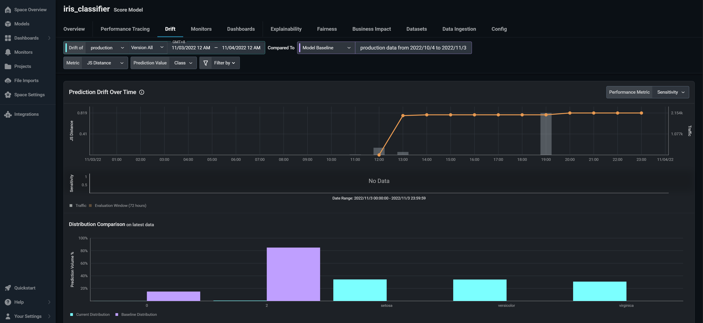
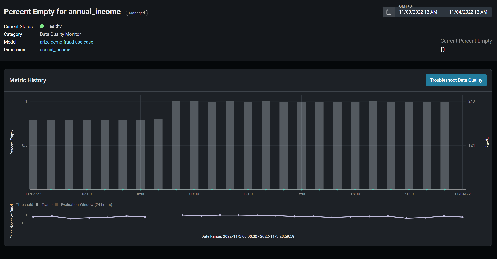
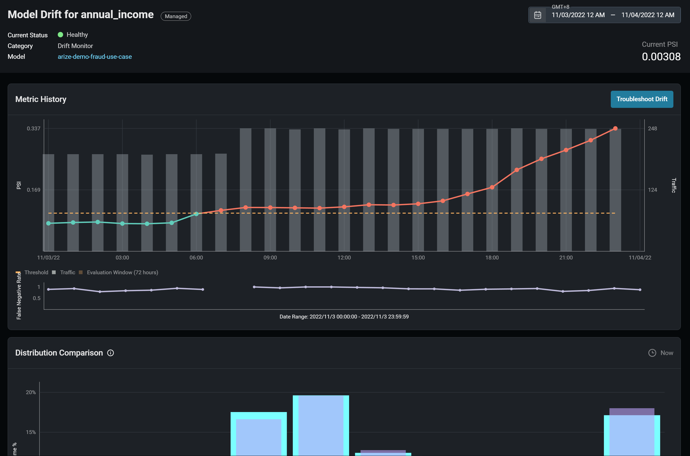
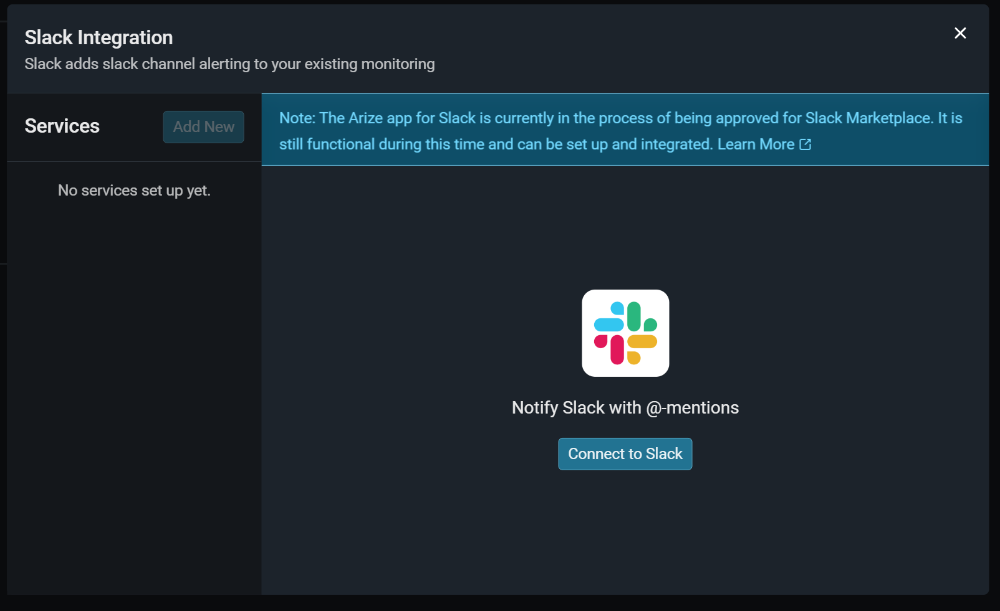

========
Arize AI
========

Arize AI provides a unified platform for data scientists, data engineers, and ML engineers to monitor, analyze, and debug ML models in production.

Our collaboration with Arize AI makes it easy to integrate end-to-end solutions for data/model monitoring with BentoML Deployments.

.. seealso::
   
   :ref:`The Arize section under the monitoring guide <guides/monitoring:Plugins and Third-party Monitoring Data Collectors>` demonstrates how to use the integration.

Preview
~~~~~~~

* Drift Detection & Monitoring

* Data Quality Monitoring

* Model Explainability

* Alerting & Notification

