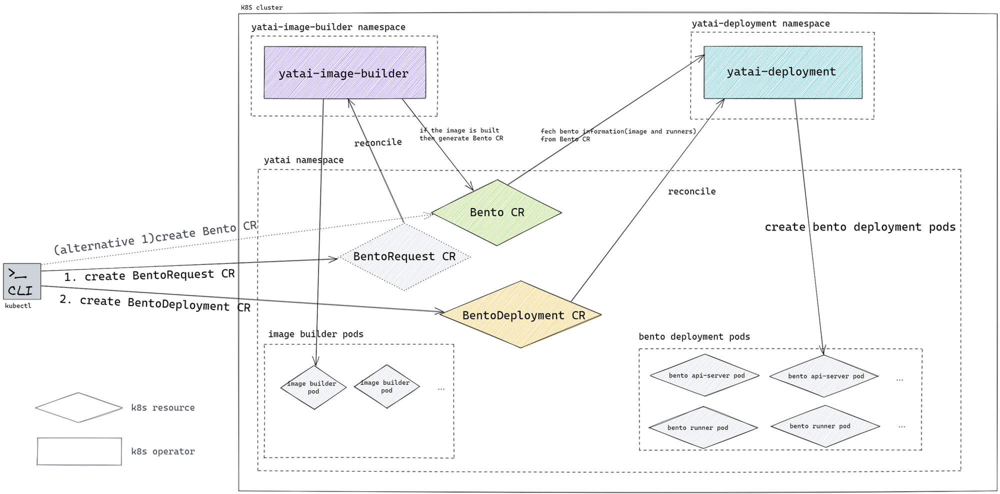
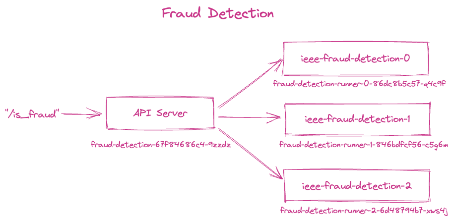

========
Kubeflow
========

Starting with the release of `Kubeflow <https://www.kubeflow.org/>`_ 1.7, BentoML provides a native integration with Kubeflow.
This integration allows you to package models trained in Kubeflow Notebooks or Pipelines as :ref:`Bentos <concepts/bento:Building Bentos>`,
and deploy them as microservices in the Kubernetes cluster through BentoML's cloud native components and custom resource definitions (CRDs).
This documentation provides a comprehensive guide on how to use BentoML and Kubeflow together to streamline the process of deploying models at scale.

Prerequisites
#############

Install Kubeflow and BentoML resources to the Kubernetes cluster. See `Kubeflow <https://github.com/kubeflow/manifests>`_ and
`BentoML <https://github.com/kubeflow/manifests/tree/master/contrib/bentoml>`_ manifests installation guides for details.

After BentoML Kubernetes resources are installed successfully, you should have the following CRDs in the namespace.

.. code-block:: bash

    kubectl -n kubeflow get crds | grep bento
    bentodeployments.serving.yatai.ai                     2022-12-22T18:46:46Z
    bentoes.resources.yatai.ai                            2022-12-22T18:46:47Z
    bentorequests.resources.yatai.ai                      2022-12-22T18:46:47Z

Kubernetes Components and CRDs
##############################

BentoML offers three custom resource definitions (CRDs) in the Kubernetes cluster through `Yatai <https://docs.bentoml.org/projects/yatai/en/latest/>`_.

.. list-table::
   :header-rows: 1

   * - CRD
     - Component
     - Description
   * - `BentoRequest <https://docs.bentoml.org/projects/yatai/en/latest/concepts/bentorequest_crd.html>`_
     - ``yatai-image-builder``
     - Describes a bento's OCI image build request and to describe how to generate a Bento CR.
   * - `Bento <https://docs.bentoml.org/projects/yatai/en/latest/concepts/bento_crd.html>`_
     - ``yatai-image-builder``
     - Describes a bento's metadata. ``yatai-deployment`` gets the bento metadata via the Bento CR. Bento CRs are often generated through the ``BentoRequest`` CR, but you can create a Bento CR manually, and ``yatai-deployment`` relies on the Bento CR to get the Bento information.
   * - `BentoDeployment <https://docs.bentoml.org/projects/yatai/en/latest/concepts/bentodeployment_crd.html>`_
     - ``yatai-deployment``
     - Describes a bento's deployment configuration. ``yatai-deployment`` watches the BentoDeployment CR and deploys the BentoService to the Kubernetes cluster.

Workflow on Notebook
####################

In this example, we will train three fraud detection models using the Kubeflow notebook and the 
`Kaggle IEEE-CIS Fraud Detection dataset <https://www.kaggle.com/c/ieee-fraud-detection>`_. We will then create a BentoML service that can
simultaneously invoke all three models and return a decision on whether a transaction is fraudulent and build it into a Bento. We will showcase
two deployment workflows using BentoML's Kubernetes operators: deploying directly from the Bento, and deploying from an OCI image built from the Bento.

See the BentoML `Fraud Detection Example <https://github.com/bentoml/BentoML/tree/main/examples/kubeflow>`_ for a detailed workflow from model training
to end-to-end deployment on Kubernetes. 
