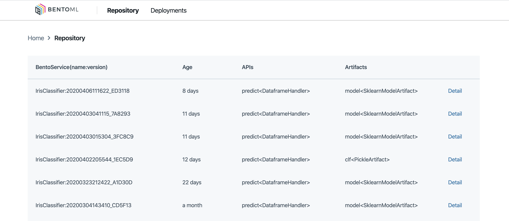
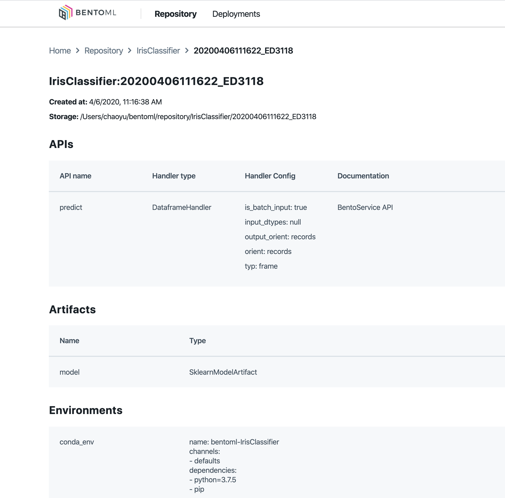

.. _getting-started-page:

Getting Started
===============

Installing BentoML
------------------

`BentoML <https://github.com/bentoml/BentoML>`_ requires python 3.6 or above, install
via :code:`pip`:

.. code-block:: bash

    pip install bentoml

Instructions for installing from source can be found in the
`development guide <https://github.com/bentoml/BentoML/blob/master/DEVELOPMENT.md>`_.

Download Quickstart Notebook
++++++++++++++++++++++++++++

Download and run the code in this quickstart locally:

.. code-block:: bash

    pip install jupyter
    git clone http://github.com/bentoml/bentoml
    jupyter notebook bentoml/guides/quick-start/bentoml-quick-start-guide.ipynb

Or :download:`Download the notebook <https://raw.githubusercontent.com/bentoml/BentoML/master/guides/quick-start/bentoml-quick-start-guide.ipynb>`
(Right-Click and then "Save Link As") to your notebook workspace.

To build a model server docker image, you will also need to install
:code:`docker` for your system, read more about how to install docker
`here <https://docs.docker.com/install/>`_.

Alternatively, play with the notebook on Google Colab:
`BentoML Quickstart on Google Colab <https://colab.research.google.com/github/bentoml/BentoML/blob/master/guides/quick-start/bentoml-quick-start-guide.ipynb>`_.

Hello World
-----------

The first step of creating a prediction service with BentoML, is to write a prediction
service class inheriting from :code:`bentoml.BentoService`, and specify the required
model artifacts, PyPI dependencies and write the service API function. Here is a minimal 
prediction service definition with BentoML:

.. code-block:: python

  # https://github.com/bentoml/BentoML/blob/master/guides/quick-start/iris_classifier.py
  import bentoml
  from bentoml.adapters import DataframeInput
  from bentoml.artifact import SklearnModelArtifact

  @bentoml.env(auto_pip_dependencies=True)
  @bentoml.artifacts([SklearnModelArtifact('model')])
  class IrisClassifier(bentoml.BentoService):

      @bentoml.api(input=DataframeInput())
      def predict(self, df):
          # Optional pre-processing, post-processing code goes here
          return self.artifacts.model.predict(df)

The :code:`bentoml.api` decorator defines a service API, which is the entry point for
accessing the prediction service. The :code:`DataframeInput` here denotes that this 
service API will convert HTTP JSON request into :code:`pandas.DataFrame` object before
passing it to the user-defined API function code for inference.

The :code:`bentoml.env` decorator allows specifying the dependencies and environment
settings for this prediction service. The example with 
:code:`auto_pip_dependencies=True` flag, BentoML will automatically inference all the
pip packages that are required by the prediction service code and pins down their
version.

Lastly :code:`bentoml.artifact` defines the required trained models to be
bundled with this prediction service. Here it is using the built-in
:code:`SklearnModelArtifact` and simply naming it 'model'. BentoML also provide model
artifact for other frameworks such as :code:`PytorchModelArtifact`,
:code:`KerasModelArtifact`, :code:`FastaiModelArtifact`, and
:code:`XgboostModelArtifact` etc.

From Model Training To Serving
------------------------------

The following code trains a scikit-learn model and bundles the trained model with an
:code:`IrisClassifier` instance. The :code:`IrisClassifier` instance is then saved to 
disk in the BentoML SavedBundle format, which is a versioned file archive that is ready 
for production models serving deployment.

.. code-block:: python

  from sklearn import svm
  from sklearn import datasets

  from iris_classifier import IrisClassifier

  if __name__ == "__main__":
      # Load training data
      iris = datasets.load_iris()
      X, y = iris.data, iris.target

      # Model Training
      clf = svm.SVC(gamma='scale')
      clf.fit(X, y)

      # Create a iris classifier service instance
      iris_classifier_service = IrisClassifier()

      # Pack the newly trained model artifact
      iris_classifier_service.pack('model', clf)

      # Save the prediction service to disk for model serving
      saved_path = iris_classifier_service.save()

By default, BentoML stores SavedBundle files under the `~/bentoml` directory. Users 
can also customize BentoML to use a different directory or cloud storage like
`AWS S3 <https://aws.amazon.com/s3/>`_. BentoML also comes with a model management
component `YataiService <https://docs.bentoml.org/en/latest/concepts.html#customizing-model-repository>`_,
which provides advanced model management features including a dashboard web UI:

.. note::

    The :code:`{saved_path}` in the following commands are referring to the returned
    value of :code:`iris_classifier_service.save()`.
    It is the file path where the BentoService saved bundle is stored.
    BentoML locally keeps track of all the BentoService SavedBundle you've created,
    you can also find the saved_path of your BentoService from the output of
    :code:`bentoml list -o wide`, :code:`bentoml get IrisClassifier -o wide` and
    :code:`bentoml get IrisClassifier:latest` command.

    A quick way of getting the :code:`saved_path` from the command line is piping the
    output of :code:`bentoml get` to `jq command <https://stedolan.github.io/jq/>`_:

    .. code-block:: bash

        saved_path=$(bentoml get IrisClassifier:latest -q | jq -r ".uri.uri")

Model Serving via REST API
--------------------------

You can start a REST API server by specifying the BentoService's name and version, or
provide the file path to the saved bundle:

.. code-block:: bash

    bentoml serve IrisClassifier:latest

.. code-block:: bash

    # Assuming JQ(https://stedolan.github.io/jq/) was installed, you can also manually
    # copy the uri field in `bentoml get` command's JSON output
    saved_path=$(bentoml get IrisClassifier:latest -q | jq -r ".uri.uri")

    bentoml serve $saved_path

The `IrisClassifier` model is now served at `localhost:5000`. Use `curl` command to send
a prediction request:

.. code-block:: bash

  curl -i \
    --header "Content-Type: application/json" \
    --request POST \
    --data '[[5.1, 3.5, 1.4, 0.2]]' \
    http://localhost:5000/predict

Similarly, with :code:`python` and 
`request <https://requests.readthedocs.io/en/master/>`_:

.. code-block:: python

    import requests
    response = requests.post("http://127.0.0.1:5000/predict", json=[[5.1, 3.5, 1.4, 0.2]])
    print(response.text)

The BentoML API server also provides a web UI for accessing predictions and debugging 
the server. Visit http://localhost:5000 in the browser and use the Web UI to send
prediction request:

.. image:: https://raw.githubusercontent.com/bentoml/BentoML/master/guides/quick-start/bento-api-server-web-ui.png
  :width: 600
  :alt: BentoML API Server Web UI Screenshot

Batch Serving via CLI
---------------------

For batch offline serving or testing your prediction service on batch test data, you
can load the BentoService SavedBundle from command line and run the prediction task on
the given input dataset. e.g.:

.. code-block:: bash

  bentoml run IrisClassifier:latest predict --input='[[5.1, 3.5, 1.4, 0.2]]'

  bentoml run IrisClassifier:latest predict --input='./iris_test_data.csv'

Containerize Model API Server
-----------------------------

BentoML provides a convenient way to containerize the model API server with Docker:

1. Find the SavedBundle directory with `bentoml get` command

2. Run `docker build` with the SavedBundle directory which contains a generated Dockerfile

3. Run the generated docker image to start a docker container serving the model

.. code-block:: bash

  saved_path=$(bentoml get IrisClassifier:latest -q | jq -r ".uri.uri")

  docker build -t {docker_username}/iris-classifier $saved_path

  docker run -p 5000:5000 -e BENTOML_ENABLE_MICROBATCH=True {docker_username}/iris-classifier

This made it possible to deploy BentoML bundled ML models with platforms such as
`Kubeflow <https://www.kubeflow.org/docs/components/serving/bentoml/>`_,
`Knative <https://knative.dev/community/samples/serving/machinelearning-python-bentoml/>`_,
`Kubernetes <https://docs.bentoml.org/en/latest/deployment/kubernetes.html>`_, which
provides advanced model deployment features such as auto-scaling, A/B testing,
scale-to-zero, canary rollout and multi-armed bandit.

.. note::

  Ensure :code:`docker` is installed before running the command above.
  Instructions on installing docker: https://docs.docker.com/install

Deploy API server to the cloud
------------------------------

BentoML has a built-in deployment management tool called YataiService. YataiService can
be deployed separately to manage all your teams' trained models, BentoService bundles,
and active deployments in a central place. But you can also create standalone model
serving deployments with just the BentoML cli, which launches a local YataiService
backed by SQLite database on your machine.

BentoML has built-in support for deploying to multiple cloud platforms. For demo
purpose, let's now deploy the IrisClassifier service we just created, to
`AWS Lambda <https://aws.amazon.com/lambda/>`_ into a serverless API endpoint.

First you need to install the :code:`aws-sam-cli` package, which is required by BentoML
to work with AWS Lambda deployment:

.. code-block:: bash

    pip install -U aws-sam-cli==0.31.1

.. note::

    You will also need to configure your AWS account and credentials if you don't have
    it configured on your machine. You can do this either
    `via environment variables <https://docs.aws.amazon.com/sdk-for-java/v1/developer-guide/setup-credentials.html>`_
    or through the :code:`aws configure` command: install `aws` cli command via
    :code:`pip install awscli` and follow
    `detailed instructions here <https://docs.aws.amazon.com/cli/latest/userguide/cli-chap-configure.html#cli-quick-configuration>`_.

Now you can run the :code:`bentoml deploy` command, to create a AWS Lambda deployment,
hosting the BentService you've created:

.. code-block:: bash

    # replace the version here with the generated version string when creating the BentoService SavedBundle
    bentoml lambda deploy quick-start-guide-deployment \
        -b=IrisClassifier:20191126125258_4AB1D4 \

Distribute BentoService as a PyPI package
-----------------------------------------

The BentoService SavedBundle is pip-installable and can be directly distributed as a
PyPI package if you plan to use the model in your python applications. You can install
it as as a system-wide python package with :code:`pip`:

.. code-block:: bash

  saved_path=$(bentoml get IrisClassifier:latest -q | jq -r ".uri.uri")

  pip install $saved_path

.. code-block:: python

  # Your bentoML model class name will become the package name
  import IrisClassifier

  installed_svc = IrisClassifier.load()
  installed_svc.predict([[5.1, 3.5, 1.4, 0.2]])

This also allow users to upload their BentoService to pypi.org as public python package
or to their organization's private PyPi index to share with other developers.

.. code-block:: bash

    cd $saved_path & python setup.py sdist upload

.. note::

    You will have to configure ".pypirc" file before uploading to pypi index.
    You can find more information about distributing python package at:
    https://docs.python.org/3.7/distributing/index.html#distributing-index

Interested in learning more about BentoML? Check out the
:ref:`BentoML Core Concepts and best practices walkthrough <core-concepts-page>`,
a must-read for anyone who is looking to adopt BentoML.

Be sure to `join BentoML slack channel <http://bit.ly/2N5IpbB>`_ to hear about the
latest development updates and be part of the roadmap discussions.
