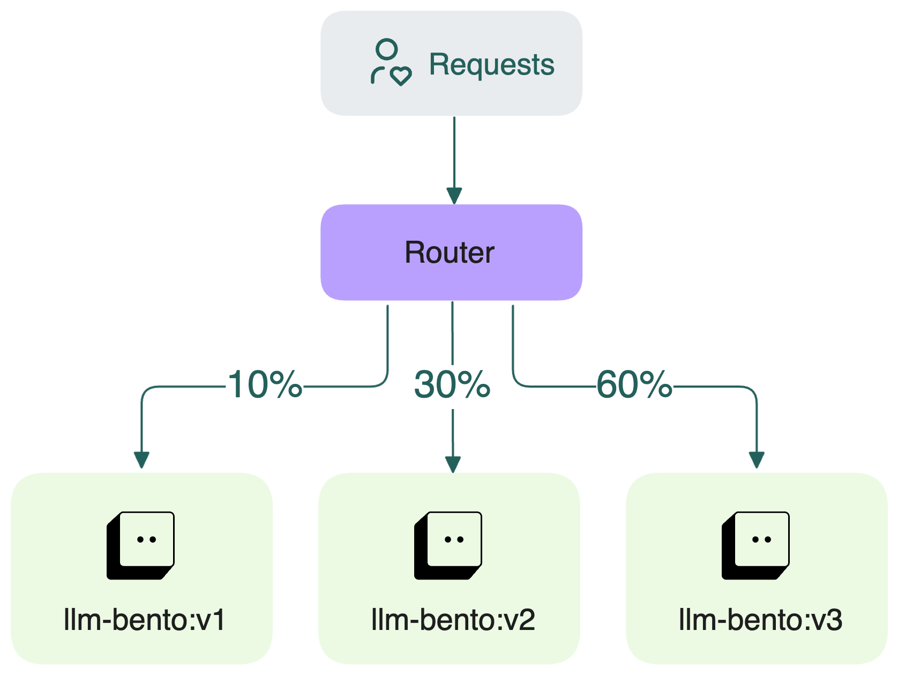

=========================
Create canary Deployments
=========================

Rolling out new versions of AI services requires careful planning. If you immediately shift all traffic to a new Deployment, it can surface regressions that impact all users at once. Without gradual rollout, even minor issues can lead to widespread disruptions and make recovery harder.

Canary Deployments on BentoCloud help mitigate these risks by enabling you to:

- Deploy multiple Bento versions simultaneously
- Choose from multiple routing strategies for fine-grained control
- Gradually shift traffic between versions (e.g., 90% to stable, 10% to canary)
- Implement rapid rollbacks to minimize production impact
- Monitor real-time performance metrics across deployed versions

How to use canary Deployments
-----------------------------

1. On the **Configuration** page, expand **Advanced Options** and toggle on **Canary** mode when creating or updating a Deployment.

   .. image:: ../../_static/img/bentocloud/how-to/canary-deployments/canary-config.png
      :alt: Enable canary model on BentoCloud

2. Select one of the following traffic routing strategies.

   - **Split traffic by header**: Hash a specified HTTP header to route traffic consistently to the same version. This is ideal for sticky sessions or user-based routing.

     Example:

     - Header/Query Key: ``X-User-ID``
     - Client request:

       .. code-block:: bash

          curl -H "X-User-ID: user123" ...

   - **Split traffic by query parameter**: Hash a query parameter in the URL to determine routing.

     Example:

     - Header/Query Key: ``feature``
     - Client request:

       .. code-block:: bash

          curl "http://your-endpoint-url/predict?feature=test" ...

   - **Random**: Distribute traffic randomly between versions according to the specified percentages.

3. Select the Bento versions to include and assign traffic percentages to each. For example:

   - Bento v1: 10%
   - Bento v2: 30%
   - Remaining 60% will go to the main Bento version.

   .. note::

      Total traffic allocation across all versions must not exceed ``100%``.

   By default, canary Deployments mirror the configuration of the main Deployment, including instance type, autoscaling settings, and replica counts. If you need to customize canary Deployments, use the BentoML CLI or Python API for more control.

4. Once the configuration is saved, navigate to the **Playground** tab to test each version independently using the version selector.

   .. image:: ../../_static/img/bentocloud/how-to/canary-deployments/multiple-bento-versions.png
      :alt: Test different Bento versions

5. Use the **Monitoring** tab to view real-time performance metrics for each Bento version in the canary Deployment.

   .. image:: ../../_static/img/bentocloud/how-to/canary-deployments/canary-performance.png
      :alt: Test different Bento versions

6. Once you're confident in a version's performance, simply edit the Deployment and increase its traffic share to 100%.

Customize canary Deployments via a configuration file
-----------------------------------------------------

You can also configure canary Deployments programmatically using a separate file and then deploy it through the BentoML CLI or Python SDK. This is ideal when you need more fine-grained control, such as using different instance types, scaling policies, or environment variables for each canary version.

Below is an example of a canary Deployment configuration file:

.. code-block:: yaml
   :caption: `config-file.yaml`

   name: summarization-blel
   bento: summarization:xq4dggshm25lecvj
   access_authorization: false
   services:
     Summarization:
       instance_type: cpu.2
       scaling:
         min_replicas: 1
         max_replicas: 1
         policy:
           scale_up_stabilization_window: 0
           scale_down_stabilization_window: 600
       config_overrides:
         traffic:
           timeout: 30
           external_queue: false
       deployment_strategy: RollingUpdate
   canary:
     route_type: query
     route_by: feature
     versions:
       a:
         bento: summarization:t226bcshm2bqicvj
         weight: 20
         services:
           Summarization:
             instance_type: cpu.1
             envs:
               - name: "VAR_NAME"
                 value: "var_value"
             scaling:
               min_replicas: 1
               max_replicas: 2
       b:
         bento: summarization:zgk7uja3goq62usu
         weight: 30
         services:
           Summarization:
             instance_type: cpu.4
             envs:
               - name: "VAR_NAME"
                 value: "var_value"
             scaling:
               min_replicas: 1
               max_replicas: 3

.. tip::

   View the full equivalent YAML/Python code on the **Configuration** page when creating or updating a Deployment.

You can then deploy it through the BentoML CLI or Python API:

.. tab-set::

    .. tab-item:: BentoML CLI

        .. code-block:: bash

           bentoml deploy -f config-file.yaml

    .. tab-item:: Python API

        .. code-block:: python

           import bentoml
           bentoml.deployment.create(config_file="config-file.yaml")
