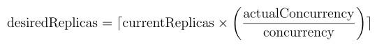

===========================
Concurrency and autoscaling
===========================

BentoCloud autoscales your Bento Deployments to efficiently handle varying loads without manual intervention. By dynamically adjusting the number of Service replicas based on incoming traffic and concurrency within the maximum replicas, it ensures optimal resource utilization and cost-efficiency.

This document explains how to configure concurrency and autoscaling in BentoCloud.

Replicas
--------

You can set the :ref:`minimum and maximum replicas <scale-with-bentocloud/deployment/configure-deployments:scaling>` to define the boundaries for scaling, allowing the autoscaler to reduce or increase the number of replicas as needed.

Scale-to-Zero
-------------

Scale-to-zero is a feature that allows the autoscaler to scale the number of replicas to zero when the Service is idle. This feature is useful when you want to minimize costs by reducing the number of replicas to zero during periods of inactivity.

To enable scale-to-zero, set the minimum replicas to 0 in the :ref:`deployment configuration <scale-with-bentocloud/deployment/configure-deployments:scaling>`.

The Deployment will automatically scale up from zero replicas when the Service receives requests. The request will be enqueued in the external queue and the timeout timer would not be started until the Service is scaled up.

.. note::

    To manually trigger a scale-up from zero replicas, you can invoke the ``/readyz`` endpoint with an HTTP GET request.

Concurrency
-----------

To enable autoscaling, first configure ``concurrency`` for your BentoML Service. Concurrency refers to the number of concurrent requests a BentoML Service is able to process simultaneously. Proper concurrency management ensures that a Service can handle varying loads efficiently, maximizing resource utilization while maintaining high-quality service (QoS).

Use the ``@bentoml.service`` decorator to set concurrency:

.. code-block:: python

    @bentoml.service(
        traffic={
            "concurrency": 32,  # An integer value
        }
    )
    class MyService:
        ...

.. warning::

    If ``concurrency`` is not set, the Service will only be autoscaled based on CPU utilization, which may not be optimal for your Service.

Setting this parameter means the Service will be automatically scaled on BentoCloud when the concurrent requests per replica exceeds the specified concurrency threshold.

For instance, consider a scenario where ``concurrency`` is set to 32 and the Service is currently operating with 2 replicas; in this case, the Service will not scale up until it handles over 64 requests simultaneously. For example, if the Service receives 100 concurrent requests, BentoCloud will automatically scale up to 4 replicas to effectively manage the increased traffic. Conversely, if the number of concurrent requests decreases to below 32, BentoCloud will intelligently scale down to 1 replica to optimize resource utilization.

In general, the autoscaler will scale the number of replicas based on the following formula, permitted by the ``min_replicas`` and ``max_replicas`` settings in the deployment:

Key points about concurrency:

- By default, BentoML does not impose a limit on ``concurrency`` to avoid bottlenecks. To determine the optimal value for ``concurrency``, we recommend conducting a stress test on your Service using a load generation tool such as `Locust <https://locust.io/>`_ either locally or on BentoCloud. The purpose of the stress test is to identify the maximum number of concurrent requests your Service can manage. After identifying this maximum, set the concurrency parameter to a value slightly below this threshold ensuring that the Service has adequate headroom to handle traffic fluctuations.
- If your Service supports :doc:`adaptive batching </get-started/adaptive-batching>` or continuous batching, set ``concurrency`` to match the batch size. This aligns processing capacity with batch requirements, optimizing throughput.
- For Services designed to handle one request at a time, set ``concurrency`` to ``1``, ensuring that requests are processed sequentially without overlap.

External queue
--------------

You can also configure to enable an external request queue to buffer incoming requests. This feature is useful when you want to prevent overloading the Service with requests that exceed the concurrency threshold.

When the external queue is enabled, BentoCloud will hold excess requests in the queue until the Service has the capacity to process them. This ensures that the Service never receives more requests simultaneously than the ``concurrency`` setting allows. BentoCloud will automatically scale the number of replicas based on the number of requests in the queue.

.. note::

    Using the external queue increases the latency of the Service because the extra IO operations are needed to handle the requests in the queue.

You can enhance concurrency management with an external request queue on BentoCloud using the ``@bentoml.service`` decorator:

.. code-block:: python

    @bentoml.service(
        traffic={
            "concurrency": 32,  # An integer value
            "external_queue": True, # A BentoCloud-only field. If set to true, BentoCloud will use an external queue to handle excess requests
        }
    )
    class MyService:
        ...

.. note::

    If you enable ``external_queue`` in the ``@bentoml.service`` decorator, you must specify a ``concurrency`` value.

It's worth noting that when external queue is enabled, ``max_concurrency`` will no longer take effect because BentoCloud guarantees the Service will never receive more requests simultaneously than the ``concurrency`` setting allows. Therefore, ``max_concurrency`` is never reached.

Autoscaling policies
--------------------

You can customize scaling behavior to match your Service's needs with scaling-up and scaling-down policies.

Allowed scaling-up policies (``scale_up_behavior``):

- ``fast`` (default): There is no stabilization window, so the autoscaler can increase the number of replicas immediately if necessary. It can increase the number of replicas by 100% or by 4 replicas, whichever is higher, every 15 seconds.
- ``stable``: The autoscaler can increase the number of replicas, but it will stabilize the number of replicas for 600 seconds (10 minutes) before deciding to scale up further. It can increase the number of replicas by 100% every 15 seconds.
- ``disabled``: Scaling-up is turned off.

Allowed scaling-down policies (``scale_down_behavior``):

- ``fast``: There is no stabilization window, so the autoscaler can reduce the number of replicas immediately if necessary. It can decrease the number of replicas by 100% or by 4 replicas, whichever is higher, every 15 seconds.
- ``stable`` (default): The autoscaler can reduce the number of replicas, but it will stabilize the number of replicas for 600 seconds (10 minutes) before deciding to scale down further. It can decrease the number of replicas by 100% every 15 seconds.
- ``disabled``: Scaling-down is turned off.

To set autoscaling policies, you need to configure the above fields in a separate YAML or JSON file. For example:

.. code-block:: yaml
    :caption: `config-file.yaml`

    services:
      MyBentoService: # The Service name
        scaling:
          max_replicas: 2
          min_replicas: 1
          policy:
            scale_down_behavior: "disabled | stable | fast"  # Choose the behavior
            scale_up_behavior: "disabled | stable | fast"  # Choose the behavior

You can then deploy your project by referencing this file.

.. tab-set::

    .. tab-item:: BentoML CLI

        .. code-block:: bash

            bentoml deploy . -f config-file.yaml

    .. tab-item:: Python API

        .. code-block:: python

            import bentoml
            # Set `bento` to the Bento name if it already exists
            bentoml.deployment.create(bento = "./path_to_your_project", config_file="config-file.yaml")
