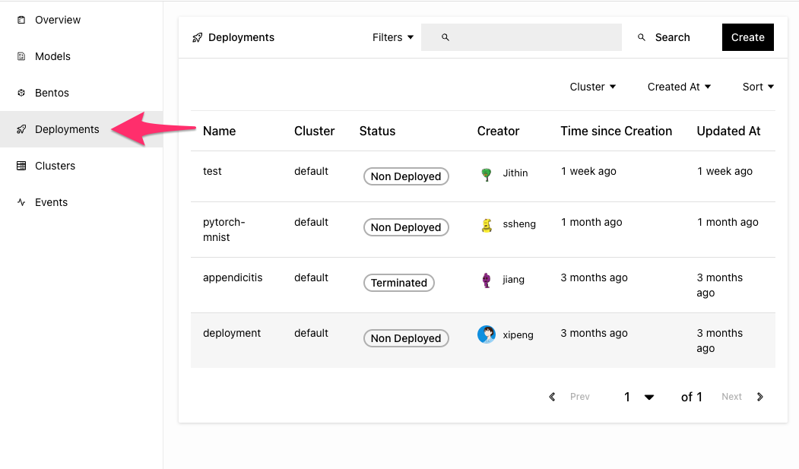
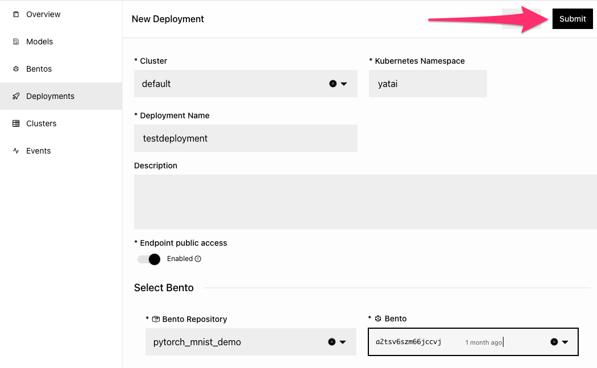
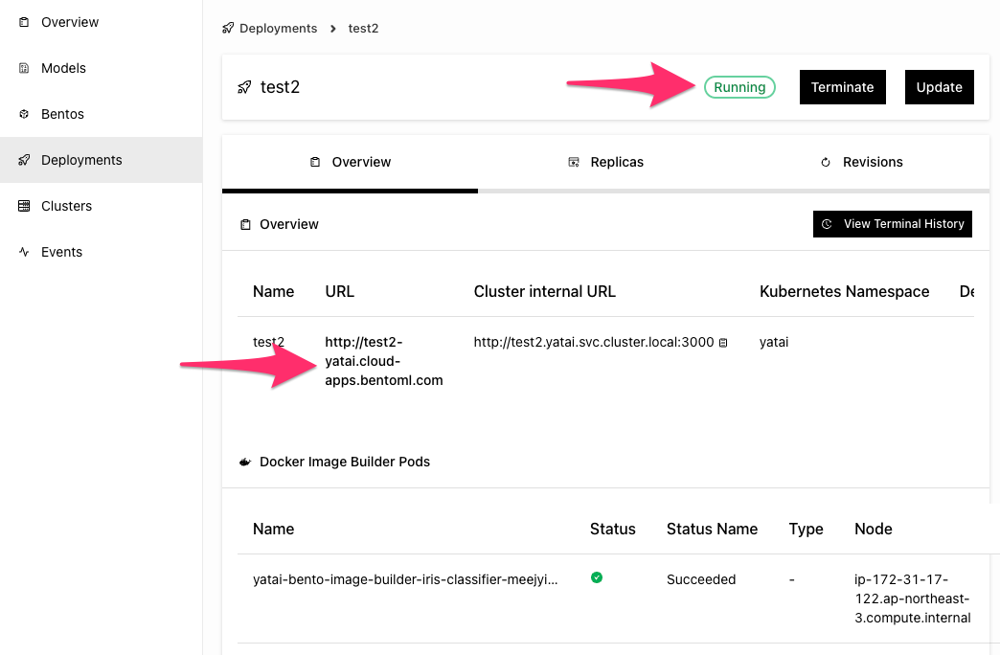

==========================
Tutorial: Intro to BentoML Cloud
==========================

*time expected: 5 minutes*

In this tutorial, we will focus on building an ML service (your bento) and deploying it to Bento ML Cloud. We will focus
on familiarizing you with the minimum requirements for deploying an end to end production ML service.


.. note::

    For a more detailed look at creating bentos
    you can checkout the :doc:`BentoML Quickstart guide<tutorial>`, which focuses on the functionality BentoML open source provides. All features
    described in BentoML open source are supported automatically in BentoML Cloud.


Saving an ML Model with BentoML
--------------------------------------

The first step is to create your bento. A bento is ML service which contains service code, models and dependencies.
Your first bento will predict the class of iris (flower) based on the features: ``['Sepal length', 'Sepal width', 'Petal length']``


Start by downloading the source code of this tutorial from `bentoml/examples <https://github.com/bentoml/BentoML/tree/main/examples>`_:

.. code-block:: bash

   » git clone --depth=1 git@github.com:bentoml/BentoML.git
   » cd bentoml/examples/quickstart/

.. note::

   BentoML supports Linux, Windows and MacOS. You will need Python 3.7 or above to run
   this tutorial. We recommend using `virtual environment <https://docs.python.org/3/library/venv.html>`_
   to create an isolated local environment. However this is not required.

Install dependencies and train your model

.. code-block:: bash

   » pip install bentoml scikit-learn pandas
   » python train.py

``train.py`` trains a scikit-learn model and then calls ``bentoml.<framework>.save_model``. Saving your model
with bentoml is the first step in building your bento. You can see the last line in ``train.py``

.. code-block:: python

   # Save model to the BentoML local model store
   saved_model = bentoml.sklearn.save_model("iris_clf", clf)


The model is now saved under the name ``iris_clf``


Creating a Service with BentoML
-------------------------------

Next, we'll proceed to define our service code where the serving logic is defined.

.. note::
   BentoML Cloud scales your serving logic separately from your model inference so that your
   service can take advantage of batching logic and running models on different accelerated hardware like GPUs

Take a quick look at the ``service.py`` file where we load the model and call predict from a classify endpoint:

.. code-block:: python
   :caption: `service.py`

    import numpy as np
    import bentoml
    from bentoml.io import NumpyNdarray

    iris_clf_runner = bentoml.sklearn.get("iris_clf:latest").to_runner()

    svc = bentoml.Service("iris_classifier", runners=[iris_clf_runner])

    @svc.api(input=NumpyNdarray(), output=NumpyNdarray())
    def classify(input_series: np.ndarray) -> np.ndarray:
        # You can write pre-transform logic here
        result = iris_clf_runner.predict.run(input_series)
        # You can write post-transform logic here
        return result


Building your ML Service (Bento 🍱)
-----------------------------------

To build a Bento, you'll also need a bentofile.yaml which is provided in the example. It will look a lot like this:

 .. code-block:: yaml

    service: "service:svc"  # Same as the argument passed to `bentoml serve`
    labels:
       owner: bentoml-team
       project: gallery
    include:
    - "*.py"
    python:
       packages:
       - scikit-learn
       - pandas
    docker:
        distro: debian
        cuda_version: "11.6.2"

.. tip::

   Specify ```docker.cuda_version``` to run your model on a GPU.
   We like to use 11.6.2 like the example above. Also make sure
   that your cluster is provisioned with GPU nodes.
   To read more about bento build options check out our :doc:`concepts/bento` page.


Next, run the ``bentoml build`` CLI command from the same directory:

.. code-block:: bash

    » bentoml build

    Building BentoML service "iris_classifier:6otbsmxzq6lwbgxi" from build context "/home/user/gallery/quickstart"
    Packing model "iris_clf:zy3dfgxzqkjrlgxi"
    Locking PyPI package versions..
 
    ██████╗░███████╗███╗░░██╗████████╗░█████╗░███╗░░░███╗██╗░░░░░
    ██╔══██╗██╔════╝████╗░██║╚══██╔══╝██╔══██╗████╗░████║██║░░░░░
    ██████╦╝█████╗░░██╔██╗██║░░░██║░░░██║░░██║██╔████╔██║██║░░░░░
    ██╔══██╗██╔══╝░░██║╚████║░░░██║░░░██║░░██║██║╚██╔╝██║██║░░░░░
    ██████╦╝███████╗██║░╚███║░░░██║░░░╚█████╔╝██║░╚═╝░██║███████╗
    ╚═════╝░╚══════╝╚═╝░░╚══╝░░░╚═╝░░░░╚════╝░╚═╝░░░░░╚═╝╚══════╝

    Successfully built Bento(tag="iris_classifier:6otbsmxzq6lwbgxi")

Save the text for your Bento "tag". You'll need it later. Now your service is ready for production! 🎉

.. tip::

   BentoML provides CLI commands and APIs for managing Bentos and moving them around, see the :ref:`concepts/bento:Managing Bentos`
   section to learn more.


Pushing to BentoML Cloud
------------------------
Now that you've built your bento, it's time to push it to BentoML Cloud for deployment

.. tip::

    First, please log your BentoML Cloud account with the provided credentials. If you don't
    have credentials, please ask someone from your team (or BentoML support) to add you to
    your account.


#. Click on your profile picture in the upper right hand corner and click "API Tokens".

   .. image:: ./_static/img/profile-api-token.png
      :width: 700
      :align: center

#. Now create an API token by clicking the "Create" button.

   .. image:: ./_static/img/create-api-token-button.png
      :width: 700
      :align: center

#. Then specify the name, token permissions and expiration date.

   .. image:: ./_static/img/create-api-token-options.png
      :width: 400
      :align: center

#. The confirmation window will provide a CLI text to copy starting with "bentoml yatai login"

   .. image:: ./_static/img/api-token-created.png
      :width: 700
      :align: center

#. Use this on the command line to log into your BentoML Account

   .. code-block:: bash

       » bentoml yatai login --api-token <your_api_token> --endpoint https://<your_namespace>.cloud.bentoml.com


#. Next push the bento with the following command:

   .. code-block:: bash

       » bentoml push <bento_tag>

   You should have the ``<bento_tag`` from when you built your bento at the end of the previous section.
   It should be in the format: ``<name>:<random id>``

#. Now back in the "Bentos" tab in the BentoML Cloud UI, confirm that your bento has been uploaded.

   .. image:: ./_static/img/bentos-tab.png
      :width: 700
      :align: center

Deploying to BentoML Cloud
--------------------------
To deploy your newly uploaded bento, go to the Deployments tab



You'll find a "Create" button which allows you to specify:
   * The cluster to deploy to
   * Name of the Deployment
   * The bento and version
   * Deployment compute resources (you can leave the defaults for now)




Once you've clicked submit, the deployment will build your docker image
(should be a "Building Image" status) and then deploy it. Once fully deployed
a URL should appear on the overview section of the deployment. Click the URL
to try out your newly deployed service.


🎉🎉
**Great Job! You deployed your first bento with BentoML Cloud!**
🎉🎉