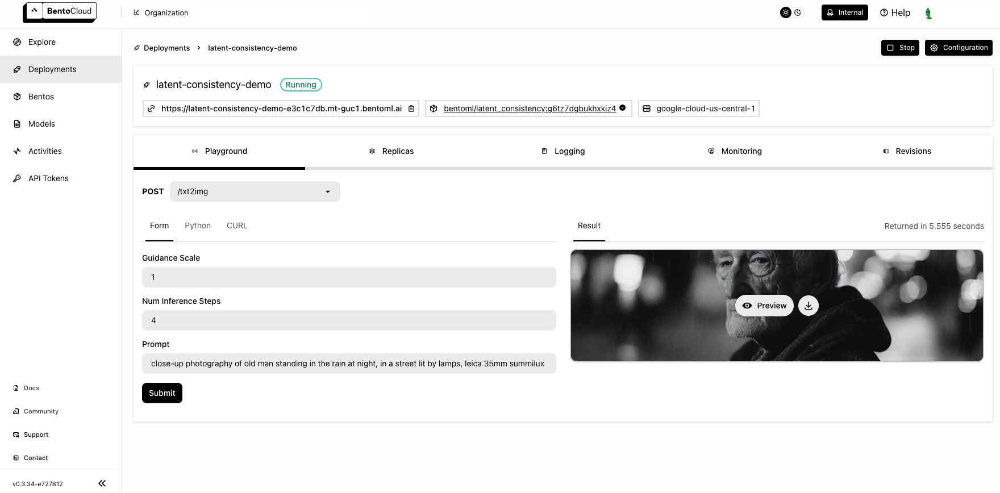

==================================
Stable Diffusion XL with LCM LoRAs
==================================

`Latent Consistency Models (LCM) <https://huggingface.co/papers/2310.04378>`_ offer a new approach to enhancing the efficiency of the image generation workflow, particularly when applied to models like Stable Diffusion (SD) and Stable Diffusion XL (SDXL). To futher to deliver high-quality inference outcomes within a significantly reduced computational timeframe within just 2 to 8 steps, `LCM LoRA <https://arxiv.org/abs/2311.05556>`_ is proposed as a universal acceleration module for SD-based models.

This document explains how to deploy `SDXL <https://huggingface.co/stabilityai/stable-diffusion-xl-base-1.0>`_ with `LCM LoRA weights <https://huggingface.co/latent-consistency/lcm-lora-sdxl>`_ using BentoML.

All the source code in this tutorial is available in the `BentoLCM GitHub repository <https://github.com/bentoml/BentoLCM>`_.

Prerequisites
-------------

- Python 3.8+ and ``pip`` installed. See the `Python downloads page <https://www.python.org/downloads/>`_ to learn more.
- You have a basic understanding of key concepts in BentoML, such as Services. We recommend you read :doc:`/get-started/quickstart` first.
- To run this BentoML Service locally, you need a Nvidia GPU with at least 12G VRAM.
- (Optional) We recommend you create a virtual environment for dependency isolation. See the `Conda documentation <https://conda.io/projects/conda/en/latest/user-guide/tasks/manage-environments.html>`_ or the `Python documentation <https://docs.python.org/3/library/venv.html>`_ for details.

Install dependencies
--------------------

Clone the project repository and install all the dependencies.

.. code-block:: bash

    git clone https://github.com/bentoml/BentoLCM.git
    cd BentoLCM
    pip install -r requirements.txt

Create a BentoML Service
------------------------

Create a BentoML :doc:`Service </guides/services>` in a ``service.py`` file to wrap the capabilities of the SDXL model with LCM LoRA weights. You can use this example file in the cloned project:

.. code-block:: python
    :caption: `service.py`

    import bentoml
    from PIL.Image import Image

    model_id = "stabilityai/stable-diffusion-xl-base-1.0"
    lcm_lora_id = "latent-consistency/lcm-lora-sdxl"

    sample_prompt = "close-up photography of old man standing in the rain at night, in a street lit by lamps, leica 35mm summilux"

    @bentoml.service(
        traffic={
            "timeout": 300,
            "external_queue": True,
            "concurrency": 1,
        },
        workers=1,
        resources={
            "gpu": 1,
            "gpu_type": "nvidia-l4",
        },
    )
    class LatentConsistency:
        def __init__(self) -> None:
            from diffusers import DiffusionPipeline, LCMScheduler
            import torch

            self.lcm_txt2img = DiffusionPipeline.from_pretrained(
                model_id,
                torch_dtype=torch.float16,
                variant="fp16",
            )
            self.lcm_txt2img.load_lora_weights(lcm_lora_id)
            self.lcm_txt2img.scheduler = LCMScheduler.from_config(self.lcm_txt2img.scheduler.config)
            self.lcm_txt2img.to(device="cuda", dtype=torch.float16)

        @bentoml.api
        def txt2img(
                self,
                prompt: str = sample_prompt,
                num_inference_steps: int = 4,
                guidance_scale: float = 1.0,
        ) -> Image:
            image = self.lcm_txt2img(
                prompt=prompt,
                num_inference_steps=num_inference_steps,
                guidance_scale=guidance_scale,
            ).images[0]
            return image

A breakdown of the Service code:

* Uses the ``@bentoml.service`` decorator to define a Service called ``LatentConsistency``. It includes service-specific :doc:`configurations </guides/configurations>` such as timeout settings, the number of workers, and resources (in this example, GPU requirements on BentoCloud).
* Loads and configures the SDXL model, LoRA weights, and the LCM scheduler during initialization. The model is moved to a GPU device for efficient computation.
* Exposes the ``txt2img`` method as a web API endpoint, making it callable via HTTP requests. It accepts a text prompt, the number of inference steps, and a guidance scale as inputs, all of which provide default values. These parameters control the image generation process:

  - ``prompt``: The textual description based on which an image will be generated.
  - ``num_inference_steps``: The number of steps the model takes to refine the generated image. A higher number can lead to more detailed images but requires more computation. Using 4 to 6 steps for this example should be sufficient. See this `Hugging Face blog post <https://huggingface.co/blog/lcm_lora>`_ to learn the difference among images created using different steps.
  - ``guidance_scale``: A factor that influences how closely the generated image should adhere to the input prompt. A higher value may affect the creativity of the result.

Run ``bentoml serve`` to start the BentoML server.

.. code-block:: bash

    $ bentoml serve service:LatentConsistency

    2024-02-19T07:20:29+0000 [WARNING] [cli] Converting 'LatentConsistency' to lowercase: 'latentconsistency'.
    2024-02-19T07:20:29+0000 [INFO] [cli] Starting production HTTP BentoServer from "service:LatentConsistency" listening on http://localhost:3000 (Press CTRL+C to quit)

The server is active at `http://localhost:3000 <http://localhost:3000>`_. You can interact with it in different ways.

.. tab-set::

    .. tab-item:: CURL

        .. code-block:: bash

            curl -X 'POST' \
                'http://localhost:3000/txt2img' \
                -H 'accept: image/*' \
                -H 'Content-Type: application/json' \
                --output output.png \
                -d '{
                "prompt": "close-up photography of old man standing in the rain at night, in a street lit by lamps, leica 35mm summilux",
                "num_inference_steps": 4,
                "guidance_scale": 1
            }'

    .. tab-item:: Python client

        The Service returns the image as a ``Path`` object. You can use it to access, read, or process the file. In the following example, the client saves the image to the path ``/path/to/save/image.png``.

        For more information, see :doc:`/guides/clients`.

        .. code-block:: python

            import bentoml
            from pathlib import Path

            with bentoml.SyncHTTPClient("http://localhost:3000") as client:
                result_path = client.txt2img(
                    guidance_scale=1,
                    num_inference_steps=4,
                    prompt="close-up photography of old man standing in the rain at night, in a street lit by lamps, leica 35mm summilux",
                )

                destination_path = Path("/path/to/save/image.png")
                result_path.rename(destination_path)

    .. tab-item:: Swagger UI

        Visit `http://localhost:3000 <http://localhost:3000/>`_, scroll down to **Service APIs**, specify the parameters, and click **Execute**.

        .. image:: ../../_static/img/use-cases/diffusion-models/sdxl-lcm-lora/service-ui.png

Expected output:

Deploy to BentoCloud
--------------------

After the Service is ready, you can deploy the project to BentoCloud for better management and scalability. `Sign up <https://www.bentoml.com/>`_ for a BentoCloud account and get $10 in free credits.

First, specify a configuration YAML file (``bentofile.yaml``) to define the build options for your application. It is used for packaging your application into a Bento. Here is an example file in the project:

.. code-block:: yaml
    :caption: `bentofile.yaml`

    service: "service:LatentConsistency"
    labels:
      owner: bentoml-team
      project: gallery
    include:
    - "*.py"
    python:
      requirements_txt: "./requirements.txt"

:ref:`Create an API token with Developer Operations Access to log in to BentoCloud <bentocloud/how-tos/manage-access-token:create an api token>`, then run the following command to deploy the project.

.. code-block:: bash

    bentoml deploy .

Once the Deployment is up and running on BentoCloud, you can access it via the exposed URL.

.. note::

   For custom deployment in your own infrastructure, use BentoML to :doc:`generate an OCI-compliant image</guides/containerization>`.
