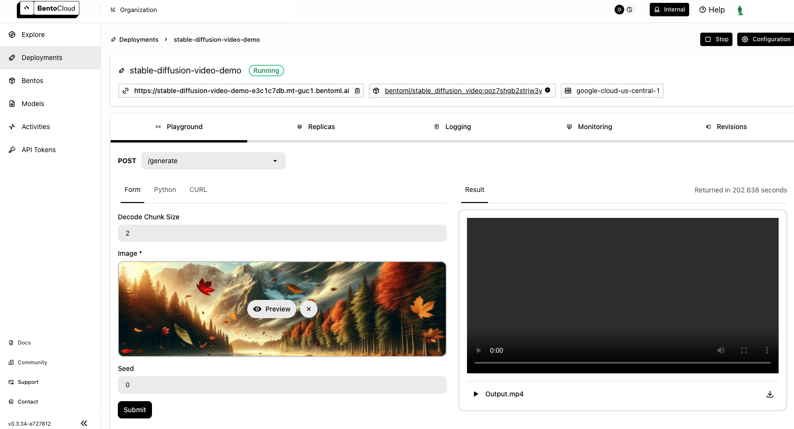

======================
Stable Video Diffusion
======================

`Stable Video Diffusion (SVD) <https://huggingface.co/stabilityai/stable-video-diffusion-img2vid-xt>`_ is a latent diffusion model developed by Stability AI. It's designed to generate short video clips from a still image. Specifically, the model can create 25 frames at a resolution of 576x1024 from a context frame of the same size.

This document demonstrates how to create a video generation server with SVD and BentoML.

All the source code in this tutorial is available in the `BentoDiffusion GitHub repository <https://github.com/bentoml/BentoDiffusion>`_.

Prerequisites
-------------

- Python 3.9+ and ``pip`` installed. See the `Python downloads page <https://www.python.org/downloads/>`_ to learn more.
- You have a basic understanding of key concepts in BentoML, such as Services. We recommend you read :doc:`/get-started/quickstart` first.
- To run this BentoML Service locally, you need a Nvidia GPU with at least 16G VRAM.
- (Optional) We recommend you create a virtual environment for dependency isolation. See the `Conda documentation <https://conda.io/projects/conda/en/latest/user-guide/tasks/manage-environments.html>`_ or the `Python documentation <https://docs.python.org/3/library/venv.html>`_ for details.

Install dependencies
--------------------

Clone the project repository and install all the dependencies.

.. code-block:: bash

    git clone https://github.com/bentoml/BentoDiffusion.git
    cd BentoDiffusion/svd
    pip install -r requirements.txt

Create a BentoML Service
------------------------

Create a BentoML :doc:`Service </guides/services>` in a ``service.py`` file to define the serving logic of the model. You can use this example file in the cloned project:

.. code-block:: python
    :caption: `service.py`

    from __future__ import annotations

    import os
    import typing as t
    from pathlib import Path
    from PIL.Image import Image

    import bentoml

    MODEL_ID = "stabilityai/stable-video-diffusion-img2vid-xt"

    @bentoml.service(
        traffic={
            "timeout": 600,
            "external_queue": True,
            "concurrency": 1,
        },
        resources={
            "gpu": 1,
            "gpu_type": "nvidia-l4",
        },
    )
    class StableDiffusionVideo:

        def __init__(self) -> None:
            import torch
            import diffusers

            self.pipe = diffusers.StableVideoDiffusionPipeline.from_pretrained(
                MODEL_ID, torch_dtype=torch.float16, variant="fp16"
            )
            self.pipe.to("cuda")

        @bentoml.api
        def generate(
                self, context: bentoml.Context,
                image: Image,
                decode_chunk_size: int = 2,
                seed: t.Optional[int] = None,
        ) -> t.Annotated[Path, bentoml.validators.ContentType("video/*")]:
            import torch
            from diffusers.utils import load_image, export_to_video

            generator = torch.manual_seed(seed) if seed is not None else None
            image = image.resize((1024, 576))
            image = image.convert("RGB")
            output_path = os.path.join(context.temp_dir, "output.mp4")

            frames = self.pipe(
                image, decode_chunk_size=decode_chunk_size, generator=generator,
            ).frames[0]
            export_to_video(frames, output_path)
            return Path(output_path)

A breakdown of the Service code:

- It defines a BentoML Service ``StableDiffusionVideo`` using the ``@bentoml.service`` decorator, with specified GPU requirements for deployment on BentoCloud, and a timeout of 600 seconds. See :doc:`/guides/configurations` for details.
- During initialization, the Service loads the model into the ``StableVideoDiffusionPipeline`` and moves it to GPU for efficient computation.
- It defines an endpoint for video generation using the ``@bentoml.api`` decorator, taking the following parameters:

  - ``image``: A base image for generating video, which will be resized and converted to RGB format for the SVD model.
  - ``decode_chunk_size``: The number of frames that are decoded at once. A lower ``decode_chunk_size`` value means reduced memory consumption but may lead to inconsistencies between frames, such as flickering. Set this value based on your GPU resources.
  - ``seed``:  A randomly generated number when not specified. Every time you generate a video with the same seed and input image, you will get the exact same output. This is particularly useful for generating reproducible results.
  - ``context``: ``bentoml.Context`` lets you access information about the existing Service context. The ``temp_dir`` property provides a temporary directory to store the generated file.

- ``export_to_video`` from the ``diffusers`` package converts the frames into a video file stored at ``output_path``.
- The method returns a ``Path`` object pointing to the generated video file. The return type is annotated with a content type validator, indicating that the endpoint returns a video file.

Run ``bentoml serve`` to start the BentoML server.

.. code-block:: bash

    $ bentoml serve service:StableDiffusionVideo

    2024-02-28T01:01:17+0000 [WARNING] [cli] Converting 'StableDiffusionVideo' to lowercase: 'stablediffusionvideo'.
    2024-02-28T01:01:18+0000 [INFO] [cli] Starting production HTTP BentoServer from "service:StableDiffusionVideo" listening on http://localhost:3000 (Press CTRL+C to quit)

The server is active at `http://localhost:3000 <http://localhost:3000>`_. You can interact with it in different ways.

.. tab-set::

    .. tab-item:: CURL

        .. code-block:: bash

            curl -X 'POST' \
                'http://localhost:3000/generate' \
                -H 'accept: video/*' \
                -H 'Content-Type: multipart/form-data' \
                -F 'image=@assets/girl-image.png;type=image/png' \
                -o generated.mp4 \
                -F 'decode_chunk_size=2' \
                -F 'seed=null'

    .. tab-item:: Python client

        This client returns the image as a ``Path`` object. You can use it to access, read, or process the file. See :doc:`/guides/clients` for details.

        .. code-block:: python

            import bentoml
            from pathlib import Path

            with bentoml.SyncHTTPClient("http://localhost:3000") as client:
                result = client.generate(
                    decode_chunk_size=2,
                    image=Path("girl-image.png"),
                    seed=0,
                )

    .. tab-item:: Swagger UI

        Visit `http://localhost:3000 <http://localhost:3000/>`_, scroll down to **Service APIs**, click the ``generate`` endpoint, specify the parameters, and click **Execute**.

        .. image:: ../../_static/img/use-cases/diffusion-models/svd/service-ui.png

Expected output:

Deploy to BentoCloud
--------------------

After the Service is ready, you can deploy the project to BentoCloud for better management and scalability. `Sign up <https://www.bentoml.com/>`_ for a BentoCloud account and get $10 in free credits.

First, specify a configuration YAML file (``bentofile.yaml``) to define the build options for your application. It is used for packaging your application into a Bento. Here is an example file in the project:

.. code-block:: yaml
    :caption: `bentofile.yaml`

    service: "service:StableDiffusionVideo"
    labels:
      owner: bentoml-team
      project: gallery
    include:
      - "*.py"
    python:
      requirements_txt: "./requirements.txt"
    docker:
      distro: debian
      system_packages:
        - ffmpeg
        - git

:ref:`Log in to BentoCloud <bentocloud/how-tos/manage-access-token:Log in to BentoCloud using the BentoML CLI>` by running ``bentoml cloud login``, then run the following command to deploy the project.

.. code-block:: bash

    bentoml deploy .

Once the Deployment is up and running on BentoCloud, you can access it via the exposed URL.

.. note::

   For custom deployment in your own infrastructure, use BentoML to :doc:`generate an OCI-compliant image</guides/containerization>`.
