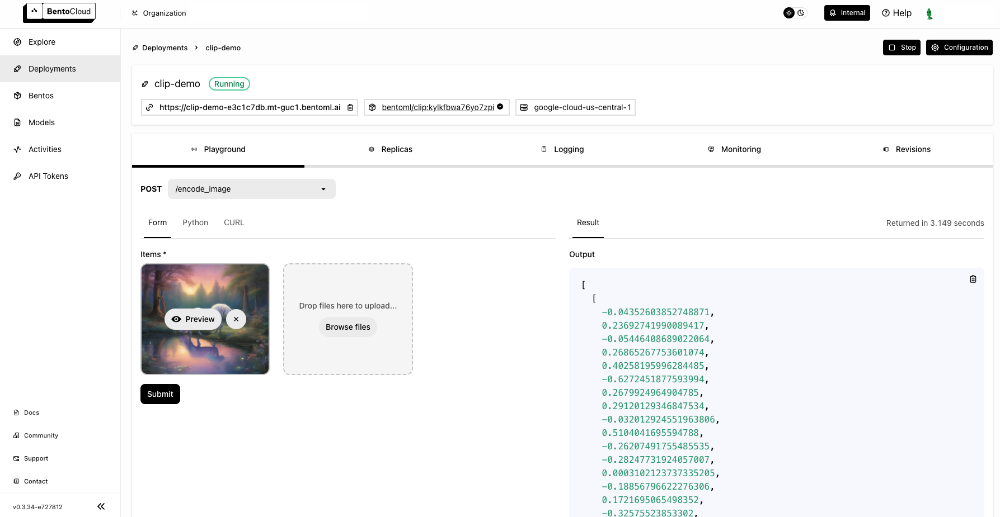

===============
CLIP embeddings
===============

CLIP (Contrastive Language-Image Pre-training) is a machine learning model developed by OpenAI. It is versatile and excels in tasks like zero-shot learning, image classification, and image-text matching without needing specific training for each task. This makes it ideal for a wide range of applications, including content recommendation, image captioning, visual search, and automated content moderation.

This document demonstrates how to build a CLIP application using BentoML, powered by the `clip-vit-base-patch32 <https://huggingface.co/openai/clip-vit-base-patch32>`_ model.

Prerequisites
-------------

- Python 3.8+ and ``pip`` installed. See the `Python downloads page <https://www.python.org/downloads/>`_ to learn more.
- You have a basic understanding of key concepts in BentoML, such as Services. We recommend you read :doc:`/get-started/quickstart` first.
- (Optional) We recommend you create a virtual environment for dependency isolation. See the `Conda documentation <https://conda.io/projects/conda/en/latest/user-guide/tasks/manage-environments.html>`_ or the `Python documentation <https://docs.python.org/3/library/venv.html>`_ for details.

Install dependencies
--------------------

Clone the project repository and install all the dependencies.

.. code-block:: bash

    git clone https://github.com/bentoml/BentoClip.git
    cd BentoClip
    pip install -r requirements.txt

Create a BentoML Service
------------------------

Define a :doc:`BentoML Service </guides/services>` in a ``service.py`` file to wrap the capabilities of the CLIP model, making them accessible and easy to use in a wide range of applications. Here is an example file in the project:

.. code-block:: python
    :caption: `service.py`

    import bentoml
    from PIL.Image import Image
    import numpy as np
    from typing import Dict
    from typing import List
    from pydantic import Field

    MODEL_ID = "openai/clip-vit-base-patch32"

    @bentoml.service(
        resources={
            "memory" : "4Gi"
        }
    )
    class CLIP:

        def __init__(self) -> None:
            import torch
            from transformers import CLIPModel, CLIPProcessor
            self.device = "cuda" if torch.cuda.is_available() else "cpu"
            self.model = CLIPModel.from_pretrained(MODEL_ID).to(self.device)
            self.processor = CLIPProcessor.from_pretrained(MODEL_ID)
            self.logit_scale = self.model.logit_scale.item() if self.model.logit_scale.item() else 4.60517
            print("Model clip loaded", "device:", self.device)

        @bentoml.api(batchable=True)
        async def encode_image(self, items: List[Image]) -> np.ndarray:
            '''
            generate the 512-d embeddings of the images
            '''
            inputs = self.processor(images=items, return_tensors="pt", padding=True).to(self.device)
            image_embeddings = self.model.get_image_features(**inputs)
            return image_embeddings.cpu().detach().numpy()

        @bentoml.api(batchable=True)
        async def encode_text(self, items: List[str]) -> np.ndarray:
            '''
            generate the 512-d embeddings of the texts
            '''
            inputs = self.processor(text=items, return_tensors="pt", padding=True).to(self.device)
            text_embeddings = self.model.get_text_features(**inputs)
            return text_embeddings.cpu().detach().numpy()

        @bentoml.api
        async def rank(self, queries: List[Image], candidates : List[str] = Field(["picture of a dog", "picture of a cat"], description="list of description candidates")) -> Dict[str, List[List[float]]]:
            '''
            return the similarity between the query images and the candidate texts
            '''
            # Encode embeddings
            query_embeds = await self.encode_image(queries)
            candidate_embeds = await self.encode_text(candidates)

            # Compute cosine similarities
            cosine_similarities = self.cosine_similarity(query_embeds, candidate_embeds)
            logit_scale = np.exp(self.logit_scale)
            # Compute softmax scores
            prob_scores = self.softmax(logit_scale * cosine_similarities)
            return {
                "probabilities": prob_scores.tolist(),
                "cosine_similarities" : cosine_similarities.tolist(),
            }

        @staticmethod
        def cosine_similarity(query_embeds, candidates_embeds):
            # Normalize each embedding to a unit vector
            query_embeds /= np.linalg.norm(query_embeds, axis=1, keepdims=True)
            candidates_embeds /= np.linalg.norm(candidates_embeds, axis=1, keepdims=True)

            # Compute cosine similarity
            cosine_similarities = np.matmul(query_embeds, candidates_embeds.T)

            return cosine_similarities

        @staticmethod
        def softmax(scores):
            # Compute softmax scores (probabilities)
            exp_scores = np.exp(
                scores - np.max(scores, axis=-1, keepdims=True)
            )  # Subtract max for numerical stability
            return exp_scores / np.sum(exp_scores, axis=-1, keepdims=True)

Here is a breakdown of the Service code:

1. The script uses the ``@bentoml.service`` decorator to annotate the ``CLIP`` class as a BentoML Service. You can set more configurations for the Service as needed with the decorator.
2. In the ``__init__`` method, the CLIP model and processor are loaded based on the specified ``MODEL_ID``. The model is transferred to a GPU if available, otherwise, it uses the CPU. The ``logit_scale`` is set to the model's logit scale or a default value if not available.
3. The Service defines the following three API endpoints:

   - ``encode_image``: Takes a list of images and generates 512-dimensional embeddings for them.
   - ``encode_text``: Takes a list of text strings and generates 512-dimensional embeddings for them.
   - ``rank``: Computes the similarity between a list of query images and candidate text descriptions. It uses the embeddings generated by the previous two endpoints to calculate cosine similarities and softmax scores, indicating how closely each text candidate matches each image.

4. The Service defines the following two static methods:

   - ``cosine_similarity``: Computes the cosine similarity between query embeddings and candidate embeddings. It normalizes each embedding to a unit vector before computing the similarity.
   - ``softmax``: Computes softmax scores from the similarity scores, turning them into probabilities. This method includes a numerical stability trick by subtracting the maximum score before exponentiation.

This Service can be used for the following use cases:

- **Image and text embedding**: Convert images and text into embeddings, which can then be utilized for various machine learning tasks like clustering and similarity search.
- **Image-text matching**: Find the most relevant text descriptions for a set of images, which is useful in applications like image captioning and content recommendation.

Run ``bentoml serve`` in your project directory to start the Service.

.. code-block:: bash

    $ bentoml serve service:CLIP

    2024-01-08T09:07:28+0000 [INFO] [cli] Starting production HTTP BentoServer from "service:CLIP" listening on http://localhost:3000 (Press CTRL+C to quit)
    Model clip loaded device: cuda

The server is active at `http://localhost:3000 <http://localhost:3000>`_. You can interact with it in different ways.

.. tab-set::

    .. tab-item:: CURL

        .. code-block:: bash

            curl -s \
                -X POST \
                -F 'items=@image.jpg' \
                http://localhost:3000/encode_image

    .. tab-item:: Python client

        .. code-block:: python

            import bentoml
            from pathlib import Path

            with bentoml.SyncHTTPClient("http://localhost:3000") as client:
                result = client.encode_image(
                    items=[
                        Path("image.jpg"),
                    ],
                )

    .. tab-item:: Swagger UI

        Visit `http://localhost:3000 <http://localhost:3000/>`_, scroll down to **Service APIs**, and select the desired API endpoint for interaction.

        .. image:: ../../_static/img/use-cases/embeddings/clip-embeddings/service-ui.png

`This is the image <https://github.com/bentoml/BentoClip/blob/main/demo.jpg>`_ sent in the request. Expected output:

.. code-block:: bash

    [[-0.04361145198345184,0.23694464564323425,
    ...
    ...
    -0.17775200307369232,0.33587712049484253]]

Deploy to BentoCloud
--------------------

After the Service is ready, you can deploy the project to BentoCloud for better management and scalability. `Sign up <https://www.bentoml.com/>`_ for a BentoCloud account and get $30 in free credits.

First, specify a configuration YAML file (``bentofile.yaml``) to define the build options for your application. It is used for packaging your application into a Bento. Here is an example file in the project:

.. code-block:: yaml
    :caption: `bentofile.yaml`

    service: "service:CLIP"
    labels:
      owner: bentoml-team
      project: gallery
    include:
    - "*.py"
    python:
      requirements_txt: "./requirements.txt"

:ref:`Create an API token with Developer Operations Access to log in to BentoCloud <bentocloud/how-tos/manage-access-token:create an api token>`, then run the following command to deploy the project.

.. code-block:: bash

    bentoml deploy .

Once the Deployment is up and running on BentoCloud, you can access it via the exposed URL.

.. note::

   For custom deployment in your own infrastructure, use BentoML to :doc:`generate an OCI-compliant image</guides/containerization>`.
