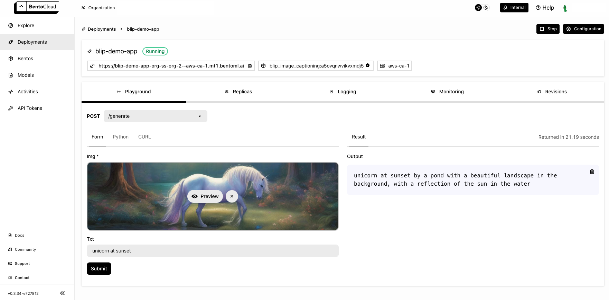

====
BLIP
====

BLIP (Bootstrapping Language Image Pre-training) is a technique to improve the way AI models understand and process the relationship between images and textual descriptions. It has a variety of use cases in the AI field, particularly in applications that require a nuanced understanding of both visual and textual data, such as image captioning, visual question answering (VQA), and image-text matching. This document demonstrates how to build an image captioning application on top of a BLIP model with BentoML.

All the source code in this tutorial is available in the `BentoBlip GitHub repository <https://github.com/bentoml/BentoBlip>`_.

Prerequisites
-------------

- Python 3.8+ and ``pip`` installed. See the `Python downloads page <https://www.python.org/downloads/>`_ to learn more.
- You have a basic understanding of key concepts in BentoML, such as Services. We recommend you read :doc:`/get-started/quickstart` first.
- (Optional) We recommend you create a virtual environment for dependency isolation. See the `Conda documentation <https://conda.io/projects/conda/en/latest/user-guide/tasks/manage-environments.html>`_ or the `Python documentation <https://docs.python.org/3/library/venv.html>`_ for details.

Install dependencies
--------------------

Clone the project repository and install all the dependencies.

.. code-block:: bash

    git clone https://github.com/bentoml/BentoBlip.git
    cd BentoBlip
    pip install -r requirements.txt

Create a BentoML Service
------------------------

Define a :doc:`BentoML Service </guides/services>` to customize the serving logic. The example ``service.py`` file in the project uses the BLIP model ``Salesforce/blip-image-captioning-large``, which is capable of generating captions for given images, optionally using additional text input for context. You can choose another model based on your need.

.. code-block:: python
    :caption: `service.py`

    from __future__ import annotations

    import typing as t

    import bentoml
    from PIL.Image import Image

    MODEL_ID = "Salesforce/blip-image-captioning-large"

    @bentoml.service(
        resources={
            "cpu" : 1,
            "memory" : "4Gi"
        }
    )
    class BlipImageCaptioning:

        def __init__(self) -> None:
            import torch
            from transformers import BlipProcessor, BlipForConditionalGeneration
            self.device = "cuda" if torch.cuda.is_available() else "cpu"
            self.model = BlipForConditionalGeneration.from_pretrained(MODEL_ID).to(self.device)
            self.processor = BlipProcessor.from_pretrained(MODEL_ID)
            print("Model blip loaded", "device:", self.device)

        @bentoml.api
        async def generate(self, img: Image, txt: t.Optional[str] = None) -> str:
            if txt:
                inputs = self.processor(img, txt, return_tensors="pt").to(self.device)
            else:
                inputs = self.processor(img, return_tensors="pt").to(self.device)

            out = self.model.generate(**inputs, max_new_tokens=100, min_new_tokens=20)
            return self.processor.decode(out[0], skip_special_tokens=True)

Here is a breakdown of the Service code:

- The ``@bentoml.service`` decorator defines the ``BlipImageCaptioning`` class as a BentoML Service, specifying that it requires ``4Gi`` of memory. You can customize the Service configurations if necessary.
- The Service loads the BLIP model based on ``MODEL_ID`` and moves the model to a GPU if available, otherwise it uses the CPU.
- The ``generate`` method is exposed as an asynchronous API endpoint. It accepts an image (``img``) and an optional ``txt`` parameter as inputs. If text is provided, the model generates a caption considering both the image and text context; otherwise, it generates a caption based only on the image. The generated tokens are then decoded into a human-readable caption.

Run ``bentoml serve`` in your project directory to start the Service.

.. code-block:: bash

    $ bentoml serve service:BlipImageCaptioning

    2024-01-02T08:32:35+0000 [INFO] [cli] Starting production HTTP BentoServer from "service:BlipImageCaptioning" listening on http://localhost:3000 (Press CTRL+C to quit)
    Model blip loaded device: cuda

The server is active at http://localhost:3000. You can interact with it in different ways.

.. tab-set::

    .. tab-item:: CURL

        .. code-block:: bash

            curl -s -X POST \
                -F txt='unicorn at sunset' \
                -F 'img=@image.jpg' \
                http://localhost:3000/generate

    .. tab-item:: Python client

        .. code-block:: python

            import bentoml
            from pathlib import Path

            with bentoml.SyncHTTPClient("http://localhost:3000") as client:
                result = client.generate(
                    img=Path("image.jpg"),
                    txt="unicorn at sunset",
                )

    .. tab-item:: Swagger UI

        Visit `http://localhost:3000 <http://localhost:3000/>`_, scroll down to **Service APIs**, and click **Try it out**. In the **Request body** box, select an image, optionally enter your prompt text and click **Execute**.

        .. image:: ../_static/img/use-cases/blip/service-ui.png

`This is the image <https://github.com/bentoml/BentoBlip/blob/main/demo.jpg>`_ sent in the request. Expected output:

.. code-block:: bash

    unicorn at sunset by a pond with a beautiful landscape in the background, with a reflection of the sun in the water

Deploy to BentoCloud
--------------------

After the Service is ready, you can deploy the project to BentoCloud for better management and scalability. `Sign up <https://www.bentoml.com/>`_ for a BentoCloud account and get $10 in free credits.

First, specify a configuration YAML file (``bentofile.yaml``) to define the build options for your application. It is used for packaging your application into a Bento. Here is an example file in the project:

.. code-block:: yaml
    :caption: `bentofile.yaml`

    service: "service:BlipImageCaptioning"
    labels:
      owner: bentoml-team
      project: gallery
    include:
    - "*.py"
    - "demo.jpeg"
    python:
      requirements_txt: "./requirements.txt"

:ref:`Create an API token with Developer Operations Access to log in to BentoCloud <bentocloud/how-tos/manage-access-token:create an api token>`, then run the following command to deploy the project.

.. code-block:: bash

    bentoml deploy .

Once the Deployment is up and running on BentoCloud, you can access it via the exposed URL.

.. note::

   For custom deployment in your own infrastructure, use BentoML to :doc:`generate an OCI-compliant image</guides/containerization>`.
