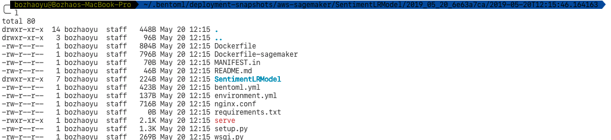
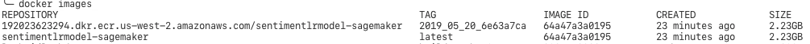
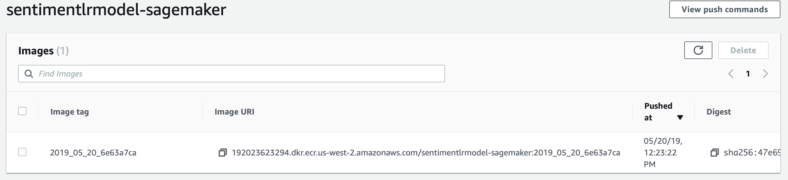
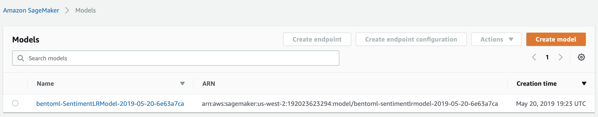
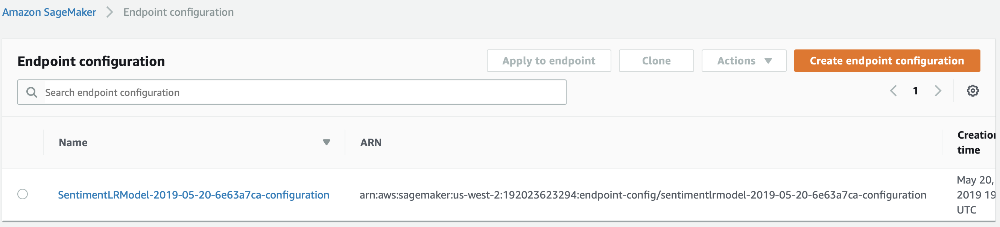
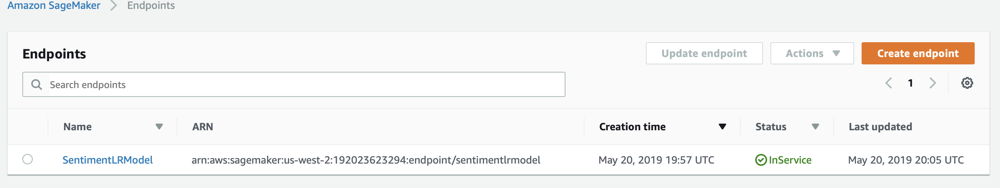

# Deploy BentoML service to AWS SageMaker

## Overview

In this example, we will show you how to deploy your customzied ML model deploy to AWS Sagemaker with BentoML.
We will create a sentiment analysis model with SciKit-Learn.
After we archive the model with BentoML, we will deploy the BentoML model archive to AWS SageMaker.
After deployment, we will show you how to check the deployment status and how to delete this deployment.

### What is AWS SageMaker

AWS SageMaker is a fully-managed service that provide data scientists and developers to train or deploy machine learning models.
It offer remote Jupyter notebook for building model and help you train and deploy models from the frameworks that they support.

## Prerequisites for deploying model to AWS SageMaker

* And activated AWS account configured on your machine
   1. Install AWS CLI. [Instructions](https://docs.aws.amazon.com/cli/latest/userguide/cli-chap-install.html)
   2. Configuring with your AWS account. [Instructions](https://docs.aws.amazon.com/cli/latest/userguide/cli-chap-configure.html)
* Docker. You can install it on your system with this [Instructions](https://docs.docker.com/install/)

## Deploy to AWS SageMaker with BentoML

After you exported your model with BentoML, you can invoke `bentoml deploy` command for SageMaker deployment. You can invoke that command either inside the Jupyter notebook or inside your terminal.

To invoke command in Jupyter notebook

```
!bentoml deploy /ARCHIVED_PATH --platform=aws-sagemaker --region=AWS_REGION --api-name=predict
```

To invoke command in terminal

```bash
bentoml deploy /ARCHIVED_PATH --platform=aws-sagemaker --region=AWS_REGION --api-name=predict
```

After you invoke the command, BentoML will first generated a snapshot of this model archive in your local file system with additional files for AWS SageMaker.



BentoML will use docker to build an image with the snapshot archive and then push the image to AWS ECR(Elasitc Container Registry)





Next, BentoML will create a model in AWS Sagemaker from the image inside AWS ECR, and create an endpoint configuration after that.





Last, BentoML will create an AWS SageMaker endpoint.



## Check deployment status

```bash
bentoml check-deployment-status /ARCHIVED_PATH --platform=aws-sagemaker --region=AWS_REGION
```

## Delete deployment

Delete a SageMaker deployment is as easy as deploying it.

```bash
bentoml delete-deployment /ARCHIVED_PATH --platform=aws-sagemaker --region=AWS_REGION
```