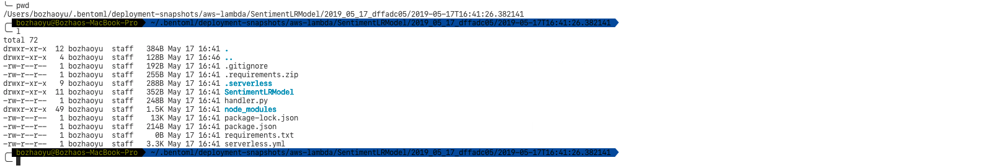
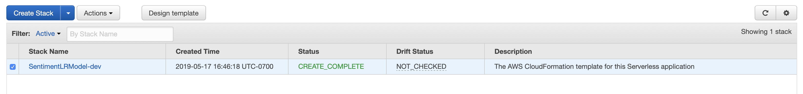
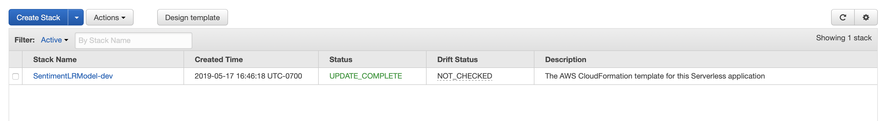
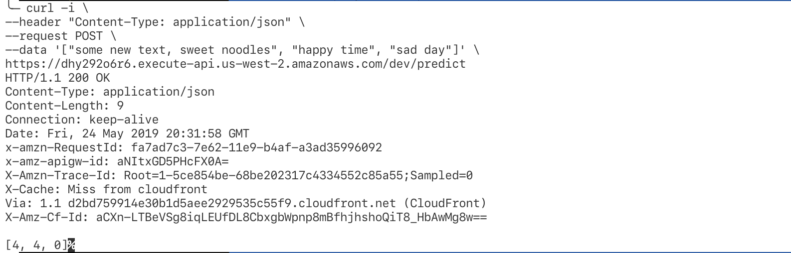

# Deploy BentoML service as serverless function on AWS Lambda or Google Cloud Function

## Overview

Cloud providers offer serverless computing service to help teams deploy a
scalable services without worry about hardware configuration and maintains. This
benefit may also apply to machine learning as well.

In this example, we will train a sentiment analysis model with SciKit-learn, and
then use BentoML to create serverless archive and deploy to AWS lambda service
with the Serverless framework.

We will exame the benefits and challenges of deploying machine learning services to *serverless* services.
And then, we will use BentoML to deploy the trained model to AWS Lambda with one command, and take a closer look of the entire process.

## Developing sentiment analysis model

We will train a scikit-learn model, and then we will use BentoML to package it.  You can follow those steps in the [Jupyter Notebook](https://www.github.com/bentoml/bentoml/examples/deploying-with-serverless/Deploying%20with%20serverless.ipynb)


## Prerequisites for deploying model to AWS Lambda

* Install Node.JS. Follow the instructions on [Nodejs.org](https://nodejs.org/en)
* Install Serverless framework.  You can find instructions [here](https://serverless.com/framework/docs/getting-started/)
* AWS account configured on your machine
   1. Install AWS CLI. [Instructions](https://docs.aws.amazon.com/cli/latest/userguide/cli-chap-install.html)
   2. Configuring with your AWS account. [Instructions](https://docs.aws.amazon.com/cli/latest/userguide/cli-chap-configure.html)


## Deploy to AWS lambda
It is simple to deploy to AWS Lambda with BentoML. After you saved your model as BentoML bundle, you invoke a single command.

You have two ways to invoke that command.

One way is invoke the command inside the training notebook. You add a new cell after you save the model with BentoML.
Make sure you add `!` before you call any command

```
!bentoml deploy /SAVED_PATH --platform aws-lambda --region us-west-2
```

The second way is invoke the same command from a terminal. 

```bash
bentoml deploy /ARCHIVE_PATH --platform aws-lambda --region us-west-2
```

#### What happens after the deploy command
BentoML does serveal things under the hood that help data scientists to deploy their model services to AWS lambda.

BentoML will first generate a serverless project and store it in the snapshot directory.
The snapshot contains your BentoML model archive and configuration files for AWS Lambda



BentoML will invoke AWS to create different services.  Those services managed by CloudFormation.  When the process complete, you will see the Lambda function in service.



Finally, you will see the Lambda function show up on your AWS Dashboard.


To make a prediction request, you can use CURL command. Copy and paste the following command and update `data` and `url`
base on your deployment

```bash
curl -i \
--header "Content-Type: application/json" \
--request POST \
--data '["good movie", "bad food"]' \
https://URL
```



## Check deployment status
```bash
bentoml check-deployment-status /ARCHIVE_PATH --platform aws-lambda -region us-west-2
```


## Delete deployment from AWS lambda
Delete deployment from AWS lambda is as simple as deploy it. To delete deployment use `bentoml delete-deployment` command.
```bash
bentoml delete-deployment /ARCHIVE_PATH --platform aws-lambda --region us-west-2
```