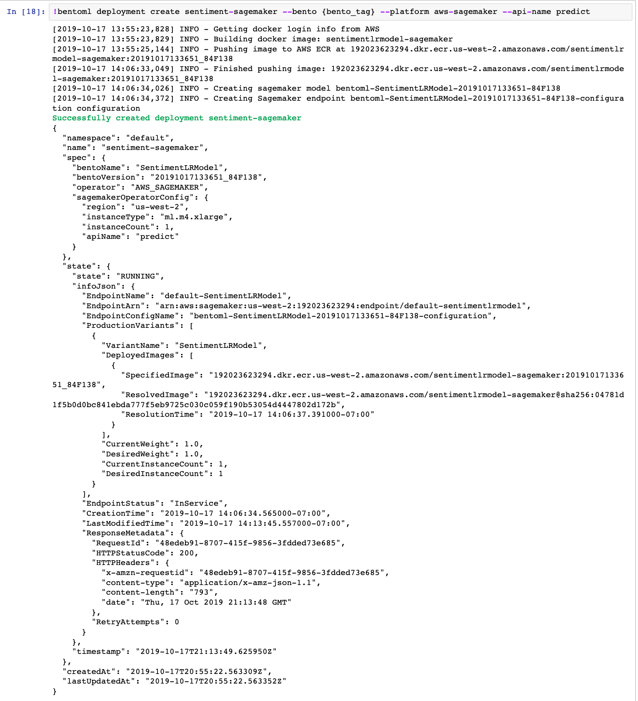
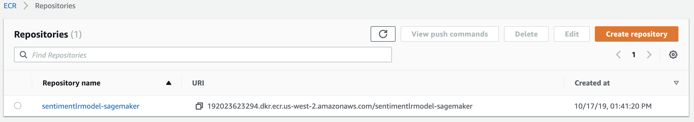
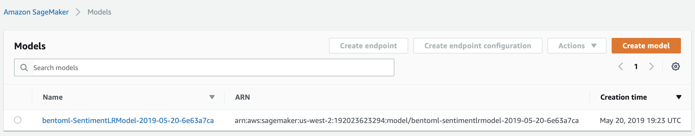
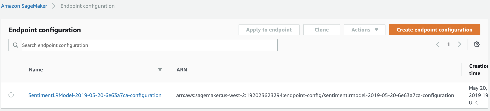
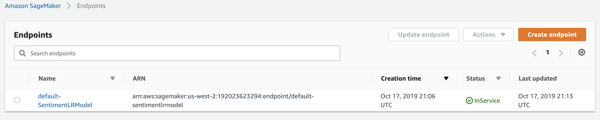
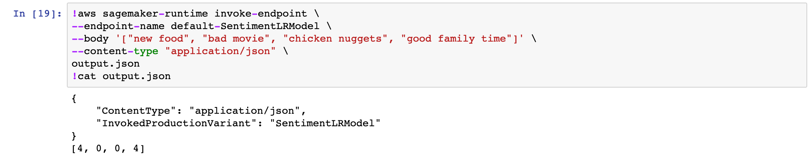
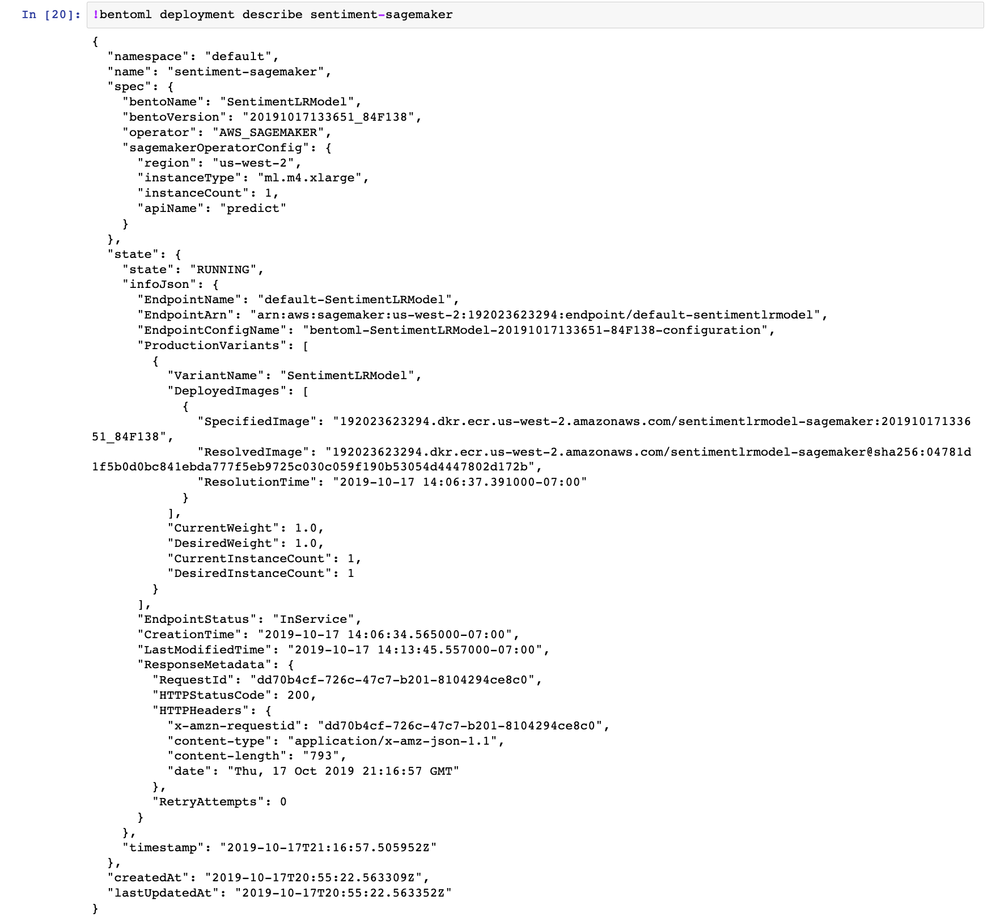
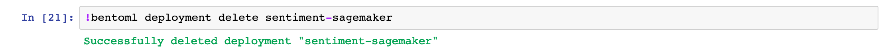

# Deploy BentoML service to AWS SageMaker

## Overview

In this example, we will show you how to deploy your customzied ML model deploy to AWS Sagemaker with BentoML.
We will create a sentiment analysis model with SciKit-Learn.
After we archive the model with BentoML, we will deploy the BentoML model archive to AWS SageMaker.
After deployment, we will show you how to check the deployment status and how to delete this deployment.

### What is AWS SageMaker

AWS SageMaker is a fully-managed service that provide data scientists and developers to train or deploy machine learning models.
It offer remote Jupyter notebook for building model and help you train and deploy models from the frameworks that they support.

## Prerequisites for deploying model to AWS SageMaker

* An activated AWS account configured on your machine
   1. Install AWS CLI. [Instructions](https://docs.aws.amazon.com/cli/latest/userguide/cli-chap-install.html)
   2. Configuring with your AWS account. [Instructions](https://docs.aws.amazon.com/cli/latest/userguide/cli-chap-configure.html)
* Docker. You can install it on your system with this [Instructions](https://docs.docker.com/install/)

## Deploy to AWS SageMaker with BentoML

After you exported your model with BentoML, you can invoke `bentoml deployment create` command for SageMaker deployment. You can invoke that command either inside the Jupyter notebook or inside your terminal.
Update `BENTO_NAME` and `BENTO_VERSION` with your saved BentoML service's inforamtion and run the following command

```bash
bentoml deployment create sentiment-sagemaker --bento BENTO_NAME:BENTO_VERSION --platform=aws-sagemaker --region=AWS_REGION --api-name=predict
```



After you invoke the command, BentoML will first generated a snapshot of this model archive in your local file system with files for AWS SageMaker.

After you invoke deploy command, BentoML will perform few operations for SageMaker deployment.

BentoML will use docker to build an image with the snapshot archive and then push the image to AWS ECR(Elasitc Container Registry)

BentoML will build a docker image from the snapshot and then push the image to AWS ECR. If you run `docker images` command in your terminal. You will see the built docker image.
You can also expect to see the same image in your AWS ECR dashboard.



Base on the docker image in AWS ECR.  BentoML will create model and endpoint configuration in AWS SageMaker.
You should able to find the created model and endpoint configuration inside SageMaker's dashboard.






BentoML will create SageMaker endpoint base on the endpoint configuration we created earlier.  After few minutes, you should see that the endpoint is in service and ready for request.




To test the newly deployed model.  We can use AWS cli to make prediction.  The result will be stored as JSON format in an output file.

You can invoke the example model with following command.

```bash
aws sagemaker-runtime invoke-endpoint \
--endpoint-name default-SentimentLRModel \
--body '["sweet food", "bad food", "happy day"]' \
--content-type "application/json" \
output.json
```



## Check deployment status

```bash
bentoml deployment describe my-sagemaker-deployment
```



## Delete deployment

Delete a SageMaker deployment is as easy as deploying it.

```bash
bentoml deployment delete my-sagemaker-deployment
```


