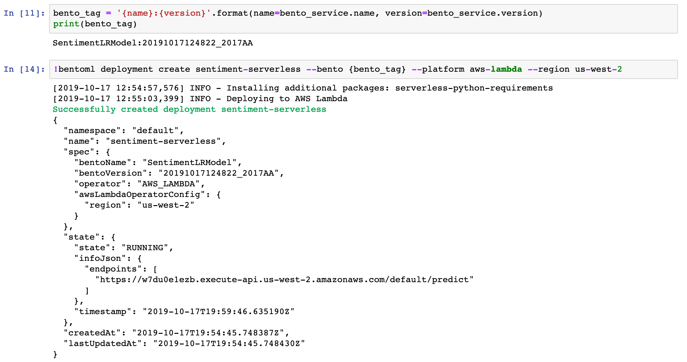
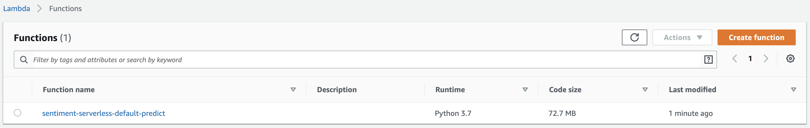
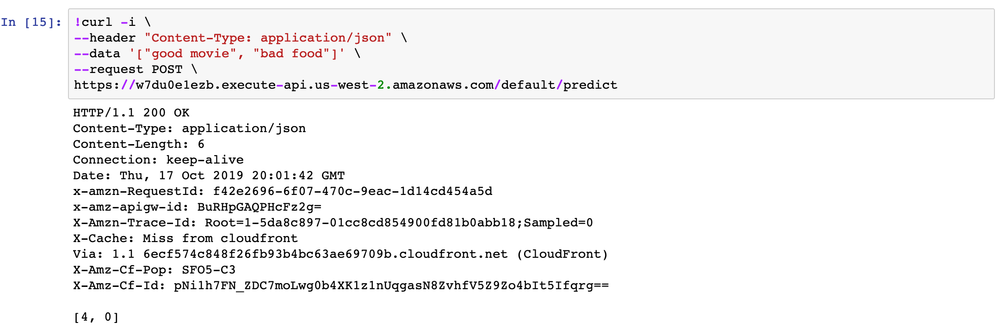
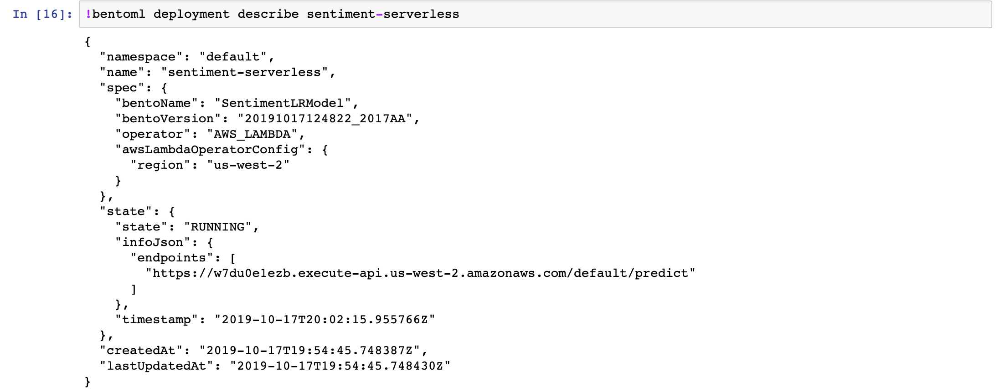
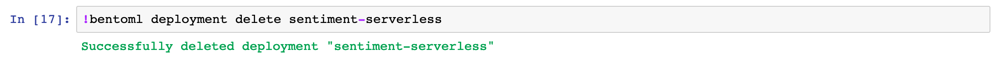

# Deploy BentoML service as serverless function on AWS Lambda or Google Cloud Function

## Overview

Cloud providers offer serverless computing service to help teams deploy a
scalable services without worry about hardware configuration and maintains. This
benefit may also apply to machine learning as well.

In this example, we will train a sentiment analysis model with SciKit-learn, and deploy to AWS lambda service, and then take a closer look of other operations with deployed service.

## Developing sentiment analysis model

We will train a scikit-learn model, and then we will use BentoML to package it.  You can follow those steps in the [Jupyter Notebook](https://www.github.com/bentoml/bentoml/examples/deploying-with-serverless/Deploying%20with%20serverless.ipynb)


## Prerequisites for deploying model to AWS Lambda

* Install Node.JS. Follow the instructions on [Nodejs.org](https://nodejs.org/en)
* AWS account configured on your machine
   1. Install AWS CLI. [Instructions](https://docs.aws.amazon.com/cli/latest/userguide/cli-chap-install.html)
   2. Configuring with your AWS account. [Instructions](https://docs.aws.amazon.com/cli/latest/userguide/cli-chap-configure.html)


## Deploy to AWS lambda
It is simple to deploy to AWS Lambda with BentoML. After you saved your model as BentoML bundle, you invoke a single command.

```bash
bentoml deployment create sentiment-serverless --bento BENTO_NAME:BENTO_VERSION --platform aws-lambda --region us-west-2
```


#### What happens after the deploy command
BentoML perform serval actions under the hood that help data scientists to deploy their model services to AWS lambda.

BentoML will invoke AWS to create different services.  Those services managed by CloudFormation.  When the process complete, you will see the Lambda function in service.


Finally, you will see the Lambda function show up on your AWS Dashboard.


To make a prediction request, you can use CURL command. Copy and paste the following command and update `data` base on your deployment, and copy the endpoint in deployment result as `url`

```bash
curl -i \
--header "Content-Type: application/json" \
--request POST \
--data '["good movie", "bad food"]' \
https://URL
```



## Check deployment status
```bash
bentoml deployment describe my-serverless-deployment
```




## Delete deployment from AWS lambda
Delete deployment from AWS lambda is as simple as deploy it. To delete deployment use `bentoml delete-deployment` command.
```bash
bentoml deployment delete my-serverless-deployment
```

