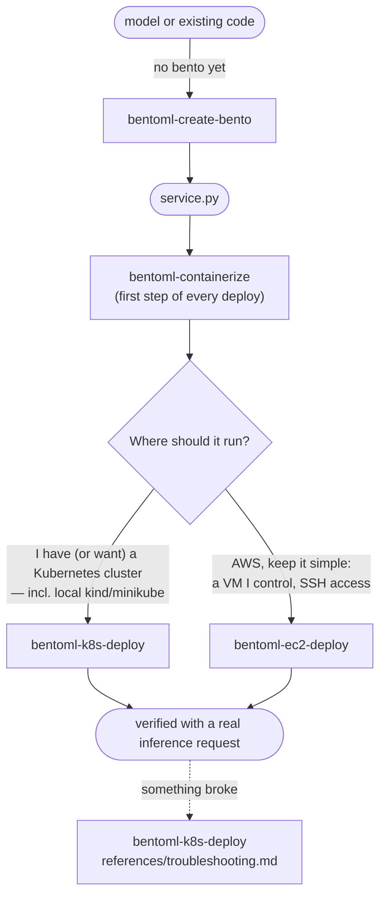

# BentoML Agent Skills

[Agent Skills](https://agentskills.io/specification) — the open, agent-neutral `SKILL.md`
format — for creating BentoML projects and deploying them to infrastructure **you** own: a
vanilla Kubernetes cluster or plain AWS EC2 instances. They run in Claude Code, OpenAI Codex, Cursor and any other host
implementing the standard ([installation](#installation)). The stack is fully open source: the
`bentoml` CLI, Docker, `kubectl` with plain manifests, `ssh`, the AWS CLI. No Helm charts, no
operators or CRDs, no Yatai, no BentoCloud.

Scope is **authoring plus basic deployment**. Commercial BentoCloud features — scale-to-zero, inference-metric
autoscaling, canary/blue-green rollouts, model registry sync, observability dashboards — are out
of scope for every target. Where a standard building block exists (Kubernetes HPA, an AWS ALB),
the skills point at it in one line and stop.

## The skills

| Skill | What it does |
|---|---|
| [`bentoml-create-bento`](bentoml-create-bento/SKILL.md) | Creates the project itself — the `service.py`, its runtime image and a built Bento — from scratch (gathers requirements, scaffolds the files) or by converting existing code (a script, a notebook, a FastAPI/Flask app, an MLflow model, a BentoML 1.1 Runner project). Ends at a served, content-verified `bentoml build`. Start here if there is no bento yet. |
| [`bentoml-containerize`](bentoml-containerize/SKILL.md) | Builds your local BentoML project into a Bento, containerizes it, smoke-tests the container locally, and pushes it to your registry (Docker Hub, GHCR, ECR, private, `kind`/`minikube` local load, or ttl.sh). The entry point for every deploy target. |
| [`bentoml-k8s-deploy`](bentoml-k8s-deploy/SKILL.md) | Deploys a pushed image to your Kubernetes cluster: writes one `deploy/config.yml`, renders plain manifests from it — **one Deployment + Service per BentoML service the bento declares**, plus optional HPA/Ingress — applies them in dependency order, and verifies with a real inference request. Its [`references/troubleshooting.md`](bentoml-k8s-deploy/references/troubleshooting.md) is the diagnostic runbook: ImagePullBackOff, CrashLoopBackOff, OOM, Pending, probe failures, unreachable services, inference 4xx/5xx. |
| [`bentoml-ec2-deploy`](bentoml-ec2-deploy/SKILL.md) | Runs a pushed image under Docker on one or more plain EC2 instances — your existing instances over SSH, or a fresh instance provisioned via the AWS CLI. Includes ECR auth, verification, teardown, and its own troubleshooting section. |
| [`bentoml-deploy-scriptgen`](bentoml-deploy-scriptgen/SKILL.md) | Generates a standalone, committable deploy bundle (`deploy/deploy.py` + one `config.yml`) that builds, pushes, deploys and verifies without any agent. Manifests are rendered from the config on every run, so there is no YAML to keep in sync. For production and CI/CD. Kubernetes and EC2 targets. |

A typical session chains **create-bento (if needed) → containerize → one deploy target**.

## Which target should I choose?



| | Kubernetes (`bentoml-k8s-deploy`) | EC2 (`bentoml-ec2-deploy`) |
|---|---|---|
| **What you need** | A cluster you can reach with `kubectl` (cloud, on-prem, or local kind/minikube) and a registry it can pull from | An AWS account, or just SSH access to existing instances; ECR is the natural registry |
| **What you get** | One Deployment + Service per BentoML service (optional HPA/Ingress) with liveness/readiness/startup probes, self-healing restarts, and the inter-service wiring derived from the bento | Your container on a VM with `--restart unless-stopped`; Swagger UI and metrics on port 3000 |
| **Cost model** | Whatever your cluster already costs — these skills add nothing | Per instance-hour until you terminate: default `t3.medium` ~$0.04/hr + EBS + $0.005/hr per public IPv4 |
| **When to pick it** | You already operate Kubernetes, or want free local testing on kind/minikube | Simplest possible cloud footprint; full control of the box; no Kubernetes anywhere |
| **Scaling** | `replicas` per service in `config.yml`, or `autoscaling` for a stock CPU-based HPA; each service scales independently | Manual: loop the deploy over N hosts; load balancing (ALB) is out of scope beyond a pointer |
| **Trade-offs** | You own cluster operations; Ingress/LoadBalancer depend on what your cluster provides | Plain HTTP on a raw port, **no authentication** unless your service adds it; you patch and secure the VM |

Zero cloud spend: `bentoml-containerize` with the kind/minikube path, then
`bentoml-k8s-deploy` on a local cluster.

## Development vs Production

| Path | What it is |
|---|---|
| **Interactive skills** (`bentoml-create-bento` → `bentoml-containerize` → `bentoml-k8s-deploy` / `bentoml-ec2-deploy`) | The agent is in the loop: it detects your project, asks the right questions, confirms every mutation, provisions infrastructure where allowed (EC2), and troubleshoots on the spot. Use for a service's **first** deploy, a new target, and anything needing judgment. |
| **The script bundle** (`bentoml-deploy-scriptgen`) | Every deploy after that: a committable `deploy/` directory (plain Python ≥ 3.9, stdlib only) repeating the exact build → containerize → push → deploy → verify pipeline with no agent and no questions, from your terminal or CI/CD. Preflight checks fail fast, exit codes are a stable contract (0 ok · 1 generic · 2 config · 3 preflight · 4 build · 5 push · 6 deploy · 7 verify), and the last stdout line is always a JSON summary. It does **less**: it never provisions EC2 instances and never edits your service. Its generated `deploy/README.md` ships a CI/CD chapter — a GitHub Actions workflow (fork-safe `--check-only --local-only` PR gate; deploy jobs with AWS OIDC, EKS kubeconfig, an SSH-key secret for EC2) plus a GitLab CI equivalent. |

First deploy interactive, then generate the bundle, commit it, wire CI.

## Prerequisites

| Prerequisite | create-bento | containerize | k8s-deploy | ec2-deploy |
|---|---|---|---|---|
| Python + `bentoml` ≥ 1.4 | required | required | — | — |
| Docker daemon running | — | required | — | on the instance only (installed by user-data on new instances; offered with confirmation on existing ones) |
| `kubectl` + cluster access | — | — | required | — |
| AWS CLI v2 + valid credentials | — | only for ECR pushes | — | required for provisioning mode and for ECR images; not needed for existing instance + non-ECR image |
| `ssh` client | — | — | — | required |
| A container registry | — | chosen here | cluster must be able to pull from it | instance must be able to pull from it |

Each skill runs its own preflight checks and stops with a clear message if something is missing.
`bentoml-create-bento` needs nothing but Python and whatever the model itself imports.

## Installation

Each skill is a directory holding a `SKILL.md` with `name` + `description` frontmatter, plus
optional `references/` and bundled files. Nothing is Claude-specific and all five validate
against the [reference implementation](#working-inside-a-bentoml-checkout). Only the scanned
**directory** differs per host, so the skills live in this repo's tool-neutral top-level
`skills/` rather than one agent's dotfolder. Every option below lands the same five directories.

| Host | Project scope | User scope (every project) |
|---|---|---|
| Claude Code | `.claude/skills/` | `~/.claude/skills/` |
| OpenAI Codex | `.codex/skills/` (cwd, then repo root) | `~/.codex/skills/`, then `/etc/codex/skills/` |
| Other hosts | check your agent's docs — the layout you copy is identical | |

### Option 1 — One command, any agent (recommended, and the only one-liner for Codex)

[`skills`](https://github.com/vercel-labs/skills) (Vercel, `npx`-runnable, 70+ agents) copies
this repo's `skills/` directory straight from GitHub into the agent you name:

```console
$ npx skills add bentoml/BentoML -a codex -g          # -> ~/.codex/skills/
$ npx skills add bentoml/BentoML -a claude-code -g    # -> ~/.claude/skills/
$ npx skills add bentoml/BentoML                      # project scope; prompts for the agent
```

`-g` is user scope, no flag is project scope; `-s <skill>` installs a subset, `-y` skips prompts.
Needs Node.js. Refresh with `npx skills update`. (BentoML is not on npm — the tool reads the repo.)

### Option 2 — Claude Code plugin install straight from GitHub

The BentoML repo is a Claude Code plugin marketplace.

```console
> /plugin marketplace add bentoml/BentoML          # in a Claude Code session
> /plugin install bentoml-deploy@bentoml
$ claude plugin marketplace add bentoml/BentoML    # or from a shell
$ claude plugin install bentoml-deploy@bentoml
```

Confirm the trust prompt and pick a scope (user = all projects). All five skills install
together and auto-load like local skills, namespaced as `/bentoml-deploy:bentoml-k8s-deploy`
(bare names resolve when unambiguous). Update with `/plugin update bentoml-deploy@bentoml`, or
auto-update the `bentoml` marketplace under `/plugin` → Marketplaces. Smaller clone:
`claude plugin marketplace add bentoml/BentoML --sparse .claude-plugin skills`.

> If you previously copied the skills into `~/.claude/skills/` manually, delete those copies
> when switching to the plugin — otherwise both sets stay active.

### Option 3 — Manual copy from a clone (works for every host)

```console
$ git clone --depth 1 https://github.com/bentoml/BentoML.git /tmp/bentoml
$ mkdir -p ~/.codex/skills && cp -r /tmp/bentoml/skills/bentoml-* ~/.codex/skills/   # or ~/.claude/skills
# or per-project, committed so the whole team shares one set (two agent dirs in one repo is fine):
$ mkdir -p ~/my-ml-project/.codex/skills && cp -r /tmp/bentoml/skills/bentoml-* ~/my-ml-project/.codex/skills/
$ cd ~/my-ml-project && git add .codex/skills && git commit -m "Add BentoML deployment skills"
```

### Option 4 — Sparse checkout (skills only)

Skips the rest of the BentoML repo and leaves a checkout you can update with `git pull`. Removing
the old copies before re-copying keeps files deleted upstream from lingering. (Option 1 updates
with `npx skills update`; the plugin with `/plugin update bentoml-deploy@bentoml`.)

```console
$ git clone --depth 1 --filter=blob:none --sparse https://github.com/bentoml/BentoML.git bentoml-skills
$ cd bentoml-skills && git sparse-checkout set skills
$ cp -r skills/bentoml-* ~/.codex/skills/      # or ~/.claude/skills/
# update later:
$ git pull && rm -rf ~/.codex/skills/bentoml-* && cp -r skills/bentoml-* ~/.codex/skills/
```

### Verify the host picked them up

**Codex** — in a new session run `/skills` (or type `$` to mention one); the five appear by
name. From a shell:

```console
$ ls ~/.codex/skills
bentoml-containerize   bentoml-deploy-scriptgen  bentoml-k8s-deploy
bentoml-create-bento   bentoml-ec2-deploy
$ head -4 ~/.codex/skills/bentoml-k8s-deploy/SKILL.md
```

**Claude Code** — start `claude` and type `/`; the skills appear as slash commands (your
listing will include others too):

```console
$ claude
> /bentoml
  /bentoml-containerize       Build a local BentoML project into a Bento, containerize it...
  /bentoml-ec2-deploy         Deploy a containerized BentoML service directly onto... EC2...
  /bentoml-k8s-deploy         Deploy a containerized BentoML service to a vanilla Kubernetes...
  /bentoml-deploy-scriptgen   Generate a standalone, committable production deploy-script...
  /bentoml-create-bento       Create a BentoML project: the service.py whose typed...
```

Plain requests work too — "deploy my BentoML service to my Kubernetes cluster" loads
`bentoml-containerize` and continues. If nothing appears: each skill must be a **directory**
containing a `SKILL.md` (e.g. `~/.codex/skills/bentoml-k8s-deploy/SKILL.md`) — copying the
`SKILL.md` files alone or nesting them one level deeper is the usual mistake — and the agent must
be restarted after installing.

### Working inside a BentoML checkout

The top-level `skills/` directory is agent-neutral, so no agent scans it automatically. Use
Option 3, or install from the local checkout as a plugin:

```console
$ claude plugin marketplace add .        # from the repo root
$ claude plugin install bentoml-deploy@bentoml
```

Run the reference validator on any skill you change, before committing:

```console
$ uvx --from git+https://github.com/agentskills/agentskills#subdirectory=skills-ref \
      skills-ref validate skills/bentoml-k8s-deploy
Valid skill: skills/bentoml-k8s-deploy
```

## Cost warning (read this before the EC2 target)

**EC2 instances bill by the hour until you tear them down**, served requests or not. An instance
bills until `terminate-instances`; a *stopped* instance still bills its EBS volume; every public
IPv4 address bills $0.005/hr (~$3.65/mo). Kubernetes adds no spend beyond your existing cluster.

Every mutating AWS CLI command is shown verbatim with a cost note and nothing runs without your
explicit confirmation. The EC2 skill tracks every resource it creates in a session and ends with a
**Teardown** section that removes exactly those and nothing else; if you keep something running on
purpose, it tells you what that costs and how to stop it later.

## What each skill will ask you

Questions come up front, in as few rounds as possible, with defaults you can accept in one go.

### `bentoml-create-bento`

Only for a project it has to create from scratch, and all in one round — a conversion asks
nothing it can read from the existing code. Every answer accepts "you decide".

| Question | Default | How to choose |
|---|---|---|
| What does it do, one endpoint or several? | one, named after the verb | Start with one even if the target is bigger |
| Where do the weights come from? | the HF ID you named, else no model | HF ID · local files (moved into the model store) · an existing model-store tag |
| Input and output types per endpoint | the model's natural pair | Annotations are the API schema, so this is the one answer worth thinking about |
| GPU? | no | Only if the model needs it |
| Python version and pinned packages | your current Python, unpinned | Pin when reproducibility matters |
| Response profile | interactive | interactive · long-running · token-streaming · fire-and-forget (a task queue) |

It also asks for **one concrete input and its expected output** and refuses to declare success
without it: verification judges the response body against that anchor, not the status code.
Never asked: workers, threads, replicas, ports, batching, timeouts — defaults hold until
something is measured.

### `bentoml-containerize`

| Question | Default | Example | How to choose |
|---|---|---|---|
| Which registry? | — (always asked) | `GHCR` | Docker Hub / GHCR / ECR / private for real clusters; **kind/minikube local load** for a local cluster (no registry, nothing to push); **ttl.sh** for anonymous, ephemeral throwaway tests. Pick **ECR** if the target is EC2. |
| Target CPU architecture? | build machine's arch | `amd64` | Must match the nodes that will run the image — most clouds are `amd64`; a mismatch crashes with `exec format error`. Building on Apple Silicon for an amd64 target adds `--opt platform=linux/amd64`. |

It may also ask for runtime env var **values** (e.g. `HF_TOKEN` for gated Hugging Face models)
during the build/smoke test. Names pass on to the deploy skill; values are never baked into
the image.

### `bentoml-k8s-deploy`

First question, always: **which kubectl context?** No default — the skill never assumes your
current context is the intended cluster, even if it is the only one — then pins `--context` on
every command. The answers become one file you own: `deploy/config.yml`, of which **four values
are required**; for a bento that needs nothing else that is the whole config:

```yaml
project: ..
image: 123456789012.dkr.ecr.us-west-1.amazonaws.com/my-bento     # no tag
kubernetes:
  context: my-cluster
  namespace: ml-services
```

The tag is the bento version; the service list, entry service and dependency DAG come from the
bento's own `bento.yaml`, so you never write a service name, an `entry` flag or a dependency list,
and nothing can drift from the code. The config cannot supply one prerequisite: **the cluster must
already be able to pull the image.** For a private registry (every ECR is one) that means a pull
secret in the namespace, on the namespace's `default` serviceaccount, or node-level credentials;
preflight reports which it found and prints the exact `kubectl create secret` line when it finds
none.

Everything below is optional, per BentoML service, and defaulted:

| Parameter | Default | Example | How to choose |
|---|---|---|---|
| Namespace | — (required) | `ml-services` | Must already exist; the skill never creates one (a skill that could would happily create a typo'd one). |
| `replicas` | `1` | `2` | Start at 1; scale after it works. Ignored when `autoscaling` is on. |
| CPU request / limit | `500m` / `"2"` | `"1"` / `"4"` | Quantities are **quoted strings**. These are load-bearing: the `@bentoml.service(resources=…)` decorator is inert in OSS. Budget per service — four services at the default need 2 CPU of schedulable room. |
| Memory request / limit | `1Gi` / `4Gi` | `8Gi` / `16Gi` | Size to the model — OOMKilled pods almost always mean the limit is below model memory (~1.5–2x weights on disk). |
| GPU per pod | none | `1` | Only if the cluster advertises `nvidia.com/gpu` (the skill checks). |
| `autoscaling` | off | `{enabled: true, max_replicas: 5}` | Stock CPU HPA via metrics-server; `concurrency` needs a custom-metrics adapter. |
| `env` | none | `LOG_LEVEL=debug` | Non-sensitive config only. |
| `env_from_secrets` | none | `HF_TOKEN` | Names an existing Kubernetes Secret key — no secret value is ever written into the config or a manifest. |
| `config_overrides` | none | `{workers: 2}` | Retunes BentoML server settings **without rebuilding the image**. |
| `image_pull_secret` | none | `ecr-creds` | See the prerequisite above. |
| `expose` / `ingress` | ClusterIP + port-forward | `{type: NodePort}` | **Entry service only** — a dependency reachable from outside is an unauthenticated pickle endpoint, so the config rejects it. NodePort / LoadBalancer / Ingress depending on what the cluster supports (the skill checks before recommending). |

The same file drives the non-interactive bundle from `bentoml-deploy-scriptgen` — same loader,
same renderer, so a config that works in one works in the other.

### `bentoml-ec2-deploy`

One question round covering:

| Question | Default | Example | How to choose |
|---|---|---|---|
| Image reference | — (required) | `123456789012.dkr.ecr.us-east-1.amazonaws.com/text-stats:v1` | From `bentoml-containerize`; ECR is the natural registry here. |
| Registry access | — | ECR | ECR / other private / public — determines the auth step. |
| Runtime env var names | none | `HF_TOKEN` | Values are expanded from your local shell env at `docker run` time, never written to files or user-data. |
| Image architecture | from handoff | `amd64` | Must match the instance family: `t3.*`/`m5.*` = amd64, `t4g.*`/`m7g.*` = arm64. |
| Container/service name | bento name, hyphenated | `text-stats` | Names the container on the host. |
| **Mode** | — (required) | B | **A** — you provide existing instance(s): SSH host, user (`ec2-user`/`ubuntu`), key path. **B** — the skill provisions a new instance via the AWS CLI. |
| ECR auth path (ECR images only) | — | instance profile | **Instance profile** (preferred for Mode B; must be created before launch) or **token over SSH** (works anywhere, only option that doesn't modify a Mode A instance; tokens expire after 12 h). |
| AWS region | your `aws configure` default, confirmed | `us-east-1` | Never assumed; for ECR images it must match the region in the image ref. |

Mode B additionally asks:

| Question | Default | How to choose |
|---|---|---|
| Key pair | reuse existing, or create new (free) | If created, the `.pem` is shown exactly once — the skill saves it locally. |
| Port-3000 scope | your IP | Your detected public IP (confirmed — VPNs skew it), **SSH-tunnel only** (no inbound 3000 rule), or `0.0.0.0/0` — the last only after an explicit warning that it exposes an unauthenticated inference API to the internet. |
| Instance type | `t3.medium` (~$0.04/hr) | Size RAM to the model; `t4g.medium` for arm64 images; GPU types cost 10–25x more and need a GPU AMI. |
| Root volume | 30–50 GiB gp3 | Bento images bake models in — the 8 GiB AMI default is usually too small. At least 2x the image size. |

## End-to-end walkthrough

A CPU-only service on a local kind cluster, zero cloud cost; the same flow fits any target.
`service.py` defines one `TextStats` service whose `analyze` API returns word, character and
unique-word counts. Illustrative transcript, abridged:

```console
$ cd ~/projects/text-stats && claude
> containerize my BentoML service and deploy it to my kind cluster

⏺ Loading skill: bentoml-containerize
  Preflight: bentoml 1.4.x OK · docker daemon OK (x86_64) · found ./service.py
  1. Which registry?  2. Target CPU architecture?
> kind load, amd64
⏺ bentoml build → text_stats:lyt7deofjkmparqe → bentoml containerize
  Smoke test (docker run -p 3007:3000): GET /readyz → 200 · POST /analyze
    {"text": "the quick brown fox"} → {"words": 4, "chars": 19, "unique_words": 4}  ✓ plausible
  kind load docker-image text_stats:lyt7deofjkmparqe --name kind
⏺ Loading skill: bentoml-k8s-deploy
  Contexts: kind-kind (current), prod-eks — which one should I deploy to?
> kind-kind
⏺ bento.yaml: 1 service (TextStats), entry TextStats, no dependencies
  Parameters: namespace default · replicas 1 · cpu 500m/"2" · memory 1Gi/4Gi · exposure
    ClusterIP + port-forward (kind-loaded image: nothing pushed, imagePullPolicy IfNotPresent)
> accept
⏺ Wrote deploy/config.yml — you customized nothing, so it is the whole config:
    project: .. · image: "" (kind-loaded) · kubernetes: {context: kind-kind, namespace: default}
  Rendered from it: 1 Deployment + 1 Service (a multi-service bento gets one of each per
  service). Review without touching the cluster:
    python3 deploy/deploy.py --target k8s --render-only /tmp/look
  About to apply: context=kind-kind namespace=default image=text_stats:lyt7deofjkmparqe
> yes
⏺ kubectl --context kind-kind apply -n default -f -      (rendered, not from disk)
  rollout status: deployment "text-stats" successfully rolled out
  port-forward svc/text-stats 3100:3000 → GET /readyz → READY · POST /analyze
    {"text": "deployed to kubernetes"} → {"words": 3, "chars": 22, "unique_words": 3} ✓ correct
  Reach it with:
    kubectl --context kind-kind port-forward svc/text-stats -n default 3000:3000
    → http://127.0.0.1:3000   (Swagger UI at /, Prometheus metrics at /metrics)
```

For a cloud target, two things change: the registry answer (e.g. ECR) and the deploy skill
invoked afterwards (`/bentoml-ec2-deploy` instead of the Kubernetes one).

## Conventions the skills follow

| Convention | Detail |
|---|---|
| **Port 3000, `/livez`, `/readyz`** | BentoML containers serve HTTP on port 3000 with those health endpoints, plus Prometheus metrics at `/metrics` and Swagger UI at `/`. Kubernetes manifests probe `/livez` (liveness) and `/readyz` (readiness/startup, with a generous ~10-minute startupProbe budget for model loading); EC2 verification polls `/readyz`. |
| **Verification is content-based** | Every deploy skill ends with a real inference request derived from your `@bentoml.api` methods and judges the **response body**, not the status code. Port-forwards and SSH tunnels use uncommon local ports (3100/3200) and liveness-check the tunnel process, so a dev server squatting on local port 3000 cannot fake a success. |
| **Manifests are rendered, not stored** | `deploy/config.yml` plus the bento's own `bento.yaml` are the inputs; objects are rendered on every run and piped to `kubectl apply`, so no YAML file can drift. `--render-only DIR` writes them out to review, diff or commit (also the GitOps path). Every object is labeled `app.kubernetes.io/name: <slug>` (the object name), `app.kubernetes.io/component: <BentoML service name>`, `app.kubernetes.io/part-of: <bento>` and `app.kubernetes.io/managed-by`. If the config cannot express what you need, `kubernetes.manifests_dir` hands the YAML back to you. EC2 resources the skill provisions are tagged `managed-by=bentoml-ec2-deploy`. |
| **Secrets hygiene** | Kubernetes secrets are created imperatively (`kubectl create secret ... --from-literal`); no secret value is ever written into a manifest or any file. On EC2, secrets are `-e` flags expanded from your local shell env, never into files or instance user-data. Secret values are never baked into image layers. |
| **Cluster/region confirmation** | `bentoml-k8s-deploy` asks which kubectl context to use, pins `--context` on every command, and never switches your current context. The AWS skills confirm the region explicitly and pass `--region` on every command. |
| **Mutations confirmed, destructive scope bounded** | Every mutating AWS CLI command is shown verbatim with a cost note before running; every mutating SSH command echoes the target host first. No skill deletes or modifies resources it did not create in the current session — teardown operates on exactly the tracked list of created resources. |
